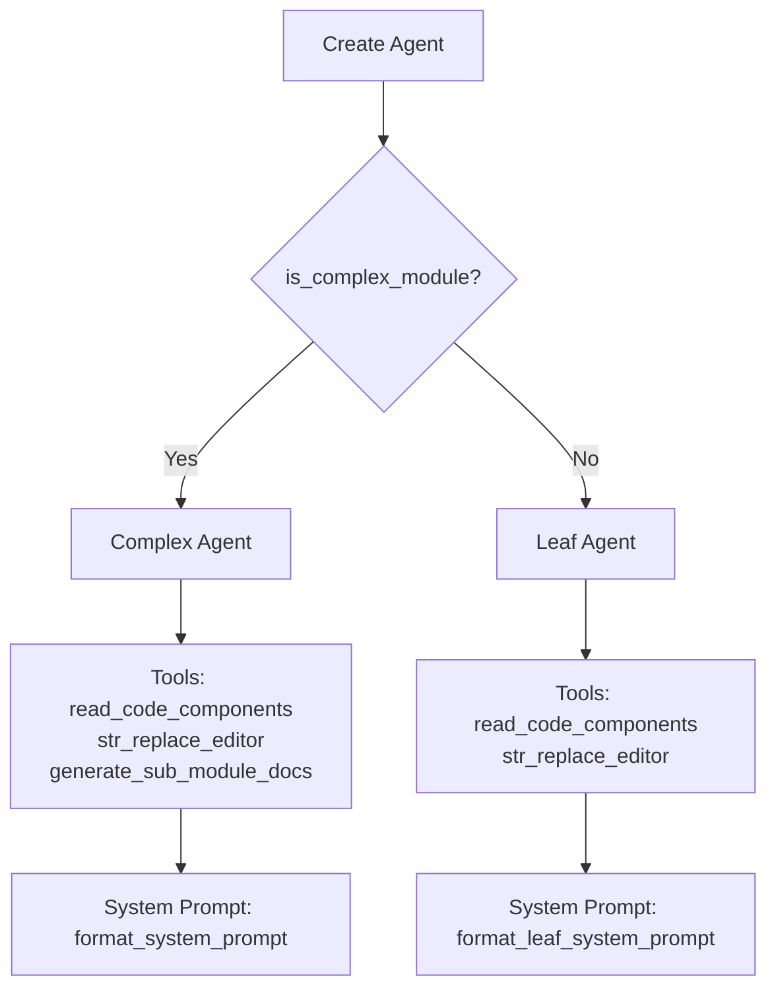

# AgentOrchestrator

The `AgentOrchestrator` class is responsible for creating and managing pydantic-ai agents for documentation generation. It provides a flexible agent creation system that adapts to module complexity.

## Overview

AgentOrchestrator serves as the bridge between the documentation generation pipeline and the pydantic-ai agent framework. It creates AI agents equipped with specialized tools for reading code, editing files, and generating sub-module documentation.

## Key Responsibilities

1. **Agent Creation** - Creates pydantic-ai agents with appropriate configuration based on module complexity
2. **Tool Configuration** - Equips agents with the right set of tools (read, edit, sub-module generation)
3. **Fallback Model Management** - Handles multiple model fallbacks for reliability
4. **Custom Instructions** - Integrates user-defined prompt additions

## Class Definition

```python
class AgentOrchestrator:
    """Orchestrates the AI agents for documentation generation."""

    def __init__(self, config: Config):
        self.config = config
        self.fallback_models = create_fallback_models(config)
        self.custom_instructions = config.get_prompt_addition() if config else None
```

## Agent Creation Strategy

The orchestrator uses a complexity-based approach to create agents:



### Complex Modules

For complex modules (those with multiple components), the agent receives:

- **Full toolset**: `read_code_components_tool`, `str_replace_editor_tool`, `generate_sub_module_documentation_tool`
- **Comprehensive system prompt**: Detailed instructions for generating hierarchical documentation
- **Deps with module tree**: Full access to the module hierarchy for cross-referencing

### Leaf Modules

For simple/leaf modules, the agent receives:

- **Limited toolset**: `read_code_components_tool`, `str_replace_editor_tool`
- **Simplified system prompt**: Focused instructions for single-module documentation
- **Deps with components**: Direct access to the module's components

## The `create_agent` Method

```python
def create_agent(self, module_name: str, components: Dict[str, Any],
                core_component_ids: List[str]) -> Agent:
    """Create an appropriate agent based on module complexity."""

    if is_complex_module(components, core_component_ids):
        return Agent(
            self.fallback_models,
            name=module_name,
            deps_type=CodeWikiDeps,
            tools=[
                read_code_components_tool,
                str_replace_editor_tool,
                generate_sub_module_documentation_tool
            ],
            system_prompt=format_system_prompt(module_name, self.custom_instructions),
        )
    else:
        return Agent(
            self.fallback_models,
            name=module_name,
            deps_type=CodeWikiDeps,
            tools=[read_code_components_tool, str_replace_editor_tool],
            system_prompt=format_leaf_system_prompt(module_name, self.custom_instructions),
        )
```

## The `process_module` Method

This async method handles the documentation generation for a single module:

```python
async def process_module(self, module_name: str, components: Dict[str, Node],
                       core_component_ids: List[str], module_path: List[str],
                       working_dir: str) -> Dict[str, Any]:
```

### Processing Steps

1. **Load module tree** - Retrieves the existing module hierarchy
2. **Check existing docs** - Skips if documentation already exists
3. **Create agent** - Instantiates an agent based on module complexity
4. **Prepare dependencies** - Creates `CodeWikiDeps` with all necessary context
5. **Run agent** - Executes the agent with the formatted prompt
6. **Save results** - Persists the updated module tree

### CodeWikiDeps Structure

The agent receives dependencies containing:

```python
deps = CodeWikiDeps(
    absolute_docs_path=working_dir,      # Documentation output directory
    absolute_repo_path=str(os.path.abspath(self.config.repo_path)),
    registry={},                           # Tool registry
    components=components,                 # Module components
    path_to_current_module=module_path,    # Module path in hierarchy
    current_module_name=module_name,        # Current module name
    module_tree=module_tree,                # Full module tree
    max_depth=self.config.max_depth,        # Max analysis depth
    current_depth=1,                        # Current processing depth
    config=self.config,                    # Full configuration
    custom_instructions=self.custom_instructions
)
```

## Integration with Tools

The orchestrator leverages three agent tools:

| Tool | Purpose | Available In |
|------|---------|--------------|
| `read_code_components_tool` | Read and analyze source code | Both |
| `str_replace_editor_tool` | Edit/write documentation files | Both |
| `generate_sub_module_documentation_tool` | Generate sub-module docs | Complex only |

## Fallback Models

The orchestrator uses `create_fallback_models(config)` to set up model fallbacks. This provides reliability when the primary model fails or hits rate limits.

## Error Handling

The `process_module` method includes comprehensive error handling:

```python
try:
    result = await agent.run(
        format_user_prompt(...),
        deps=deps
    )
    file_manager.save_json(deps.module_tree, module_tree_path)
    return deps.module_tree
except Exception as e:
    logger.error(f"Error processing module {module_name}: {str(e)}")
    logger.error(f"Traceback: {traceback.format_exc()}")
    raise
```

## Relationship with CmdAgentOrchestrator

AgentOrchestrator is the API-mode counterpart to `CmdAgentOrchestrator`. Both implement the same interface, allowing `DocumentationGenerator` to use either:

- **API Mode** (AgentOrchestrator): Uses pydantic-ai with OpenAI/Anthropic APIs
- **CLI Mode** (CmdAgentOrchestrator): Uses CLI agent subprocess for unlimited context

See [cmd_agent_orchestrator.md](cmd_agent_orchestrator.md) for the CLI alternative.
