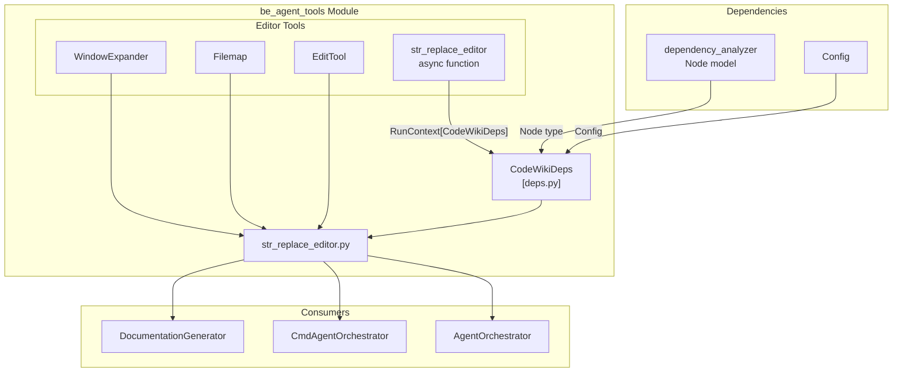
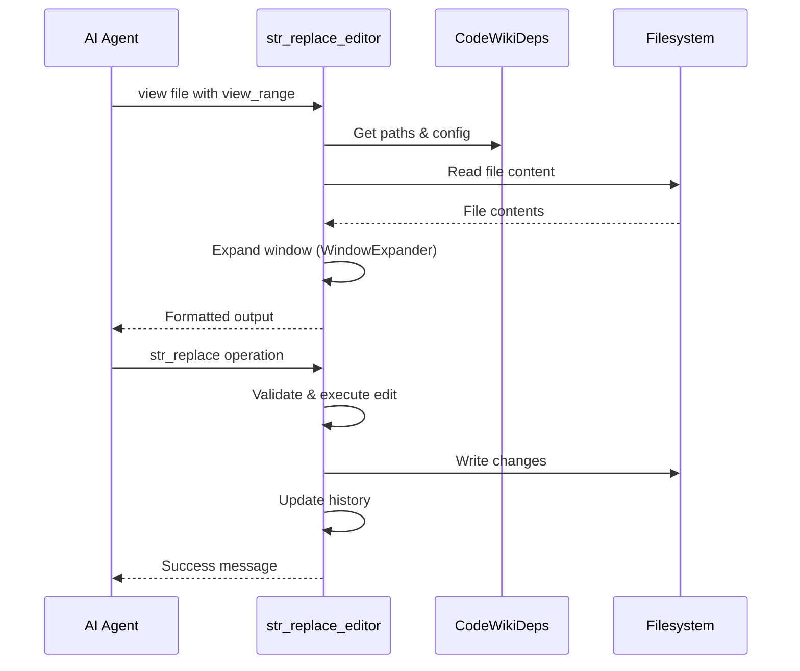

# be_agent_tools Module Documentation

The `be_agent_tools` module provides the core tools enabling AI agents to interact with source code repositories and documentation files. It serves as the interface layer between autonomous agents and the filesystem, allowing agents to view, search, create, and modify code and documentation files during automated documentation generation workflows.

## Architecture Overview

## Core Components

### 1. CodeWikiDeps (deps.py)

The `CodeWikiDeps` dataclass serves as the context container that provides agents with all necessary information about the repository, documentation structure, and configuration. It acts as a dependency injection container, passing essential context to all agent tools.

| Property | Type | Description |
|----------|------|-------------|
| `absolute_docs_path` | `str` | Absolute path to the documentation output directory |
| `absolute_repo_path` | `str` | Absolute path to the source repository |
| `registry` | `dict` | Persistent key-value store for agent state |
| `components` | `dict[str, Node]` | Dictionary mapping component names to dependency graph nodes |
| `path_to_current_module` | `list[str]` | Hierarchical path to the module being processed |
| `current_module_name` | `str` | Name of the current module |
| `module_tree` | `dict[str, any]` | Complete tree structure of the repository modules |
| `max_depth` | `int` | Maximum depth for recursive operations |
| `current_depth` | `int` | Current depth in recursive operations |
| `config` | `Config` | LLM configuration settings |
| `custom_instructions` | `str` | Optional custom instructions for the agent |

For detailed information about the dependency analysis models (Node, Repository), see [dependency_analyzer](dependency_analyzer.md).

### 2. str_replace_editor.py

This module provides a comprehensive file editing toolkit adapted from [SWE-agent](https://github.com/SWE-agent/SWE-agent/blob/main/tools/edit_anthropic/bin/str_replace_editor). It enables AI agents to perform filesystem operations with safety checks, history tracking, and optional linting integration.

#### Available Commands

| Command | Description | Working Directory |
|---------|-------------|-------------------|
| `view` | Display file contents with line numbers | `repo` or `docs` |
| `create` | Create a new file | `docs` only |
| `str_replace` | Replace exact string in file | `docs` only |
| `insert` | Insert text at specific line | `docs` only |
| `undo_edit` | Revert last edit operation | `docs` only |

#### Tool Parameters

The `str_replace_editor` async function accepts the following parameters:

- **working_dir**: Target directory (`repo` or `docs`)
- **command**: Operation to perform
- **path** / **file**: File or directory path
- **file_text**: Content for file creation
- **view_range**: Line range for viewing `[start, end]`
- **old_str**: String to replace (for str_replace)
- **new_str**: Replacement string
- **insert_line**: Line number for insertion

## Sub-Module Documentation

- [WindowExpander](window_expander.md) - Intelligent viewport expansion for code viewing
- [Filemap](filemap.md) - Tree-sitter based code abbreviation
- [EditTool](edit_tool.md) - Core file editing operations with history

## Integration with Agent Orchestration

The `be_agent_tools` module integrates with the agent orchestration system to enable autonomous documentation generation:

## Usage Context

This module is primarily used by:

1. **AgentOrchestrator** - Coordinates multiple agents working on documentation
2. **CmdAgentOrchestrator** - Handles command-based agent interactions
3. **DocumentationGenerator** - Generates module documentation automatically

The tools enforce security constraints by:
- Requiring absolute paths for all file operations
- Restricting write operations to the documentation directory only
- Maintaining edit history for undo capability
- Supporting optional linting integration for code validation

## Configuration

The module respects the global `Config` object for LLM settings and can be customized through the `custom_instructions` field in `CodeWikiDeps` to provide agent-specific guidance.