# CLI Config Module Documentation

The `cli_config` module provides essential configuration and git management capabilities for the CodeWiki CLI. It handles credential storage with flexible fallback mechanisms and manages git operations for documentation generation workflows.

## Architecture Overview


## Core Components

### 1. ConfigManager

The `ConfigManager` class provides a triple-fallback credential chain for secure and flexible configuration management:

```mermaid
flowchart LR
    subgraph Priority["Priority Order (Highest → Lowest)"]
        ENV[1. Environment Variables] --> FILE[2. Config File] --> KEYCHAIN[3. System Keychain]
    end
    
    ENV --- ENV_VARS["CODEWIKI_API_KEY<br/>CODEWIKI_BASE_URL<br/>CODEWIKI_MAIN_MODEL<br/>..."]
    FILE --- CONFIG_JSON["~/.codewiki/config.json"]
    KEYCHAIN --- KR[macOS Keychain / Linux Secret Service]
```



**Key Features:**

- **Environment Variable Support**: Highest priority, ideal for headless/CI environments
  - `CODEWIKI_API_KEY` - API authentication key
  - `CODEWIKI_BASE_URL` - Base URL for API endpoint
  - `CODEWIKI_MAIN_MODEL` - Primary LLM model
  - `CODEWIKI_CLUSTER_MODEL` - Clustering model
  - `CODEWIKI_FALLBACK_MODEL` - Fallback model

- **Config File Storage**: Plaintext storage in `~/.codewiki/config.json`
- **Keychain Integration**: Secure storage via system keychain (macOS Keychain / Linux Secret Service)

**Configuration Fields:**

| Field | Description |
|-------|-------------|
| `base_url` | API endpoint URL |
| `main_model` | Primary LLM model for generation |
| `cluster_model` | Model for clustering modules |
| `fallback_model` | Primary fallback model |
| `fallback_models` | List of fallback models for cascading |
| `default_output` | Default output directory |
| `max_tokens` | Maximum tokens per request |
| `max_token_per_module` | Token limit per module |
| `max_token_per_leaf_module` | Token limit for leaf modules |
| `max_depth` | Maximum dependency depth |

**Usage Example:**

```python
from codewiki.cli.config_manager import ConfigManager

# Initialize and load configuration
config_mgr = ConfigManager()
config_mgr.load()

# Check if configured
if config_mgr.is_configured():
    api_key = config_mgr.get_api_key()
    config = config_mgr.get_config()

# Save new configuration
config_mgr.save(
    api_key="your-api-key",
    base_url="https://api.example.com",
    main_model="gpt-4",
    cluster_model="gpt-4"
)
```

### 2. GitManager

The `GitManager` class handles all git operations required for documentation generation workflows:


**Key Features:**

- **Repository Validation**: Validates git repository existence
- **Clean Working Directory Detection**: Checks for uncommitted changes
- **Documentation Branch Management**: Creates timestamped branches for documentation
- **Commit Operations**: Commits generated documentation files
- **GitHub Integration**: Generates PR URLs for branch comparison

**Usage Example:**

```python
from codewiki.cli.git_manager import GitManager
from pathlib import Path

# Initialize with repository path
git_mgr = GitManager(Path("/path/to/repo"))

# Check working directory status
is_clean, message = git_mgr.check_clean_working_directory()
print(f"Clean: {is_clean}, Message: {message}")

# Create documentation branch
branch_name = git_mgr.create_documentation_branch()

# Commit documentation
commit_hash = git_mgr.commit_documentation(
    docs_path=Path("docs"),
    message="Add generated documentation"
)

# Get GitHub PR URL
pr_url = git_mgr.get_github_pr_url(branch_name)
```

## Error Handling

Both components use custom error classes from `cli_utils`:

| Error Class | Component | Description |
|-------------|-----------|-------------|
| `ConfigurationError` | ConfigManager | Configuration load/save failures |
| `FileSystemError` | ConfigManager | File system operations |
| `RepositoryError` | GitManager | Git operations failures |

## Configuration File Structure

The configuration file (`~/.codewiki/config.json`) follows this schema:

```json
{
  "version": "1.0",
  "base_url": "",
  "main_model": "",
  "cluster_model": "",
  "fallback_model": "glm-4p5",
  "fallback_models": ["glm-4p5"],
  "default_output": "docs",
  "api_key": "",
  "max_tokens": null,
  "max_token_per_module": null,
  "max_token_per_leaf_module": null,
  "max_depth": null,
  "agent_instructions": {
    "system_prompt": "",
    "cluster_prompt": "",
    "doc_prompt": ""
  }
}
```

## Related Documentation

- [cli_models](cli_models.md) - Configuration and data models
- [cli_utils](cli_utils.md) - Error handling and utilities
- [cli_adapters](cli_adapters.md) - Documentation generators and translators