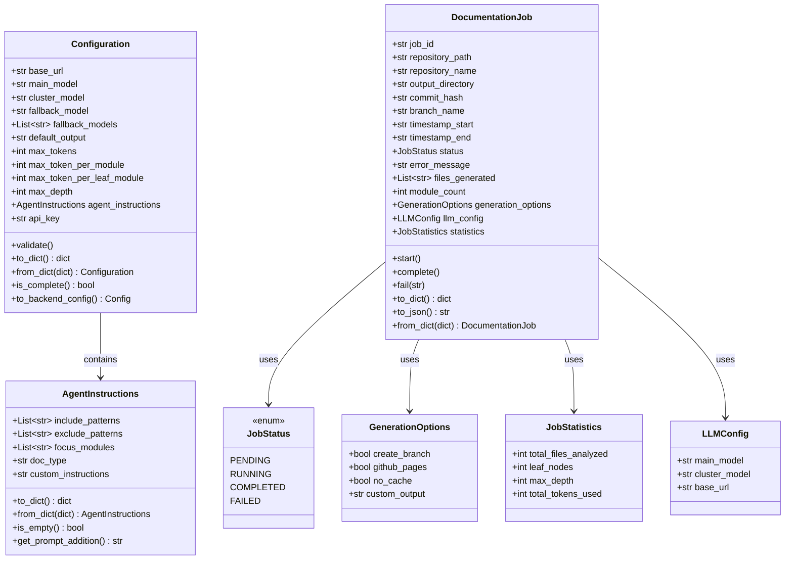
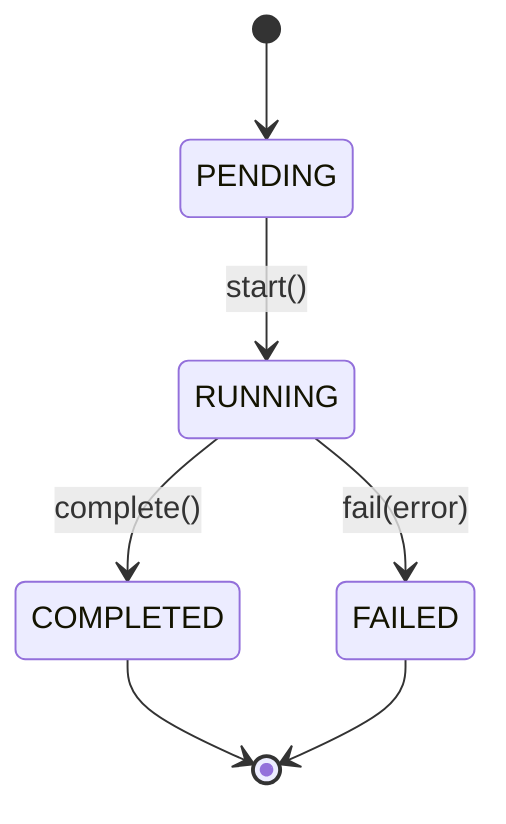
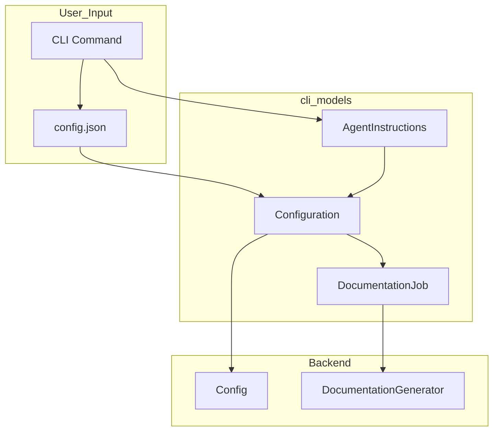

# CLI Models

The `cli_models` module provides data models for the CodeWiki CLI, encompassing configuration management and job tracking for documentation generation.

## Overview

The `cli_models` module is a foundational component of the CodeWiki CLI that handles two critical aspects of the documentation generation pipeline:

1. **Configuration Management** - Persistent user settings and runtime instructions
2. **Job Tracking** - Documentation job lifecycle and statistics

These models bridge the gap between user-facing CLI operations and the backend documentation generation system.

## Architecture

## Configuration Models

### AgentInstructions

The `AgentInstructions` class allows users to customize documentation generation behavior:

| Field | Type | Description |
|-------|------|-------------|
| `include_patterns` | `List[str]` | File patterns to include (e.g., `["*.cs", "*.py"]`) |
| `exclude_patterns` | `List[str]` | Patterns to exclude (e.g., `["*Tests*", "*test*"]`) |
| `focus_modules` | `List[str]` | Modules to document in more detail |
| `doc_type` | `str` | Type: `api`, `architecture`, `user-guide`, or `developer` |
| `custom_instructions` | `str` | Free-form additional instructions |

The class provides helper methods:
- `to_dict()` / `from_dict()` - Serialization support
- `is_empty()` - Check if any instructions are set
- `get_prompt_addition()` - Generate prompt additions based on instructions

### Configuration

The `Configuration` class represents persistent user settings stored in `~/.codewiki/config.json`:

| Field | Type | Default | Description |
|-------|------|---------|-------------|
| `base_url` | `str` | - | LLM API base URL |
| `main_model` | `str` | - | Primary model for documentation generation |
| `cluster_model` | `str` | - | Model for module clustering |
| `fallback_model` | `str` | `""` | Legacy single fallback model |
| `fallback_models` | `List[str]` | `[]` | Ordered fallback chain (preferred) |
| `default_output` | `str` | `"docs"` | Default output directory |
| `max_tokens` | `int` | `32768` | Maximum tokens for LLM response |
| `max_token_per_module` | `int` | `36369` | Maximum tokens per module for clustering |
| `max_token_per_leaf_module` | `int` | `16000` | Maximum tokens per leaf module |
| `max_depth` | `int` | `2` | Maximum depth for hierarchical decomposition |
| `agent_instructions` | `AgentInstructions` | - | Custom agent instructions |
| `api_key` | `str` | `None` | API key fallback (when keyring unavailable) |

Key methods:
- `validate()` - Validates all configuration fields
- `to_dict()` / `from_dict()` - Serialization support
- `is_complete()` - Check if required fields are set
- `to_backend_config()` - Converts CLI Configuration to Backend Config

## Job Models

### JobStatus

An enum representing the lifecycle states of a documentation job:

- `PENDING` - Job created but not yet started
- `RUNNING` - Job is actively processing
- `COMPLETED` - Job finished successfully
- `FAILED` - Job encountered an error

### GenerationOptions

Options for documentation generation:

| Field | Type | Default | Description |
|-------|------|---------|-------------|
| `create_branch` | `bool` | `False` | Create a new git branch for documentation |
| `github_pages` | `bool` | `False` | Deploy to GitHub Pages |
| `no_cache` | `bool` | `False` | Disable caching |
| `custom_output` | `str` | `None` | Custom output directory |

### JobStatistics

Statistics collected during documentation generation:

| Field | Type | Default | Description |
|-------|------|---------|-------------|
| `total_files_analyzed` | `int` | `0` | Number of files analyzed |
| `leaf_nodes` | `int` | `0` | Number of leaf modules |
| `max_depth` | `int` | `0` | Maximum hierarchy depth |
| `total_tokens_used` | `int` | `0` | Total LLM tokens consumed |

### LLMConfig

LLM configuration for a specific job:

| Field | Type | Description |
|-------|------|-------------|
| `main_model` | `str` | Primary model for documentation generation |
| `cluster_model` | `str` | Model for module clustering |
| `base_url` | `str` | LLM API base URL |

### DocumentationJob

The main job model representing a documentation generation task:

| Field | Type | Description |
|-------|------|-------------|
| `job_id` | `str` | Unique identifier (UUID) |
| `repository_path` | `str` | Absolute path to repository |
| `repository_name` | `str` | Repository name |
| `output_directory` | `str` | Output directory path |
| `commit_hash` | `str` | Git commit SHA |
| `branch_name` | `str` | Git branch name |
| `timestamp_start` | `str` | Job start time (ISO format) |
| `timestamp_end` | `str` | Job end time (ISO format) |
| `status` | `JobStatus` | Current job status |
| `error_message` | `str` | Error message (if failed) |
| `files_generated` | `List[str]` | List of generated files |
| `module_count` | `int` | Number of modules documented |
| `generation_options` | `GenerationOptions` | Generation options used |
| `llm_config` | `LLMConfig` | LLM configuration used |
| `statistics` | `JobStatistics` | Job statistics |

Lifecycle methods:
- `start()` - Mark job as started
- `complete()` - Mark job as completed
- `fail(error_message)` - Mark job as failed with error

Serialization methods:
- `to_dict()` - Convert to dictionary
- `to_json()` - Convert to JSON string
- `from_dict(data)` - Create from dictionary

## Data Flow

## Module Dependencies

The `cli_models` module depends on:

| Module | Dependency Type |
|--------|-----------------|
| `cli_utils` | Validation utilities |
| `core_utils` | Backend Config conversion |

The module provides data models that are consumed by:

| Module | Usage |
|--------|-------|
| `cli_adapters` | Uses Configuration for API settings |
| `cli_config` | Uses Configuration for config management |
| `be_agent_orchestrator` | Uses DocumentationJob for job tracking |

## Related Documentation

- [cli_config](cli_config.md) - Configuration management and git operations
- [cli_adapters](cli_adapters.md) - Documentation generation and translation adapters
- [core_utils](core_utils.md) - Backend configuration and file management