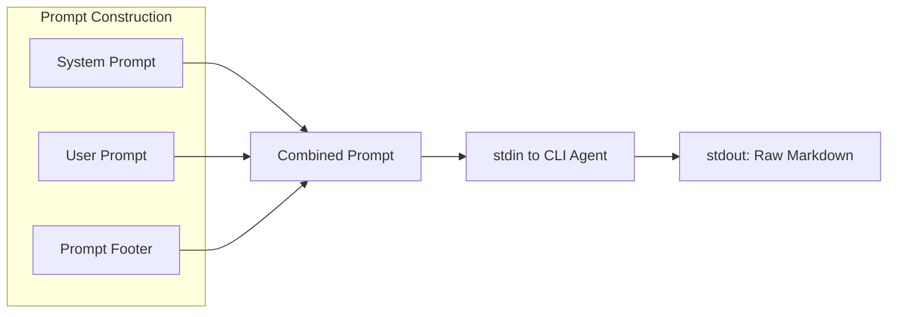
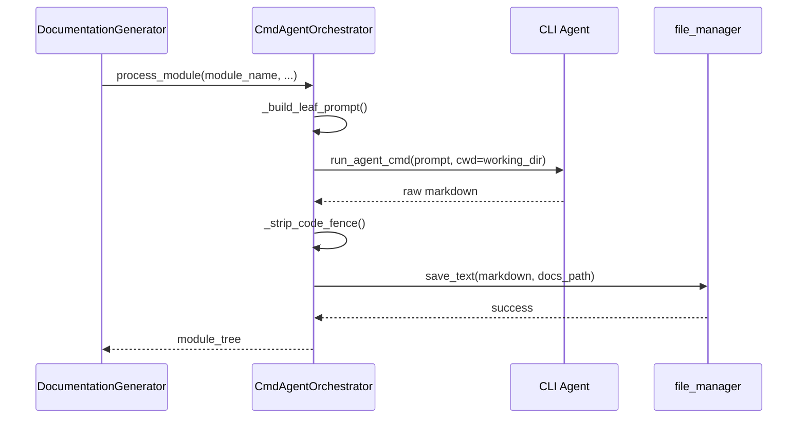

# CmdAgentOrchestrator

The `CmdAgentOrchestrator` class is a drop-in replacement for `AgentOrchestrator` that routes all AI calls through a CLI agent subprocess instead of using direct API calls. This approach eliminates context window limitations and provides unlimited documentation generation capacity.

## Overview

CmdAgentOrchestrator mirrors the interface of `AgentOrchestrator` but uses a fundamentally different execution model:

- **Input**: Prompts are piped to a CLI agent via stdin
- **Output**: Raw markdown is read from stdout
- **No API limits**: Bypasses rate limits and token restrictions

## When to Use CmdAgentOrchestrator

- Large repositories that exceed API context limits
- Projects requiring extensive documentation
- Environments with restricted API access
- When using local Claude CLI or similar tools

## Class Definition

```python
class CmdAgentOrchestrator:
    """
    Generates module documentation by piping prompts to a CLI agent subprocess.

    Mirrors the public interface used by DocumentationGenerator so it can be
    used as a drop-in replacement for AgentOrchestrator.
    """

    def __init__(self, config: Config, agent_cmd: str):
        self.config = config
        self.agent_cmd = agent_cmd
        self.custom_instructions = config.get_prompt_addition() if config else None
```

## CLI Agent Protocol

The CLI agent expects:

1. **Input**: Complete prompt on stdin (system + user prompt combined)
2. **Output**: Raw markdown content on stdout
3. **No wrappers**: No JSON/XML formatting, just raw markdown

### Example CLI Agent

```bash
# Example usage with Claude CLI
claude --dangerously-skip-permissions -p
```

## Prompt Formatting

CmdAgentOrchestrator uses special formatting to ensure the CLI agent outputs correctly:



### Prompt Footer

```python
CMD_AGENT_FOOTER = """

---
IMPORTANT OUTPUT INSTRUCTIONS:
- Output ONLY the complete markdown content for the documentation file.
- Do NOT add any preamble, explanation, or commentary before or after the markdown.
- Do NOT use XML/JSON wrappers.  Just raw markdown starting from the first heading.
- Mermaid diagrams are welcome; make sure they are well-formed.
"""
```

### Overview Footer

```python
CMD_OVERVIEW_FOOTER = """

---
IMPORTANT OUTPUT INSTRUCTIONS:
Return ONLY the markdown content wrapped exactly as shown:
<OVERVIEW>
…your markdown here…
</OVERVIEW>
"""
```

## Core Methods

### `process_module`

Generates documentation for a single module:

```python
async def process_module(
    self,
    module_name: str,
    components: Dict[str, Node],
    core_component_ids: List[str],
    module_path: List[str],
    working_dir: str,
) -> Dict[str, Any]:
```

#### Processing Steps

1. **Load module tree** - Retrieves existing module hierarchy
2. **Check existing docs** - Skips if already generated
3. **Build prompt** - Combines system + user prompts with footer
4. **Execute CLI** - Runs agent command with prompt on stdin
5. **Process output** - Strips any code fences added by agent
6. **Save markdown** - Writes documentation to file

### `generate_parent_module_docs`

Generates overview documentation for parent modules:

```python
async def generate_parent_module_docs(
    self,
    module_path: List[str],
    working_dir: str,
    module_tree: Dict[str, Any],
) -> Dict[str, Any]:
```

This method:

- Builds repo structure with children's docs embedded
- Selects appropriate prompt template (module vs repo overview)
- Executes CLI agent with formatted prompt
- Extracts content from `<OVERVIEW>` tags
- Saves to the appropriate markdown file

## Helper Functions

### `_strip_code_fence`

Removes markdown code fences that agents might add:

```python
def _strip_code_fence(text: str) -> str:
    """Remove ```markdown … ``` or ``` … ``` wrapper if the agent added one."""
    text = text.strip()
    if text.startswith("```"):
        lines = text.splitlines()
        inner = lines[1:-1] if lines[-1].strip() == "```" else lines[1:]
        return "\n".join(inner).strip()
    return text
```

### `_extract_overview`

Extracts content from overview tags:

```python
def _extract_overview(text: str) -> str:
    """Extract content between <OVERVIEW> … </OVERVIEW> tags, or return raw."""
    if "<OVERVIEW>" in text and "</OVERVIEW>" in text:
        return text.split("<OVERVIEW>")[1].split("</OVERVIEW>")[0].strip()
    return _strip_code_fence(text)
```

### `_build_overview_structure`

Builds the repository structure with embedded child documentation for overview generation:

```python
def _build_overview_structure(
    module_tree: Dict[str, Any],
    module_path: List[str],
    working_dir: str,
) -> Dict[str, Any]:
```

This function:
- Traverses the module tree to the target module
- Marks the target with `is_target_for_overview_generation`
- Embeds each child's markdown documentation into the structure

## Execution Flow



## Comparison with AgentOrchestrator

| Feature | AgentOrchestrator | CmdAgentOrchestrator |
|---------|-------------------|---------------------|
| Execution | pydantic-ai API | CLI subprocess |
| Context Limits | API token limits | None (agent handles) |
| Latency | Lower (direct API) | Higher (process spawn) |
| Error Handling | API error codes | Process exit codes |
| Complexity Detection | Yes | Yes (via is_complex_module) |

## Configuration

To enable CLI mode, set the `agent_cmd` configuration:

```python
config.agent_cmd = "claude --dangerously-skip-permissions -p"
generator = DocumentationGenerator(config)
# Uses CmdAgentOrchestrator automatically
```

## Integration

CmdAgentOrchestrator is automatically selected by `DocumentationGenerator` when `config.agent_cmd` is set:

```python
# In DocumentationGenerator.__init__
if getattr(config, 'agent_cmd', None):
    from codewiki.src.be.cmd_agent_orchestrator import CmdAgentOrchestrator
    self.agent_orchestrator = CmdAgentOrchestrator(config, config.agent_cmd)
    self._cmd_mode = True
else:
    self.agent_orchestrator = AgentOrchestrator(config)
    self._cmd_mode = False
```
