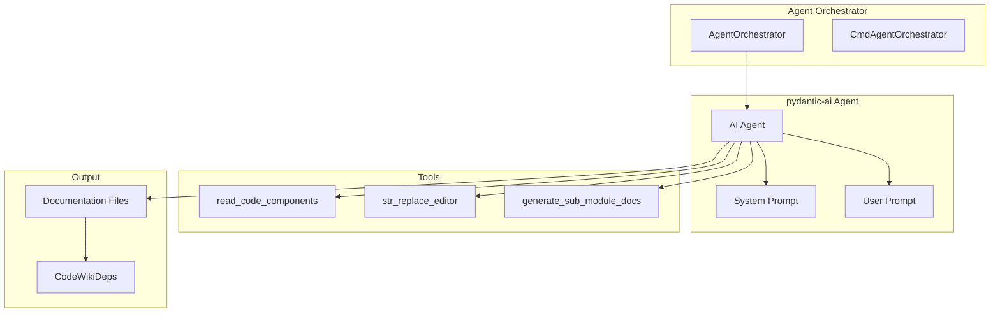

# 智能体编排器

智能体编排器管理与大语言模型 (LLMs) 交互以生成文档的 AI 智能体。它支持两种模式：使用 pydantic-ai 的 API 模式和使用子进程执行的 CLI 模式。

## 概述

编排器创建并管理执行以下操作的 AI 智能体：

1. 从代码库读取代码组件
2. 生成全面的文档
3. 将 Markdown 文件写入输出目录

## 架构



## AgentOrchestrator

使用 pydantic-ai 进行 LLM 交互的主要编排器。

```python
class AgentOrchestrator:
    def __init__(self, config: Config):
        self.config = config
        self.fallback_models = create_fallback_models(config)
        self.custom_instructions = config.get_prompt_addition()

    def create_agent(self, module_name: str, components: Dict, core_component_ids: List) -> Agent:
        """Create an appropriate agent based on module complexity."""
        if is_complex_module(components, core_component_ids):
            return Agent(
                self.fallback_models,
                name=module_name,
                deps_type=CodeWikiDeps,
                tools=[
                    read_code_components_tool,
                    str_replace_editor_tool,
                    generate_sub_module_documentation_tool
                ],
                system_prompt=format_system_prompt(module_name, self.custom_instructions),
            )
        else:
            return Agent(
                self.fallback_models,
                name=module_name,
                deps_type=CodeWikiDeps,
                tools=[read_code_components_tool, str_replace_editor_tool],
                system_prompt=format_leaf_system_prompt(module_name, self.custom_instructions),
            )
```

## CMD Agent Orchestrator

使用 CLI 智能体子进程以实现无限上下文的替代编排器。

```python
class CmdAgentOrchestrator:
    """
    Generates module documentation by piping prompts to a CLI agent subprocess.
    """

    def __init__(self, config: Config, agent_cmd: str):
        self.config = config
        self.agent_cmd = agent_cmd

    async def process_module(self, module_name: str, components: Dict, ...):
        """Process module via CLI agent."""
        prompt = _build_leaf_prompt(module_name, ...)
        markdown = run_agent_cmd(self.agent_cmd, prompt, cwd=working_dir)
        file_manager.save_text(markdown, docs_path)
```

## 智能体工具

### read_code_components

从代码库读取代码组件供 AI 分析。

```python
async def read_code_components(
    ctx: RunContext[CodeWikiDeps],
    component_ids: List[str],
) -> str:
    """Read specified code components from the repository."""
    components = ctx.deps.components
    result = []

    for comp_id in component_ids:
        if comp_id in components:
            node = components[comp_id]
            result.append(format_component(node))

    return "\n\n".join(result)
```

### str_replace_editor

编辑文档文件。

```python
async def str_replace_editor(
    ctx: RunContext[CodeWikiDeps],
    working_dir: Literal["repo", "docs"],
    command: Literal["view", "create", "str_replace", "insert", "undo_edit"],
    path: str,
    ...
) -> str:
    """View, create, or edit documentation files."""
```

### generate_sub_module_documentation

为子模块生成文档。

```python
async def generate_sub_module_documentation(
    ctx: RunContext[CodeWikiDeps],
    module_names: List[str],
    ...
) -> str:
    """Generate documentation for sub-modules."""
```

## 提示词模板

### 系统提示词

```python
def format_system_prompt(module_name: str, custom_instructions: str) -> str:
    return f"""You are an expert software documentation writer.

Your task is to generate comprehensive documentation for the {module_name} module.

## Guidelines:
- Write in clear, concise English
- Include code examples where helpful
- Use Markdown formatting
- Focus on API and architecture documentation

{custom_instructions}

## Output Format:
Write the documentation directly to the file specified by the user."""
```

### 用户提示词

```python
def format_user_prompt(module_name: str, core_component_ids: List[str], ...) -> str:
    return f"""Generate documentation for module: {module_name}

Components to document:
{format_components(core_component_ids)}

Module tree:
{json.dumps(module_tree, indent=2)}

Please write the documentation to: {module_name}.md"""
```

## CodeWikiDeps

智能体上下文的依赖注入。

```python
@dataclass
class CodeWikiDeps:
    absolute_docs_path: str
    absolute_repo_path: str
    registry: dict
    components: dict[str, Node]
    path_to_current_module: list[str]
    current_module_name: str
    module_tree: dict
    max_depth: int
    current_depth: int
    config: Config
    custom_instructions: str = None
```

## 备用模型

如果主模型失败，系统支持备用模型：

```python
def create_fallback_models(config: Config):
    """Create model pool with fallback support."""
    models = []

    # Add main model
    models.append(Model(name=config.main_model, ...))

    # Add fallback models
    for fb_model in config.fallback_models:
        models.append(Model(name=fb_model, ...))

    return models
```

## 模块复杂度检测

系统根据模块复杂度决定为智能体提供哪些工具：

```python
def is_complex_module(components: Dict, core_component_ids: List[str]) -> bool:
    """Determine if module needs advanced tools."""
    total_components = sum(len(ids) for ids in core_component_ids)
    return total_components > 10  # Threshold
```

## 相关文档

- [Documentation Generator](documentation_generator.md)
- [CMD Agent Orchestrator](cmd_agent_orchestrator.md)
- [Agent Tools](agent_tools.md)
- [Configuration](config.md)