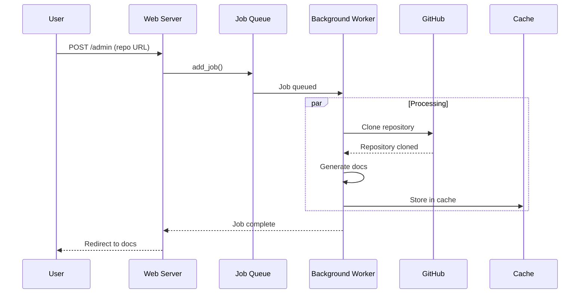

# 后台工作器

后台工作器负责处理 Web 应用程序中文档生成任务的异步处理。

## 概述

后台工作器管理文档生成任务队列，在后台处理这些任务，同时保持 Web 界面的响应能力。

## 类定义

```python
class BackgroundWorker:
    def __init__(self, cache_manager: CacheManager, temp_dir: str = None):
        self.cache_manager = cache_manager
        self.temp_dir = temp_dir or WebAppConfig.TEMP_DIR
        self.running = False
        self.processing_queue = Queue(maxsize=WebAppConfig.QUEUE_SIZE)
        self.job_status: Dict[str, JobStatus] = {}
```

## 关键方法

### start() / stop()

控制工作线程：

```python
def start(self):
    """Start the background worker thread."""
    if not self.running:
        self.running = True
        thread = threading.Thread(target=self._worker_loop, daemon=True)
        thread.start()

def stop(self):
    """Stop the background worker."""
    self.running = False
```

### add_job()

将任务添加到队列：

```python
def add_job(self, job_id: str, job: JobStatus):
    """Add a job to the processing queue."""
    self.job_status[job_id] = job
    self.processing_queue.put(job_id)
```

## 任务处理

### _worker_loop()

主工作循环：

```python
def _worker_loop(self):
    """Main worker loop."""
    while self.running:
        try:
            if not self.processing_queue.empty():
                job_id = self.processing_queue.get(timeout=1)
                self._process_job(job_id)
            else:
                time.sleep(1)
        except Exception as e:
            print(f"Worker error: {e}")
            time.sleep(1)
```

### _process_job()

处理单个任务：

```python
def _process_job(self, job_id: str):
    """Process a single documentation generation job."""
    job = self.job_status[job_id]

    try:
        # Update status
        job.status = 'processing'
        job.started_at = datetime.now()
        job.progress = "Cloning repository..."

        # Check cache
        if not job.options.no_cache:
            cached_docs = self.cache_manager.get_cached_docs(job.repo_url)
            if cached_docs and Path(cached_docs).exists():
                job.status = 'completed'
                job.docs_path = cached_docs
                return

        # Clone repository
        repo_info = GitHubRepoProcessor.get_repo_info(job.repo_url)
        temp_repo_dir = os.path.join(self.temp_dir, job_id)
        GitHubRepoProcessor.clone_repository(repo_info['clone_url'], temp_repo_dir)

        # Generate documentation
        config = Config.from_args(argparse.Namespace(repo_path=temp_repo_dir))
        doc_generator = DocumentationGenerator(config, job.commit_id)

        loop = asyncio.new_event_loop()
        asyncio.set_event_loop(loop)
        try:
            loop.run_until_complete(doc_generator.run())
        finally:
            loop.close()

        # Cache results
        self.cache_manager.add_to_cache(job.repo_url, docs_path)

        # Generate HTML if requested
        if job.options.github_pages:
            html_generator = HTMLGenerator()
            html_generator.generate(output_path=Path(docs_path) / "index.html", ...)

        # Translate if requested
        if job.options.output_lang:
            translator = DocTranslator(config)
            translator.translate_docs(output_dir=Path(docs_path), lang_code=job.options.output_lang)

        # Update status
        job.status = 'completed'
        job.completed_at = datetime.now()
        job.docs_path = docs_path

    except Exception as e:
        job.status = 'failed'
        job.error_message = str(e)
```

## 任务状态管理

### load_job_statuses()

```python
def load_job_statuses(self):
    """Load job statuses from disk."""
    if self.jobs_file.exists():
        data = file_manager.load_json(self.jobs_file)

        for job_id, job_data in data.items():
            # Only load completed jobs
            if job_data.get('status') == 'completed':
                self.job_status[job_id] = JobStatus(**job_data)
```

### save_job_statuses()

```python
def save_job_statuses(self):
    """Save job statuses to disk."""
    data = {}
    for job_id, job in self.job_status.items():
        data[job_id] = job.to_dict()

    file_manager.save_json(data, self.jobs_file)
```

## 队列流程



## 配置

| 设置 | 默认值 | 描述 |
|---------|---------|-------------|
| `QUEUE_SIZE` | 100 | 最大队列大小 |
| `CACHE_EXPIRY_DAYS` | 365 | 缓存过期时间 |
| `CLONE_TIMEOUT` | 300 | Git 克隆超时时间（秒） |
| `CLONE_DEPTH` | 1 | 浅克隆深度 |

## 相关文档

- [路由](routes.md)
- [缓存管理器](cache_manager.md)
- [任务模型](job.md)