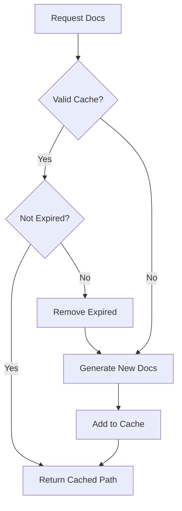

# 缓存管理器

缓存管理器负责处理生成文档的缓存，以避免对未更改的存储库进行冗余处理。

## 概述

缓存管理器存储生成的文档并跟踪过期时间，以优化性能。

## 类定义

```python
class CacheManager:
    def __init__(self, cache_dir: str = None, cache_expiry_days: int = None):
        self.cache_dir = Path(cache_dir or WebAppConfig.CACHE_DIR)
        self.cache_expiry_days = cache_expiry_days or WebAppConfig.CACHE_EXPIRY_DAYS
        self.cache_index: Dict[str, CacheEntry] = {}
        self.load_cache_index()
```

## 缓存条目

```python
@dataclass
class CacheEntry:
    repo_url: str
    repo_url_hash: str
    docs_path: str
    created_at: datetime
    last_accessed: datetime
```

## 关键方法

### get_cached_docs()

检索缓存的文档：

```python
def get_cached_docs(self, repo_url: str) -> Optional[str]:
    """Get cached documentation path if available."""
    repo_hash = self.get_repo_hash(repo_url)

    if repo_hash in self.cache_index:
        entry = self.cache_index[repo_hash]

        # Check expiration
        if datetime.now() - entry.created_at < timedelta(days=self.cache_expiry_days):
            # Update last accessed
            entry.last_accessed = datetime.now()
            self.save_cache_index()
            return entry.docs_path
        else:
            # Expired - remove
            self.remove_from_cache(repo_url)

    return None
```

### add_to_cache()

将文档添加到缓存：

```python
def add_to_cache(self, repo_url: str, docs_path: str):
    """Add documentation to cache."""
    repo_hash = self.get_repo_hash(repo_url)
    now = datetime.now()

    self.cache_index[repo_hash] = CacheEntry(
        repo_url=repo_url,
        repo_url_hash=repo_hash,
        docs_path=docs_path,
        created_at=now,
        last_accessed=now
    )

    self.save_cache_index()
```

### cleanup_expired_cache()

移除过期条目：

```python
def cleanup_expired_cache(self):
    """Remove expired cache entries."""
    expired_entries = []
    cutoff = datetime.now() - timedelta(days=self.cache_expiry_days)

    for repo_hash, entry in self.cache_index.items():
        if entry.created_at < cutoff:
            expired_entries.append(repo_hash)

    for repo_hash in expired_entries:
        del self.cache_index[repo_hash]

    if expired_entries:
        self.save_cache_index()
```

## 缓存存储

### 索引文件

```
output/cache/
├── cache_index.json
└── (documentation directories)
```

### 索引格式

```json
{
  "a1b2c3d4e5f6": {
    "repo_url": "https://github.com/owner/repo",
    "repo_url_hash": "a1b2c3d4e5f6",
    "docs_path": "output/docs/repo-docs",
    "created_at": "2024-01-01T00:00:00",
    "last_accessed": "2024-01-02T00:00:00"
  }
}
```

## 哈希生成

```python
def get_repo_hash(self, repo_url: str) -> str:
    """Generate hash for repository URL."""
    return hashlib.sha256(repo_url.encode()).hexdigest()[:16]
```

## 流程图



## 配置

| 设置 | 默认值 | 描述 |
|---------|---------|-------------|
| `CACHE_DIR` | `./output/cache` | 缓存目录 |
| `CACHE_EXPIRY_DAYS` | 365 | 缓存过期时间（天） |

## 相关文档

- [后台任务处理器](background_worker.md)
- [路由](routes.md)