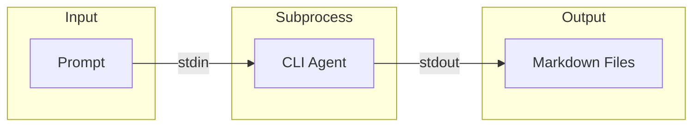

# CMD 代理编排器

CMD Agent Orchestrator 是 AgentOrchestrator 的直接替代品，它将所有 LLM 调用通过 CLI 代理子进程进行路由，而不是通过 OpenAI API。这消除了生成阶段的所有上下文窗口限制。

## 概述

CMD Agent Orchestrator 通过以下方式解决上下文窗口限制：

1. 将提示词写入临时文件或 stdin
2. 将 CLI 代理（如 Claude CLI）作为子进程运行
3. 从 stdout 读取生成的文档
4. 将结果直接写入 markdown 文件

## 架构



## 主要功能

### 无限上下文

与基于 API 的方法不同，CLI 代理没有上下文窗口限制，因为它在本地处理文件。

### 标准输入/输出

编排器通过 stdin/stdout 进行通信：

```python
def run_agent_cmd(agent_cmd: str, prompt: str, cwd: str = None) -> str:
    """Run CLI agent with prompt and return output."""
    process = subprocess.Popen(
        agent_cmd.split(),
        stdin=subprocess.PIPE,
        stdout=subprocess.PIPE,
        stderr=subprocess.PIPE,
        cwd=cwd
    )
    stdout, stderr = process.communicate(input=prompt.encode())
    return stdout.decode()
```

### 页脚指令

特殊指令确保代理仅输出 markdown：

```python
CMD_AGENT_FOOTER = """

---
IMPORTANT OUTPUT INSTRUCTIONS:
- Output ONLY the complete markdown content
- Do NOT add preamble or commentary
- Do NOT use XML/JSON wrappers
- Start from the first heading
"""
```

## 类定义

```python
class CmdAgentOrchestrator:
    def __init__(self, config: Config, agent_cmd: str):
        self.config = config
        self.agent_cmd = agent_cmd
        self.custom_instructions = config.get_prompt_addition()
```

## 方法

### process_module()

处理单个模块并写入其 markdown 文档：

```python
async def process_module(
    self,
    module_name: str,
    components: Dict[str, Node],
    core_component_ids: List[str],
    module_path: List[str],
    working_dir: str,
) -> Dict[str, Any]:
    """Process module via CLI agent."""

    # Build prompt
    prompt = _build_leaf_prompt(
        module_name=module_name,
        core_component_ids=core_component_ids,
        components=components,
        module_tree=module_tree,
        custom_instructions=self.custom_instructions,
        is_complex=is_complex_module(components, core_component_ids),
    )

    # Run CLI agent
    markdown = run_agent_cmd(self.agent_cmd, prompt, cwd=working_dir)

    # Strip accidental wrappers
    markdown = _strip_code_fence(markdown)

    # Write output
    docs_path = os.path.join(working_dir, f"{module_name}.md")
    file_manager.save_text(markdown, docs_path)

    return module_tree
```

### generate_parent_module_docs()

为父模块生成概览文档：

```python
async def generate_parent_module_docs(
    self,
    module_path: List[str],
    working_dir: str,
    module_tree: Dict[str, Any],
) -> Dict[str, Any]:
    """Generate parent/overview documentation."""

    # Build structure with children docs
    repo_structure = _build_overview_structure(
        module_tree, module_path, working_dir
    )

    # Build prompt
    prompt = MODULE_OVERVIEW_PROMPT.format(
        module_name=module_name,
        repo_structure=json.dumps(repo_structure, indent=4)
    ) + CMD_OVERVIEW_FOOTER

    # Run agent
    raw_output = run_agent_cmd(self.agent_cmd, prompt, cwd=working_dir)

    # Extract content
    content = _extract_overview(raw_output)

    # Write output
    parent_docs_path = os.path.join(working_dir, f"{module_name}.md")
    file_manager.save_text(content, parent_docs_path)

    return module_tree
```

## 辅助函数

### _build_leaf_prompt()

组合系统和用户提示词：

```python
def _build_leaf_prompt(
    module_name: str,
    core_component_ids: List[str],
    components: Dict[str, Node],
    module_tree: Dict[str, Any],
    custom_instructions: Optional[str],
    is_complex: bool,
) -> str:
    """Combine prompts into single string."""

    if is_complex:
        sys_prompt = format_system_prompt(module_name, custom_instructions)
    else:
        sys_prompt = format_leaf_system_prompt(module_name, custom_instructions)

    user_prompt = format_user_prompt(...)

    return f"{sys_prompt}\n\n{user_prompt}{CMD_AGENT_FOOTER}"
```

### _strip_code_fence()

移除代码围栏包装器：

```python
def _strip_code_fence(text: str) -> str:
    """Remove ```markdown … ``` wrapper."""
    text = text.strip()
    if text.startswith("```"):
        lines = text.splitlines()
        inner = lines[1:-1] if lines[-1].strip() == "```" else lines[1:]
        return "\n".join(inner).strip()
    return text
```

### _extract_overview()

从概览标签中提取内容：

```python
def _extract_overview(text: str) -> str:
    """Extract content between <OVERVIEW> tags."""
    if "<OVERVIEW>" in text and "</OVERVIEW>" in text:
        return text.split("<OVERVIEW>")[1].split("</OVERVIEW>")[0].strip()
    return _strip_code_fence(text)
```

## 使用示例

```bash
# Using Claude CLI
codewiki generate /path/to/repo --with-agent-cmd "claude --dangerously-skip-permissions -p"

# Using custom agent
codewiki generate /path/to/repo --with-agent-cmd "my-agent --prompt"
```

## 与 API 模式的比较

| 功能 | API 模式 | CLI 模式 |
|---------|----------|----------|
| 上下文限制 | 是（因模型而异） | 否 |
| 成本 | API 令牌 | 本地计算 |
| 速度 | 快速 | 取决于 CLI |
| 离线 | 否 | 是 |
| 设置 | 需要 API 密钥 | 需要 CLI 工具 |

## 相关文档

- [代理编排器](agent_orchestrator.md)
- [文档生成器](documentation_generator.md)