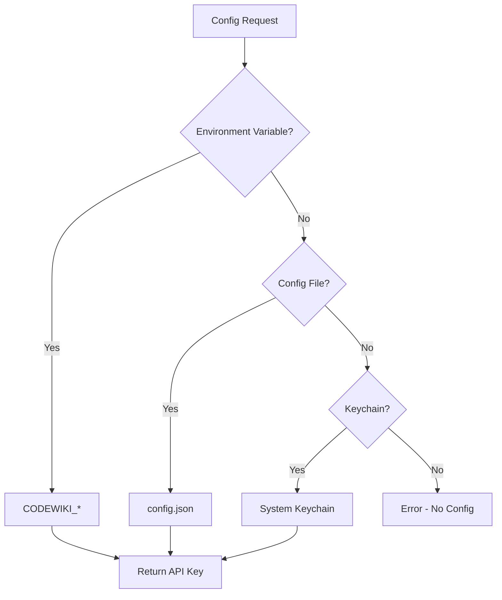

# 配置管理器

配置管理器负责处理 CodeWiki 的所有配置方面，支持基于优先级解析系统的多种存储后端。

## 概述

CodeWiki 支持灵活的配置，具有三个备用源：

1. **环境变量** - 最高优先级，用于 CI/无头环境
2. **配置文件** - `~/.codewiki/config.json` 用于持久化设置
3. **系统钥匙串** - 安全存储

## 优先级链



## 配置存储

### 环境变量

| 变量 | 描述 |
|----------|-------------|
| `CODEWIKI_API_KEY` | LLM API 密钥 |
| `CODEWIKI_BASE_URL` | LLM API 基础 URL |
| `CODEWIKI_MAIN_MODEL` | 主模型 |
| `CODEWIKI_CLUSTER_MODEL` | 聚类模型 |
| `CODEWIKI_FALLBACK_MODEL` | 回退模型 |

### 配置文件

位置：`~/.codewiki/config.json`

```json
{
  "version": "1.0",
  "base_url": "https://api.example.com",
  "main_model": "claude-sonnet-4",
  "cluster_model": "claude-sonnet-4",
  "fallback_model": "claude-haiku",
  "fallback_models": ["claude-haiku"],
  "default_output": "docs",
  "max_tokens": 32768,
  "max_token_per_module": 36369,
  "max_token_per_leaf_module": 16000,
  "max_depth": 2,
  "api_key": "sk-...",
ructions": {
     "agent_inst "include_patterns": ["*.py"],
    "exclude_patterns": ["*test*"],
    "doc_type": "api"
  }
}
```

## 类定义

```python
class ConfigManager:
    def __init__(self):
        self._api_key: Optional[str] = None
        self._config: Optional[Configuration] = None
        self._keyring_available = self._check_keyring_available()

    def load(self) -> bool:
        """Load configuration with priority resolution."""
        if not CONFIG_FILE.exists():
            return False

        # Load from file
        data = json.loads(CONFIG_FILE.read_text())

        # Resolve API key priority
        self._api_key = self._resolve_api_key(data)

        return True

    def get_api_key(self) -> Optional[str]:
        """Get API key using priority chain."""
        # 1. Environment variable
        env_key = os.environ.get(ENV_API_KEY)
        if env_key:
            return env_key

        # 2. In-memory cache
        if self._api_key:
            return self._api_key

        # 3. Config file field
        if self._config and self._config.api_key:
            return self._config.api_key

        # 4. Keychain
        if self._keyring_available:
            return keyring.get_password(KEYRING_SERVICE, KEYRING_API_KEY_ACCOUNT)

        return None
```

## 配置方法

### load()

从文件加载配置：

```python
def load(self) -> bool:
    """Load configuration from file and resolve credentials."""
    if not CONFIG_FILE.exists():
        return False

    # Load JSON
    data = json.loads(CONFIG_FILE.read_text())
    self._config = Configuration.from_dict(data)

    # Resolve API key with priority
    self._api_key = self._resolve_api_key(data)

    return True
```

### save()

持久化配置：

```python
def save(
    self,
    api_key: Optional[str] = None,
    base_url: Optional[str] = None,
    main_model: Optional[str] = None,
    cluster_model: Optional[str] = None,
    fallback_model: Optional[str] = None,
    fallback_models: Optional[list] = None,
    default_output: Optional[str] = None,
    max_tokens: Optional[int] = None,
    max_token_per_module: Optional[int] = None,
    max_token_per_leaf_module: Optional[int] = None,
    max_depth: Optional[int] = None,
    force_key_to_file: bool = False,
):
    """Persist configuration."""

    # Update config object
    if base_url:
        self._config.base_url = base_url
    # ... more fields

    # Store API key
    if api_key is not None:
        self._api_key = api_key

        # Try keychain first
        if self._keyring_available and not force_key_to_file:
            try:
                keyring.set_password(KEYRING_SERVICE, KEYRING_API_KEY_ACCOUNT, api_key)
                return
            except KeyringError:
                pass

        # Fallback to config file
        self._config.api_key = api_key
```

### is_configured()

检查是否具有完整配置：

```python
def is_configured(self) -> bool:
    """Return True if complete configuration is available."""
    if self._env_only_config() and self.get_api_key():
        return True

    if self._config is None:
        return False

    effective = self._apply_env_overrides(self._config)
    return bool(self.get_api_key() and effective.is_complete())
```

## 环境变量覆盖

系统支持运行时环境变量覆盖：

```python
def _apply_env_overrides(self, config: Configuration) -> Configuration:
    """Apply environment variable overrides."""
    from dataclasses import replace
    overrides = {}

    if os.environ.get(ENV_BASE_URL):
        overrides["base_url"] = os.environ[ENV_BASE_URL]
    if os.environ.get(ENV_MAIN_MODEL):
        overrides["main_model"] = os.environ[ENV_MAIN_MODEL]

    if overrides:
        return replace(config, **overrides)
    return config
```

## 配置模型

```python
@dataclass
class Configuration:
    base_url: str
    main_model: str
    cluster_model: str
    fallback_model: str = ""
    fallback_models: List[str] = field(default_factory=list)
    default_output: str = "docs"
    max_tokens: int = 32768
    max_token_per_module: int = 36369
    max_token_per_leaf_module: int = 16000
    max_depth: int = 2
    agent_instructions: AgentInstructions = field(default_factory=AgentInstructions)
    api_key: Optional[str] = None
```

## 代理指令

```python
@dataclass
class AgentInstructions:
    include_patterns: Optional[List[str]] = None  # e.g., ["*.cs", "*.py"]
    exclude_patterns: Optional[List[str]] = None  # e.g., ["*Tests*"]
    focus_modules: Optional[List[str]] = None     # e.g., ["src/core"]
    doc_type: Optional[str] = None                # "api", "architecture"
    custom_instructions: Optional[str] = None
```

## 使用示例

### 命令行使用

```bash
# Set configuration
codewiki config set --api-key sk-xxx --base-url https://api.example.com

# Use environment variables
export CODEWIKI_API_KEY=sk-xxx
codewiki generate /path/to/repo
```

### 编程方式使用

```python
from codewiki.cli.config_manager import ConfigManager

config_manager = ConfigManager()
config_manager.load()

api_key = config_manager.get_api_key()
config = config_manager.get_config()
```

## 相关文档

- [配置后端](config.md)
- [HTML 生成器](html_generator.md)
- [进度跟踪器](progress.md)