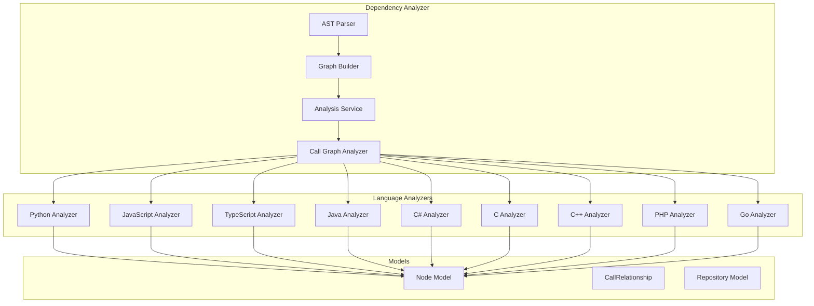

# 依赖分析器

依赖分析器是一个用于分析代码仓库并提取结构信息的综合系统，包括函数、类、方法及其相互关系。

## 概览

依赖分析器由几个相互连接的组件组成：

1. **AST 解析器** (`ast_parser.py`) - 解析的入口点
2. **图构建器** (`dependency_graphs_builder.py`) - 构建依赖图
3. **分析服务** (`analysis_service.py`) - 编排分析
4. **调用图分析器** (`call_graph_analyzer.py`) - 分析函数调用
5. **特定语言分析器** - 解析不同语言

## 架构



## 核心组件

### DependencyGraphBuilder

为仓库构建完整的依赖图。

```python
class DependencyGraphBuilder:
    def build_dependency_graph(self) -> tuple[Dict[str, Any], List[str]]:
        """Build and save dependency graph, returning components and leaf nodes."""
        # 1. Parse repository structure
        parser = DependencyParser(repo_path, include_patterns, exclude_patterns)
        components = parser.parse_repository()

        # 2. Save dependency graph
        parser.save_dependency_graph(dependency_graph_path)

        # 3. Build traversal graph
        graph = build_graph_from_components(components)

        # 4. Get leaf nodes (classes/interfaces without dependents)
        leaf_nodes = get_leaf_nodes(graph, components)

        return components, leaf_nodes
```

### DependencyParser

解析仓库结构的主入口点。

```python
class DependencyParser:
    def __init__(self, repo_path: str, include_patterns=None, exclude_patterns=None):
        self.repo_path = repo_path
        self.components: Dict[str, Node] = {}
        self.analysis_service = AnalysisService()

    def parse_repository(self, filtered_folders: List[str] = None) -> Dict[str, Node]:
        # Analyze structure
        structure_result = self.analysis_service._analyze_structure(
            self.repo_path,
            include_patterns=self.include_patterns,
            exclude_patterns=self.exclude_patterns
        )

        # Analyze call graph
        call_graph_result = self.analysis_service._analyze_call_graph(
            structure_result["file_tree"],
            self.repo_path
        )

        # Build components
        self._build_components_from_analysis(call_graph_result)
        return self.components
```

### CallGraphAnalyzer

编排多语言调用图分析。

```python
class CallGraphAnalyzer:
    def analyze_code_files(self, code_files: List[Dict], base_dir: str) -> Dict:
        """Complete analysis of all files."""
        for file_info in code_files:
            self._analyze_code_file(base_dir, file_info)

        # Resolve relationships
        self._resolve_call_relationships()

        # Generate visualization
        return {
            "functions": [...],
            "relationships": [...],
            "visualization": {...}
        }
```

## 数据模型

### Node

表示代码组件（函数、类、方法等）

```python
class Node(BaseModel):
    id: str                          # Unique identifier
    name: str                        # Component name
    component_type: str              # function, class, method, etc.
    file_path: str                   # Source file path
    relative_path: str               # Path relative to repo root
    depends_on: Set[str]             # Dependencies
    source_code: Optional[str]       # Source code snippet
    start_line: int                  # Start line number
    end_line: int                    # End line number
    has_docstring: bool              # Has documentation
    docstring: str                   # Documentation string
    parameters: Optional[List[str]]  # Function parameters
    node_type: str                   # Specific node type
    base_classes: Optional[List[str]] # Base classes
    class_name: Optional[str]         # Containing class
    display_name: str                 # Display name
```

### CallRelationship

表示组件之间的关系

```python
class CallRelationship(BaseModel):
    caller: str              # Calling component
    callee: str             # Called component
    call_line: Optional[int] # Line number
    is_resolved: bool       # Whether target was found
```

## 语言支持

### Python 分析

使用 Python 内置的 AST 模块：

```python
class PythonASTAnalyzer(ast.NodeVisitor):
    def visit_ClassDef(self, node):
        # Extract class information
        class_node = Node(
            component_type="class",
            base_classes=[self._extract_base_class_name(b) for b in node.bases]
        )

    def visit_FunctionDef(self, node):
        # Extract function/method
        func_node = Node(component_type="function")

    def visit_Call(self, node):
        # Extract call relationships
        self.call_relationships.append(CallRelationship(...))
```

### JavaScript/TypeScript 分析

使用 tree-sitter 进行解析：

```python
class TreeSitterJSAnalyzer:
    def analyze(self):
        tree = self.parser.parse(self.content)
        self._extract_functions(tree.root_node)
        self._extract_call_relationships(tree.root_node)
```

### 其他语言

均使用 tree-sitter 解析器：
- **Java**: `TreeSitterJavaAnalyzer`
- **C#**: `TreeSitterCSharpAnalyzer`
- **C**: `TreeSitterCAnalyzer`
- **C++**: `TreeSitterCppAnalyzer`
- **PHP**: `TreeSitterPHPAnalyzer`
- **Go**: `TreeSitterGoAnalyzer`

## 文件过滤

分析器支持包含/排除模式：

```python
# Include only certain file types
include_patterns = ["*.py", "*.js", "*.ts"]

# Exclude test files
exclude_patterns = ["*Tests*", "*test*", "*/__pycache__/*"]

parser = DependencyParser(
    repo_path,
    include_patterns=include_patterns,
    exclude_patterns=exclude_patterns
)
```

## 输出

### 依赖图 JSON

```json
{
  "src.module.ClassName": {
    "id": "src.module.ClassName",
    "name": "ClassName",
    "component_type": "class",
    "file_path": "src/module.py",
    "relative_path": "src/module.py",
    "depends_on": ["src.module.OtherClass"],
    "source_code": "class ClassName:\n    ...",
    "start_line": 10,
    "end_line": 50
  }
}
```

### 可视化数据

```python
{
    "cytoscape": {
        "elements": [
            {"data": {"id": "func1", "label": "function1"}, "classes": "node-function lang-python"},
            {"data": {"source": "func1", "target": "func2"}, "classes": "edge-call"}
        ]
    }
}
```

## 相关文档

- [文档生成器](documentation_generator.md)
- [代理编排器](agent_orchestrator.md)
- [Python 分析器](python_analyzer.md)
- [JavaScript 分析器](javascript_analyzer.md)