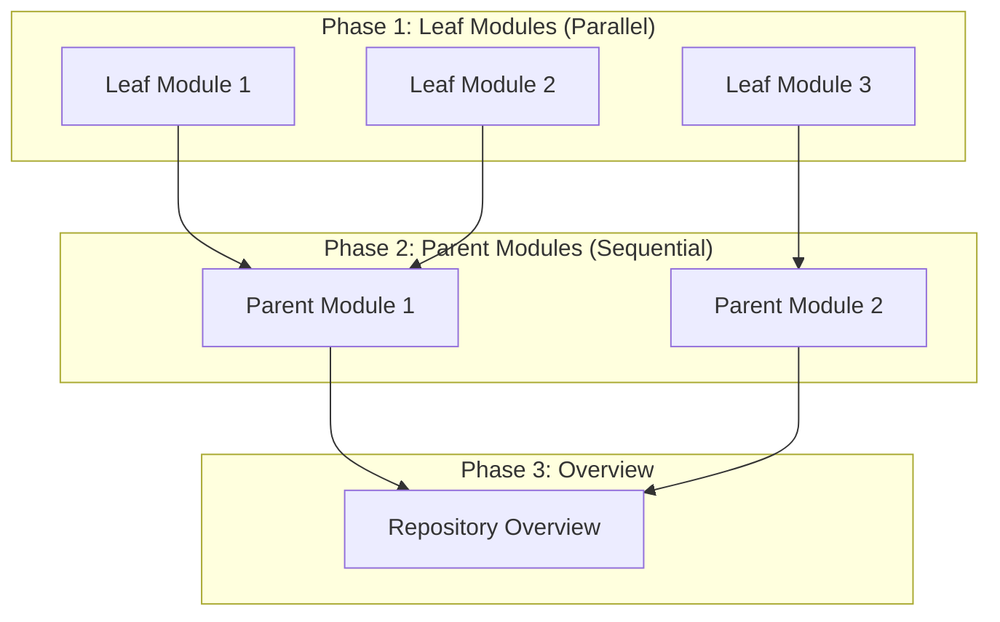

# 文档生成器

`DocumentationGenerator` 类是 CodeWiki 文档生成系统的主要编排器。它协调从依赖分析到最终文档输出的整个过程。

## 概述

DocumentationGenerator 处理完整的文档生成工作流：

1. **依赖分析**：构建代码库的依赖关系图
2. **模块聚类**：使用 LLM 将代码组件分组为逻辑模块
3. **文档生成**：为每个模块生成 Markdown 文档
4. **元数据创建**：为生成的文档创建元数据文件

## 类定义

```python
class DocumentationGenerator:
    """Main documentation generation orchestrator."""

    def __init__(self, config: Config, commit_id: str = None):
        self.config = config
        self.commit_id = commit_id
        self.graph_builder = DependencyGraphBuilder(config)

        # Choose between CLI agent or pydantic-ai API
        if getattr(config, 'agent_cmd', None):
            self.agent_orchestrator = CmdAgentOrchestrator(config, config.agent_cmd)
            self._cmd_mode = True
        else:
            self.agent_orchestrator = AgentOrchestrator(config)
            self._cmd_mode = False
```

## 关键方法

### `run()`

运行完整文档生成过程的主入口点。

```python
async def run(self) -> None:
    """Run the complete documentation generation process."""
    # 1. Build dependency graph
    components, leaf_nodes = self.graph_builder.build_dependency_graph()

    # 2. Cluster modules
    module_tree = cluster_modules(leaf_nodes, components, self.config)

    # 3. Generate module documentation
    await self.generate_module_documentation(components, leaf_nodes)

    # 4. Create metadata
    self.create_documentation_metadata(working_dir, components, len(leaf_nodes))
```

### `generate_module_documentation()`

使用动态规划方法为所有模块生成文档，该方法优先处理叶子模块，然后处理父模块。

```python
async def generate_module_documentation(
    self,
    components: Dict[str, Any],
    leaf_nodes: List[str],
    concurrency: int = 1,
) -> str:
```

**关键特性：**
- 优先处理叶子模块（无依赖项）
- 父模块聚合子模块的文档
- 支持并发处理（可配置）
- 处理缓存 - 跳过已生成的文档

### `generate_parent_module_docs()`

通过聚合子模块的文档，为父模块生成概述文档。

```python
async def generate_parent_module_docs(
    self,
    module_path: List[str],
    working_dir: str
) -> Dict[str, Any]:
```

### `create_documentation_metadata()`

创建包含生成信息的元数据文件。

```python
def create_documentation_metadata(
    self,
    working_dir: str,
    components: Dict[str, Any],
    num_leaf_nodes: int
):
```

## 处理顺序

系统使用动态规划方法来确定最佳处理顺序：



## 数据结构

### 模块树

模块树按层级组织代码组件：

```json
{
  "core": {
    "description": "Core functionality",
    "components": ["ComponentA", "ComponentB"],
    "children": {
      "database": {
        "description": "Database operations",
        "components": ["Database", "QueryBuilder"]
      }
    }
  }
}
```

### 处理顺序

`get_processing_order()` 方法按拓扑顺序返回模块：

```python
def get_processing_order(
    self,
    module_tree: Dict[str, Any],
    parent_path: List[str] = []
) -> List[tuple[List[str], str]]:
```

## 配置

DocumentationGenerator 使用 `Config` 类进行设置：

| 参数 | 描述 | 默认值 |
|-----------|-------------|---------|
| `repo_path` | 代码库路径 | 必填 |
| `docs_dir` | 输出目录 | `./output/docs` |
| `max_depth` | 最大模块深度 | 2 |
| `max_tokens` | LLM 响应 token 数 | 32768 |
| `concurrency` | 并行工作线程数 | 4 |
| `agent_cmd` | CLI agent 命令 | None |

## 集成点

### 依赖图构建器

```python
self.graph_builder = DependencyGraphBuilder(config)
components, leaf_nodes = self.graph_builder.build_dependency_graph()
```

### Agent 编排器

```python
# API mode (pydantic-ai)
self.agent_orchestrator = AgentOrchestrator(config)

# CLI mode (subprocess)
self.agent_orchestrator = CmdAgentOrchestrator(config, config.agent_cmd)
```

## 错误处理

生成器包含全面的错误处理：

```python
try:
    await doc_generator.run()
except Exception as e:
    logger.error(f"Documentation generation failed: {str(e)}")
    logger.error(f"Traceback: {traceback.format_exc()}")
    raise
```

## 相关文档

- [Agent 编排器](agent_orchestrator.md)
- [CMD Agent 编排器](cmd_agent_orchestrator.md)
- [依赖分析器](dependency_analyzer.md)
- [配置](config.md)