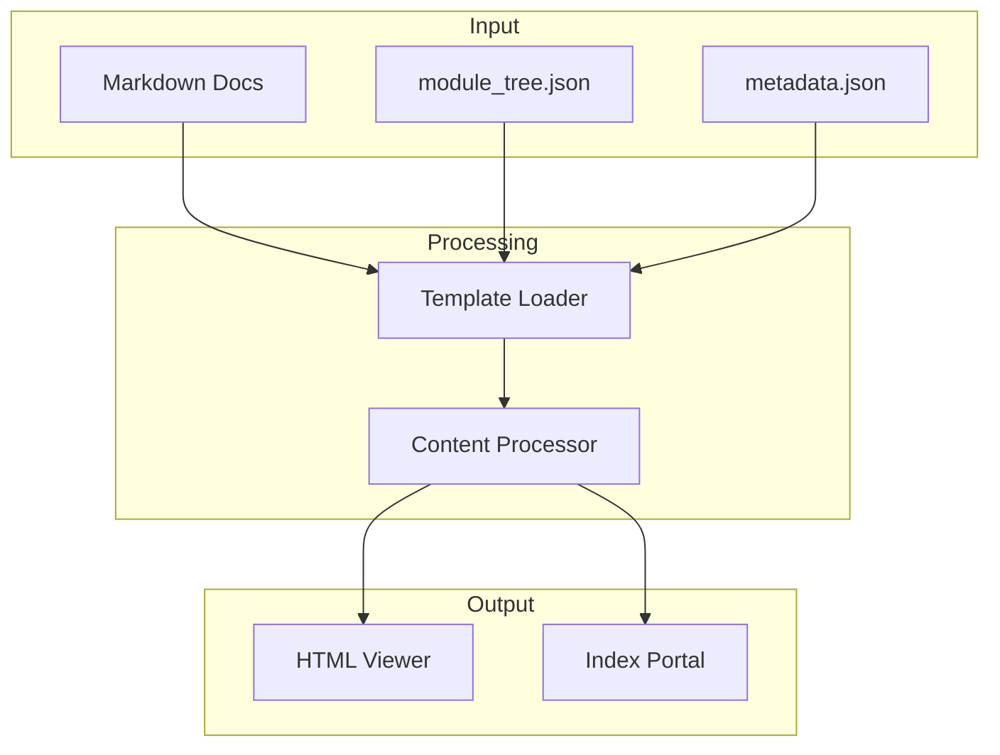

# HTML 生成器

HTML 生成器为 GitHub Pages 部署创建静态 HTML 文档查看器。它将生成的 Markdown 文档转换为具有导航、搜索和语法高亮功能的交互式 HTML 页面。

## 概述

HTML 生成器提供两种输出模式：

1. **查看器模式**：为单个文档集创建交互式查看器
2. **索引门户模式**：为多个文档集创建图库风格的门户

## 类定义

```python
class HTMLGenerator:
    def __init__(self, template_dir: Optional[Path] = None):
        """Initialize HTML generator."""
        if template_dir is None:
            template_dir = Path(__file__).parent.parent / "templates" / "github_pages"

        self.template_dir = Path(template_dir)
```

## 核心方法

### generate()

为单个文档集生成 HTML 文档查看器：

```python
def generate(
    self,
    output_path: Path,
    title: str,
    module_tree: Optional[Dict[str, Any]] = None,
    repository_url: Optional[str] = None,
    docs_dir: Optional[Path] = None,
    metadata: Optional[Dict[str, Any]] = None,
):
    """Generate HTML documentation viewer."""

    # Load module tree and metadata if not provided
    if docs_dir:
        if module_tree is None:
            module_tree = self.load_module_tree(docs_dir)
        if metadata is None:
            metadata = self.load_metadata(docs_dir)

    # Load template
    template_path = self.template_dir / "viewer_template.html"
    template_content = template_path.read_text()

    # Build info content
    info_content = self._build_info_content(metadata)

    # Replace placeholders
    html_content = template_content
    html_content = html_content.replace("{{TITLE}}", self._escape_html(title))
    html_content = html_content.replace("{{MODULE_TREE_JSON}}", json.dumps(module_tree))
    html_content = html_content.replace("{{METADATA_JSON}}", json.dumps(metadata))

    # Write output
    output_path.write_text(html_content)
```

### generate_index_portal()

为多个文档集创建图库门户：

```python
def generate_index_portal(
    self,
    output_path: Path,
    title: str,
    repository_url: Optional[str] = None,
    docs_root: Optional[Path] = None,
):
    """Generate index portal with gallery."""

    # Discover documentation sets
    wiki_gallery = []
    if docs_root and docs_root.exists():
        for child in sorted(docs_root.iterdir()):
            if child.is_dir() and not child.name.startswith('.'):
                if (child / "module_tree.json").exists():
                    metadata = self.load_metadata(child)
                    wiki_gallery.append({
                        "id": child.name,
                        "name": child.name.title(),
                        "path": child.name,
                        "description": f"Docs for {child.name}",
                        "statistics": metadata.get('statistics', {}),
                    })

    # Load template
    template = self.template_dir / "index_template.html"

    # Replace placeholders
    html = template.read_text()
    html = html.replace("{{TITLE}}", title)
    html = html.replace("{{WIKI_GALLERY_JSON}}", json.dumps(wiki_gallery))

    # Write output
    output_path.write_text(html)
```

## 模板变量

### 查看器模板

| 变量 | 描述 |
|----------|-------------|
| `{{TITLE}}` | 文档标题 |
| `{{REPO_LINK}}` | 仓库链接 HTML |
| `{{MODULE_TREE_JSON}}` | 模块树结构 |
| `{{METADATA_JSON}}` | 生成元数据 |
| `{{CONFIG_JSON}}` | 查看器配置 |
| `{{DOCS_BASE_PATH}}` | 文档基础路径 |
| `{{AVAILABLE_LANGUAGES}}` | 翻译语言 |

### 索引模板

| 变量 | 描述 |
|----------|-------------|
| `{{TITLE}}` | 门户标题 |
| `{{REPO_LINK}}` | 仓库链接 |
| `{{WIKI_GALLERY_JSON}}` | 图库项 |

## 数据加载

### load_module_tree()

```python
def load_module_tree(self, docs_dir: Path) -> Dict[str, Any]:
    """Load module tree from documentation directory."""
    module_tree_path = docs_dir / "module_tree.json"

    if not module_tree_path.exists():
        return {"Overview": {"description": "Repository overview", "components": [], "children": {}}}

    return json.loads(module_tree_path.read_text())
```

### load_metadata()

```python
def load_metadata(self, docs_dir: Path) -> Optional[Dict[str, Any]]:
    """Load metadata from documentation directory."""
    metadata_path = docs_dir / "metadata.json"

    if not metadata_path.exists():
        return None

    return json.loads(metadata_path.read_text())
```

## 语言检测

检测可用的翻译语言：

```python
def detect_available_languages(self, docs_dir: Path) -> List[str]:
    """Detect available translation language directories."""
    languages = []

    for child in sorted(docs_dir.iterdir()):
        if child.is_dir() and not child.name.startswith('.'):
            # Check for .md files
            if list(child.glob('*.md')):
                languages.append(child.name)

    return languages
```

## 仓库检测

从 git 提取仓库信息：

```python
def detect_repository_info(self, repo_path: Path) -> Dict[str, Optional[str]]:
    """Detect repository information from git."""
    info = {
        'name': repo_path.name,
        'url': None,
        'github_pages_url': None,
    }

    repo = git.Repo(repo_path)

    # Get remote URL
    if repo.remotes:
        url = repo.remotes.origin.url
        # Clean SSH URL
        if url.startswith('git@github.com:'):
            url = url.replace('git@github.com:', 'https://github.com/')

        # Compute GitHub Pages URL
        if 'github.com' in url:
            owner, repo = url.split('/')[-2:]
            info['github_pages_url'] = f"https://{owner}.github.io/{repo}/"

    return info
```

## HTML 输出结构



## 相关文档

- [文档生成器](documentation_generator.md)
- [CLI 入口点](cli_overview.md)