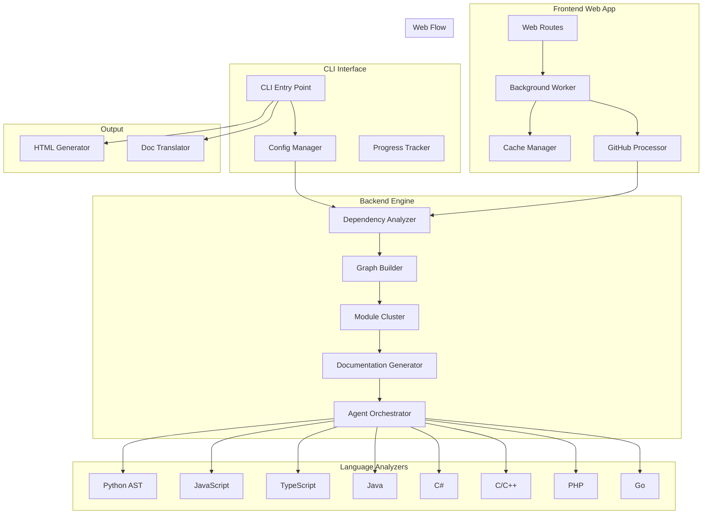
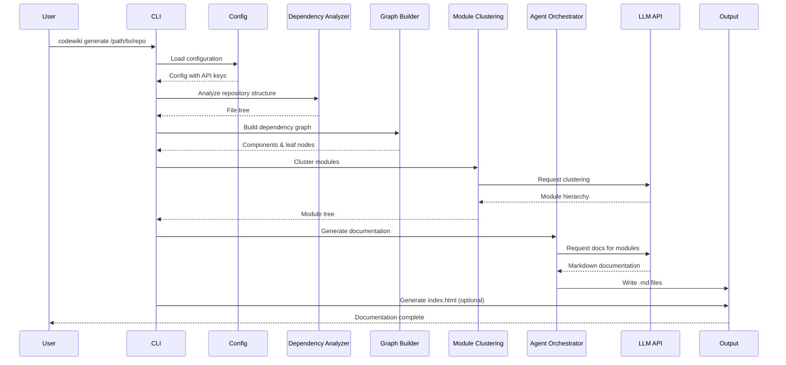
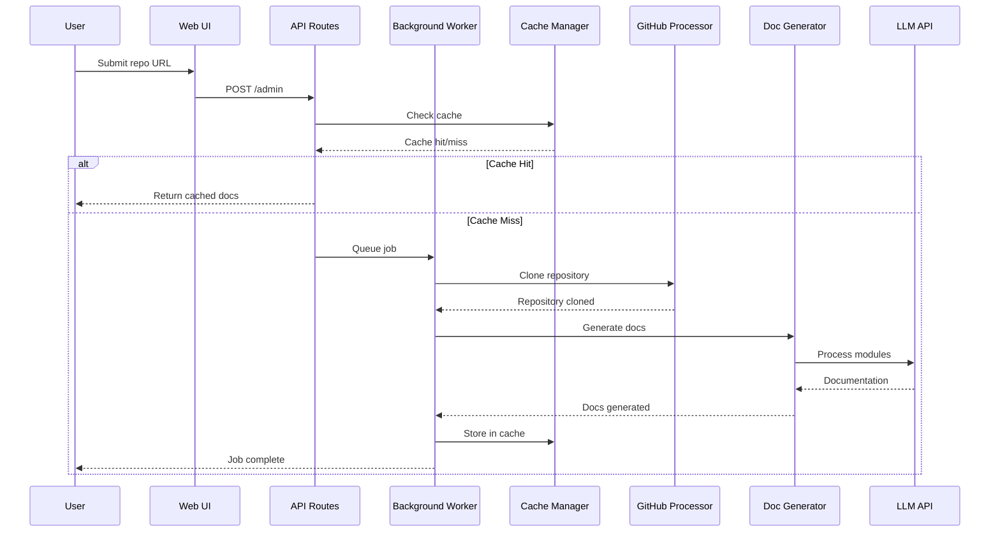
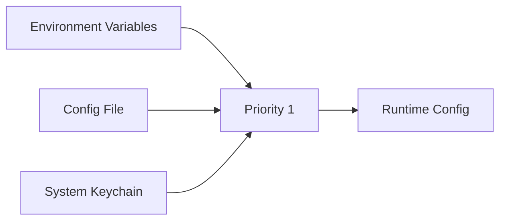

# CodeWiki 文档

CodeWiki 是一个智能文档生成系统，可以自动分析源代码仓库并使用大型语言模型生成全面的文档。它支持多种编程语言，并提供 CLI 接口和基于 Web 的前端。

## 概述

CodeWiki 通过以下方式将您的代码库转换为结构良好的文档：

1.  **分析代码结构** - 解析仓库以提取类、函数、方法及其关系
2.  **模块聚类** - 使用 LLM 驱动的分析将相关组件分组为逻辑模块
3.  **生成文档** - 为每个模块创建详细的 Markdown 文档
4.  **多语言支持** - 支持 Python、JavaScript、TypeScript、Java、C#、C、C++、PHP 和 Go
5.  **翻译** - 可以将文档翻译成多种语言

## 架构



## 系统组件

### CLI 组件

CLI 提供了一个命令行界面，用于从任何目录生成文档。

| 组件 | 描述 | 文档 |
|-----------|-------------|---------------|
| `config_manager` | 管理配置，支持环境变量、配置文件和钥匙串 | [config_manager.md](config_manager.md) |
| `html_generator` | 为 GitHub Pages 生成静态 HTML 文档查看器 | [html_generator.md](html_generator.md) |
| `git_manager` | 处理 git 操作，包括分支创建和提交 | [git_manager.md](git_manager.md) |
| `progress` | 进度跟踪和 ETA 估算 | [progress.md](progress.md) |
| `job` | 作业数据模型和统计信息 | [job.md](job.md) |
| `translator` | 生成后的多语言翻译 | [translator.md](translator.md) |

### 后端组件

后端处理核心文档生成逻辑。

| 组件 | 描述 | 文档 |
|-----------|-------------|---------------|
| `documentation_generator` | 文档生成的主要编排器 | [documentation_generator.md](documentation_generator.md) |
| `agent_orchestrator` | 使用 pydantic-ai 进行 AI 代理编排 | [agent_orchestrator.md](agent_orchestrator.md) |
| `cmd_agent_orchestrator` | 用于无限上下文的 CLI 代理子进程 | [cmd_agent_orchestrator.md](cmd_agent_orchestrator.md) |
| `dependency_analyzer` | 代码依赖分析和图构建 | [dependency_analyzer.md](dependency_analyzer.md) |
| `agent_tools` | AI 代理可用的工具 | [agent_tools.md](agent_tools.md) |
| `config` | 后端配置管理 | [config.md](config.md) |

### 前端组件

Web 前端提供了一个用于管理文档作业的 UI。

| 组件 | 描述 | 文档 |
|-----------|-------------|---------------|
| `routes` | FastAPI 路由处理器 | [routes.md](routes.md) |
| `background_worker` | 后台作业处理 | [background_worker.md](background_worker.md) |
| `cache_manager` | 文档缓存管理 | [cache_manager.md](cache_manager.md) |
| `github_processor` | GitHub 仓库处理 | [github_processor.md](github_processor.md) |
| `models` | Web 应用程序的数据模型 | [models.md](models.md) |

### 语言分析器

CodeWiki 通过专用分析器支持多种编程语言：

| 语言 | 分析器 | 文档 |
|----------|----------|---------------|
| Python | `PythonASTAnalyzer` | [python_analyzer.md](python_analyzer.md) |
| JavaScript | `TreeSitterJSAnalyzer` | [javascript_analyzer.md](javascript_analyzer.md) |
| TypeScript | `TreeSitterTSAnalyzer` | [typescript_analyzer.md](typescript_analyzer.md) |
| Java | `TreeSitterJavaAnalyzer` | [java_analyzer.md](java_analyzer.md) |
| C# | `TreeSitterCSharpAnalyzer` | [csharp_analyzer.md](csharp_analyzer.md) |
| C | `TreeSitterCAnalyzer` | [c_analyzer.md](c_analyzer.md) |
| C++ | `TreeSitterCppAnalyzer` | [cpp_analyzer.md](cpp_analyzer.md) |
| PHP | `TreeSitterPHPAnalyzer` | [php_analyzer.md](php_analyzer.md) |
| Go | `TreeSitterGoAnalyzer` | [go_analyzer.md](go_analyzer.md) |

## 数据流

### 文档生成流程



### Web 应用流程



## 配置

CodeWiki 支持具有多个优先级的灵活配置：



有关详细配置选项，请参阅 [config_manager.md](config_manager.md)。

## 使用方法

### CLI 使用

```bash
# Generate documentation for a repository
codewiki generate /path/to/repo

# With custom output directory
codewiki generate /path/to/repo --output ./docs

# Generate with HTML viewer
codewiki generate /path/to/repo --github-pages

# Generate index portal
codewiki generate /path/to/repo --index-page

# Translate to Chinese
codewiki generate /path/to/repo --output-lang zh

# With custom agent command
codewiki generate /path/to/repo --with-agent-cmd "claude -p"
```

### Web 应用程序

```bash
# Start web server
codewiki web

# Access at http://127.0.0.1:8000
```

## 输出结构

生成的文档遵循以下结构：

docs/
├── index.html              # HTML viewer (if --github-pages)
├── overview.md            # Repository overview
├── module_tree.json       # Module hierarchy
├── metadata.json          # Generation metadata
├── core_module.md         # Core modules documentation
├── utils_module.md        # Utility modules
└── zh/                   # Translated documentation (optional)
    ├── overview.md
    └── ...

## 高级功能

- **动态规划处理**：模块按最优顺序处理（优先处理叶子模块，然后是父模块）
- **缓存系统**：避免为未更改的仓库重新生成文档
- **并发控制**：并行处理多个模块
- **自定义指令**：为文档生成提供具体指令
- **Git 集成**：自动为生成的文档创建分支和提交