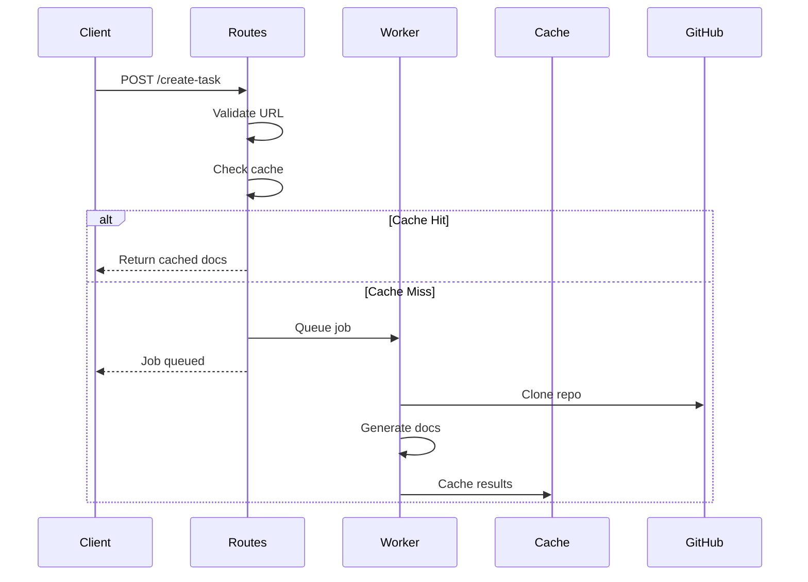

# 路由

Routes 模块处理 CodeWiki FastAPI 应用程序的所有 Web HTTP 路由。

## 概述

Routes 提供了以下内容的 REST 端点和 HTML 页面：
- 仓库提交
- 任务状态跟踪
- 文档查看
- 任务管理

## 类定义

```python
class WebRoutes:
    def __init__(self, background_worker: BackgroundWorker, cache_manager: CacheManager):
        self.background_worker = background_worker
        self.cache_manager = cache_manager
```

## 主要路由

### index_get() / index_post()

主页处理程序：

```python
async def index_get(self, request: Request) -> HTMLResponse:
    """包含用于提交 Git 仓库的表单的主页。"""
    return await self.admin_get(request)

async def index_post(self, request: Request, ...) -> HTMLResponse:
    """处理仓库提交。"""
    return await self.admin_post(request, ...)
```

### get_job_status()

获取任务状态的 API 端点：

```python
async def get_job_status(self, job_id: str) -> JobStatusResponse:
    """获取任务状态的 API 端点。"""
    job = self.background_worker.get_job_status(job_id)

    if not job:
        raise HTTPException(status_code=404, detail="未找到任务")

    return JobStatusResponse(**asdict(job))
```

### view_docs()

重定向到文档查看器：

```python
async def view_docs(self, job_id: str) -> RedirectResponse:
    """查看生成的文档。"""
    job = self.background_worker.get_job_status(job_id)

    if not job or job.status != 'completed':
        raise HTTPException(status_code=404, detail="文档不可用")

    return RedirectResponse(url=f"/static-docs/{job_id}/", status_code=302)
```

### serve_generated_docs()

提供文档文件服务：

```python
async def serve_generated_docs(self, job_id: str, filename: str = "overview.md") -> HTMLResponse:
    """提供生成的文档文件服务。"""
    # 1. 查找文档
    docs_path = self._find_docs_path(job_id)

    # 2. 加载模块树
    module_tree = file_manager.load_json(docs_path / "module_tree.json")

    # 3. 加载 markdown 内容
    content = file_manager.load_text(docs_path / filename)

    # 4. 转换为 HTML
    html_content = markdown_to_html(content)

    # 5. 渲染模板
    return HTMLResponse(content=render_template(DOCS_VIEW_TEMPLATE, {
        "title": filename,
        "content": html_content,
        "navigation": module_tree,
    }))
```

## 任务管理路由

### list_tasks()

列出所有任务，支持可选过滤：

```python
async def list_tasks(self, status_filter: str = None) -> JSONResponse:
    """列出所有任务的 API 端点。"""
    all_jobs = self.background_worker.get_all_jobs()
    jobs_list = []

    for job_id, job in all_jobs.items():
        if status_filter and job.status != status_filter:
            continue
        jobs_list.append(JobStatusResponse(...))

    jobs_list.sort(key=lambda x: x.created_at, reverse=True)
    return JSONResponse(content=[job.dict() for job in jobs_list])
```

### create_task_api()

创建新任务：

```python
async def create_task_api(self, repo_url: str, ...) -> JSONResponse:
    """创建新任务的 API 端点。"""
    # 验证 URL
    if not GitHubRepoProcessor.is_valid_github_url(repo_url):
        raise HTTPException(status_code=400, detail="无效的 Git 仓库 URL")

    # 规范化 URL
    normalized_url = self._normalize_github_url(repo_url)
    repo_info = GitHubRepoProcessor.get_repo_info(normalized_url)

    # 创建任务
    job_id = self._repo_full_name_to_job_id(repo_info['full_name'])
    job = JobStatus(
        job_id=job_id,
        repo_url=normalized_url,
        status='queued',
        created_at=datetime.now(),
        ...
    )

    self.background_worker.add_job(job_id, job)

    return JSONResponse(content={"job_id": job_id, "status": "queued"})
```

### delete_task()

删除任务：

```python
async def delete_task(self, job_id: str) -> JSONResponse:
    """删除任务的 API 端点。"""
    job = self.background_worker.get_job_status(job_id)

    if not job:
        raise HTTPException(status_code=404, detail="未找到任务")

    if job.status == 'processing':
        raise HTTPException(status_code=400, detail="无法删除正在处理中的任务")

    del self.background_worker.job_status[job_id]

    return JSONResponse(content={"message": "任务已成功删除"})
```

## 管理员路由

### admin_get()

管理员页面：

```python
async def admin_get(self, request: Request) -> HTMLResponse:
    """用于管理任务的管理员页面。"""
    all_jobs = self.background_worker.get_all_jobs()
    jobs_list = sorted(all_jobs.values(), key=lambda x: x.created_at, reverse=True)

    # 按状态统计
    queued = sum(1 for j in jobs_list if j.status == 'queued')
    processing = sum(1 for j in jobs_list if j.status == 'processing')
    completed = sum(1 for j in jobs_list if j.status == 'completed')
    failed = sum(1 for j in jobs_list if j.status == 'failed')

    return HTMLResponse(content=render_template(ADMIN_TEMPLATE, {
        "jobs": jobs_list,
        "queued_count": queued,
        "processing_count": processing,
        "completed_count": completed,
        "failed_count": failed,
    }))
```

### admin_post()

来自管理员的任务提交：

```python
async def admin_post(self, request: Request, ...) -> HTMLResponse:
    """处理来自管理员页面的任务提交。"""
    # 逻辑与 create_task_api 相同，但返回管理员页面
    ...

    return await self.admin_get(request)
```

## URL 辅助函数

### _normalize_github_url()

规范化 GitHub URL：

```python
def _normalize_github_url(self, url: str) -> str:
    """规范化 Git 仓库 URL 以便进行一致的比较。"""
    repo_info = GitHubRepoProcessor.get_repo_info(url)
    return f"https://{repo_info['domain']}/{repo_info['full_name']}"
```

### _job_id_to_repo_full_name()

转换任务 ID：

```python
def _job_id_to_repo_full_name(self, job_id: str) -> str:
    """将任务 ID 转换回仓库全名。"""
    return job_id.replace('--', '/')

def _repo_full_name_to_job_id(self, full_name: str) -> str:
    """将仓库全名转换为 URL 安全的任务 ID。"""
    return full_name.replace('/', '--')
```

## API 流程



## 相关文档

- [后台工作器](background_worker.md)
- [缓存管理器](cache_manager.md)
- [模型](models.md)