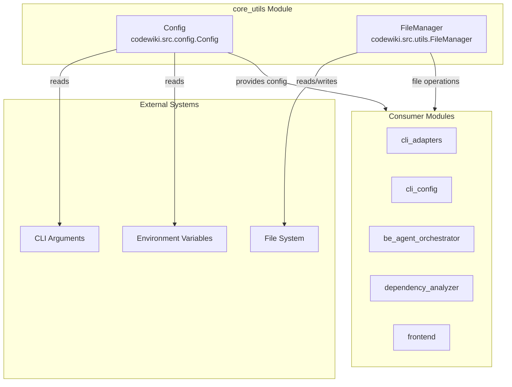
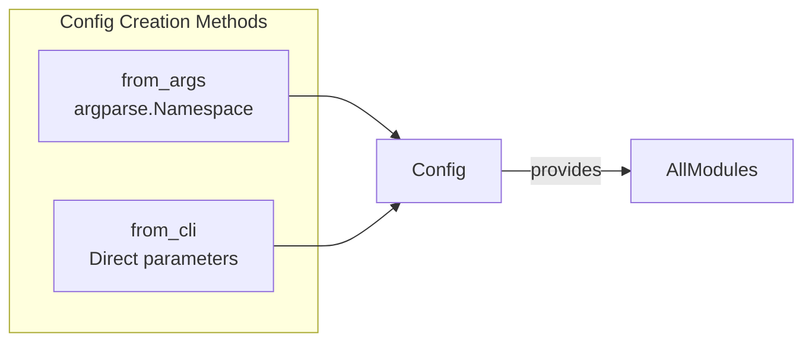

# Core Utils Module

The `core_utils` module provides foundational configuration and utility components for the CodeWiki system. It handles application configuration management and basic file I/O operations that are essential throughout the application.

## Overview

The `core_utils` module consists of two primary components:

- **`Config`**: Central configuration class that manages all settings for the CodeWiki documentation generator
- **`FileManager`**: Utility class for standardized file and directory operations

These components form the base layer that other modules depend on for configuration and file handling.

## Architecture



## Components

### Config (`codewiki.src.config.Config`)

The `Config` class is a comprehensive configuration management system that centralizes all settings required by the CodeWiki application.

#### Key Responsibilities

- **Directory Configuration**: Manages paths for output, dependency graphs, and documentation
- **LLM Service Configuration**: Handles API endpoints, authentication, and model selection
- **Token Limits**: Controls maximum token usage for different processing stages
- **Agent Instructions**: Supports customizable documentation generation instructions

#### Configuration Properties

| Property | Type | Description |
|----------|------|-------------|
| `repo_path` | str | Path to the repository to document |
| `output_dir` | str | Base output directory |
| `docs_dir` | str | Directory for generated documentation |
| `llm_base_url` | str | LLM API base URL |
| `llm_api_key` | str | API key for LLM authentication |
| `main_model` | str | Primary LLM model to use |
| `cluster_model` | str | Model used for code clustering |
| `fallback_models` | List[str] | Ordered list of fallback models |
| `max_tokens` | int | Maximum tokens for LLM responses |
| `max_token_per_module` | int | Token limit per module during clustering |
| `max_depth` | int | Maximum depth for hierarchical decomposition |

#### Agent Instructions

The Config class supports rich agent instructions through the `agent_instructions` dictionary:

```python
@dataclass
class AgentInstructions:
    include_patterns: Optional[List[str]]  # File patterns to include
    exclude_patterns: Optional[List[str]]  # File patterns to exclude
    focus_modules: Optional[List[str]]     # Priority modules for detailed docs
    doc_type: Optional[str]                # Type: api, architecture, user-guide, developer
    custom_instructions: Optional[str]     # Free-form custom instructions
```

#### Factory Methods



- **`from_args(args: argparse.Namespace)`**: Creates Config from command-line argument parser results
- **`from_cli(...)`**: Creates Config directly from parameter values for programmatic use

### FileManager (`codewiki.src.utils.FileManager`)

The `FileManager` class provides static utility methods for file and directory operations, ensuring consistent I/O handling across the application.

#### Methods

| Method | Description |
|--------|-------------|
| `ensure_directory(path)` | Creates directory with `exist_ok=True` |
| `save_json(data, filepath)` | Serializes and saves data as JSON |
| `load_json(filepath)` | Loads JSON file, returns None if missing |
| `save_text(content, filepath)` | Writes text content to file |
| `load_text(filepath)` | Reads text content from file |

#### Usage Pattern

```python
from codewiki.src.utils import file_manager

# Directory operations
file_manager.ensure_directory('/path/to/output')

# JSON operations
file_manager.save_json({'key': 'value'}, 'data.json')
data = file_manager.load_json('data.json')

# Text operations
file_manager.save_text('content', 'file.txt')
content = file_manager.load_text('file.txt')
```

## Integration with Other Modules

The `core_utils` module serves as a foundation for all other modules in the CodeWiki system:

| Module | Usage |
|--------|-------|
| [cli_adapters](cli_adapters.md) | Uses Config for documentation generation settings |
| [cli_config](cli_config.md) | Reads/writes configuration via ConfigManager |
| [be_agent_orchestrator](be_agent_orchestrator.md) | Uses Config for agent execution settings |
| [dependency_analyzer](dependency_analyzer.md) | Uses FileManager for graph and analysis output |
| [frontend](frontend.md) | Uses Config for web application settings |

## Constants

The module also defines important constants used throughout the system:

```python
OUTPUT_BASE_DIR = 'output'           # Base directory for all output
DEPENDENCY_GRAPHS_DIR = 'dependency_graphs'  # Subdirectory for dependency graphs
DOCS_DIR = 'docs'                    # Subdirectory for documentation
FIRST_MODULE_TREE_FILENAME = 'first_module_tree.json'
MODULE_TREE_FILENAME = 'module_tree.json'
OVERVIEW_FILENAME = 'overview.md'
MAX_DEPTH = 2                         # Default maximum depth for module tree

# Token limits
DEFAULT_MAX_TOKENS = 32_768
DEFAULT_MAX_TOKEN_PER_MODULE = 36_369
DEFAULT_MAX_TOKEN_PER_LEAF_MODULE = 16_000
```

## CLI Context Detection

The module includes context detection for distinguishing between CLI and web application modes:

```python
set_cli_context(enabled: bool)  # Set running context
is_cli_context() -> bool        # Check current context
```

This allows the configuration system to adapt based on whether CodeWiki is running as a command-line tool or as a web application.