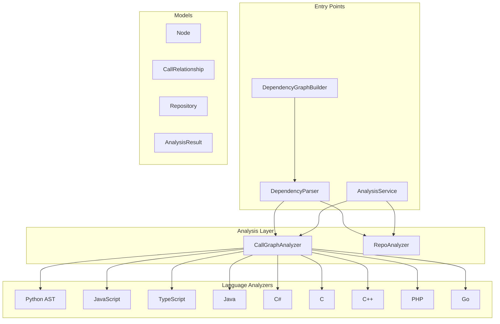
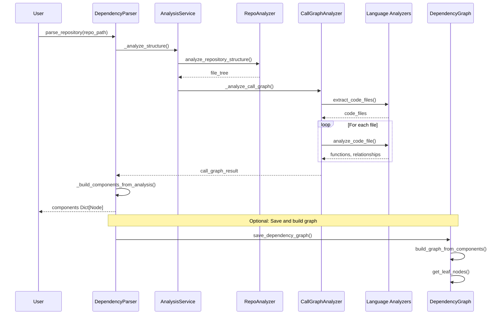

# Dependency Analyzer Module

The dependency_analyzer module is a comprehensive multi-language code analysis framework designed to extract, analyze, and visualize code dependencies across repositories. It provides tools for understanding code structure, function calls, class relationships, and overall architecture of software projects.

## Overview

The module supports parsing and analyzing code in multiple programming languages including Python, JavaScript, TypeScript, Java, C#, C, C++, PHP, and Go. It extracts code components (functions, classes, methods, interfaces, etc.) and builds dependency graphs to help developers understand how different parts of their codebase relate to each other.

## Architecture



## Core Components

### Parsing and Graph Building

| Component | File | Description |
|-----------|------|-------------|
| DependencyParser | [dependency_analyzer.md#dependencyparser](dependency_analyzer.md#dependencyparser) | Extracts code components from multi-language repositories |
| DependencyGraphBuilder | [dependency_analyzer.md#dependencygraphbuilder](dependency_analyzer.md#dependencygraphbuilder) | Builds and manages dependency graphs with topological sorting |

### Analysis Services

| Component | File | Description |
|-----------|------|-------------|
| AnalysisService | [analysis_service.md](analysis_service.md) | Centralized orchestration for repository analysis |
| CallGraphAnalyzer | [call_graph_analyzer.md](call_graph_analyzer.md) | Multi-language call graph analysis coordinator |
| RepoAnalyzer | [repo_analyzer.md](repo_analyzer.md) | Repository structure and file tree analysis |

### Language-Specific Analyzers

The module includes specialized analyzers for each supported programming language:

| Language | Analyzer | Documentation |
|----------|----------|---------------|
| Python | PythonASTAnalyzer | [python_analyzer.md](python_analyzer.md) |
| JavaScript | TreeSitterJSAnalyzer | [javascript_analyzer.md](javascript_analyzer.md) |
| TypeScript | TreeSitterTSAnalyzer | [typescript_analyzer.md](typescript_analyzer.md) |
| Java | TreeSitterJavaAnalyzer | [java_analyzer.md](java_analyzer.md) |
| C# | TreeSitterCSharpAnalyzer | [csharp_analyzer.md](csharp_analyzer.md) |
| C | TreeSitterCAnalyzer | [c_analyzer.md](c_analyzer.md) |
| C++ | TreeSitterCppAnalyzer | [cpp_analyzer.md](cpp_analyzer.md) |
| PHP | TreeSitterPHPAnalyzer, NamespaceResolver | [php_analyzer.md](php_analyzer.md) |
| Go | TreeSitterGoAnalyzer | [go_analyzer.md](go_analyzer.md) |

### Data Models

| Model | File | Description |
|-------|------|-------------|
| Node | [models.md](models.md) | Represents a code component (function, class, method) |
| CallRelationship | [models.md](models.md) | Represents dependencies between components |
| Repository | [models.md](models.md) | Contains repository metadata |
| AnalysisResult | [analysis_models.md](analysis_models.md) | Complete analysis output with visualization data |

### Utilities

| Component | File | Description |
|-----------|------|-------------|
| ColoredFormatter | [logging_config.md](logging_config.md) | Colored console logging for better debugging |

## Data Flow



## Usage

### Basic Repository Analysis

```python
from codewiki.src.be.dependency_analyzer.ast_parser import DependencyParser

parser = DependencyParser(
    repo_path="/path/to/repo",
    include_patterns=["*.py", "*.js"],
    exclude_patterns=["*test*", "node_modules"]
)

components = parser.parse_repository()
print(f"Found {len(components)} components")
```

### Building Dependency Graphs

```python
from codewiki.src.be.dependency_analyzer.dependency_graphs_builder import DependencyGraphBuilder
from codewiki.src.config import Config

config = Config(repo_path="/path/to/repo")
builder = DependencyGraphBuilder(config)
components, leaf_nodes = builder.build_dependency_graph()
```

### Full Repository Analysis with GitHub URL

```python
from codewiki.src.be.dependency_analyzer.analysis.analysis_service import AnalysisService

service = AnalysisService()
result = service.analyze_repository_full(
    github_url="https://github.com/owner/repo",
    include_patterns=["*.py", "*.js"],
    exclude_patterns=["*test*.py"]
)

print(f"Analyzed {result.summary['total_functions']} functions")
print(f"Found {result.summary['total_relationships']} relationships")
```

## Supported Languages

The dependency analyzer supports the following languages with their respective file extensions:

| Language | Extensions | Analyzer |
|----------|------------|----------|
| Python | .py, .pyx | PythonASTAnalyzer |
| JavaScript | .js, .jsx, .mjs, .cjs | TreeSitterJSAnalyzer |
| TypeScript | .ts, .tsx | TreeSitterTSAnalyzer |
| Java | .java | TreeSitterJavaAnalyzer |
| C# | .cs | TreeSitterCSharpAnalyzer |
| C | .c, .h | TreeSitterCAnalyzer |
| C++ | .cpp, .cc, .cxx, .hpp, .hxx | TreeSitterCppAnalyzer |
| PHP | .php, .phtml, .inc | TreeSitterPHPAnalyzer |
| Go | .go | TreeSitterGoAnalyzer |

## Integration with Other Modules

The dependency_analyzer module integrates with several other modules in the CodeWiki system:

- **cli_config** - Uses Config for settings management
- **be_agent_orchestrator** - Provides analysis results for documentationcli_adapters** - Works with DocTranslator for multi generation
- **-language documentation
- **core_utils** - Uses FileManager for file operations

See also: [cli_adapters.md](cli_adapters.md), [cli_config.md](cli_config.md), [be_agent_orchestrator.md](be_agent_orchestrator.md), [core_utils.md](core_utils.md)