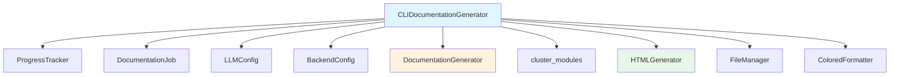

# CLIDocumentationGenerator

**File:** `codewiki/cli/adapters/doc_generator.py`

The `CLIDocumentationGenerator` is the primary orchestrator for documentation generation in the CLI. It wraps the backend `DocumentationGenerator` and provides a complete end-to-end pipeline for analyzing repositories and generating documentation.

## Overview

`CLIDocumentationGenerator` manages the full documentation generation workflow as a 5-stage pipeline:

1. **Dependency Analysis** (40% of time) - Analyzes source code and builds dependency graph
2. **Module Clustering** (20% of time) - Groups related components into modules using LLM
3. **Documentation Generation** (30% of time) - Generates markdown documentation for each module
4. **HTML Generation** (5% of time, optional) - Creates HTML viewer for GitHub Pages
5. **Finalization** (5% of time) - Completes job and saves metadata

## Class Definition

```python
class CLIDocumentationGenerator:
    """
    CLI adapter for documentation generation with progress reporting.

    This class wraps the backend documentation generator and adds
    CLI-specific features like progress tracking and error handling.
    """
```

## Initialization

```python
def __init__(
    self,
    repo_path: Path,
    output_dir: Path,
    config: Dict[str, Any],
    verbose: bool = False,
    generate_html: bool = False
)
```

**Parameters:**
| Parameter | Type | Description |
|-----------|------|-------------|
| `repo_path` | `Path` | Path to the repository to document |
| `output_dir` | `Path` | Output directory for generated docs |
| `config` | `Dict[str, Any]` | LLM configuration dictionary |
| `verbose` | `bool` | Enable verbose output with detailed progress |
| `generate_html` | `bool` | Whether to generate HTML viewer |

**Config dictionary expected keys:**
- `base_url` - LLM API base URL
- `api_key` - LLM API key
- `main_model` - Primary model for documentation generation
- `cluster_model` - Model for module clustering
- `fallback_model` - Fallback model name
- `fallback_models` - List of additional fallback models
- `agent_cmd` - Agent command for complex tasks
- `max_tokens` - Max tokens for LLM responses (default: 32768)
- `max_token_per_module` - Max tokens per module (default: 36369)
- `max_token_per_leaf_module` - Max tokens for leaf modules (default: 16000)
- `max_depth` - Maximum dependency depth (default: 2)
- `concurrency` - Number of parallel workers (default: 1)

## Core Methods

### generate()

```python
def generate(self) -> DocumentationJob
```

Main entry point that executes the complete documentation generation pipeline.

**Returns:** `DocumentationJob` - Completed job with statistics and file list

**Raises:**
- `APIError` - If LLM API call fails
- `Exception` - Other errors during generation

**Process:**
1. Initializes job start time
2. Creates backend configuration
3. Executes 5-stage pipeline
4. Returns completed DocumentationJob

### _run_backend_generation()

```python
async def _run_backend_generation(self, backend_config: BackendConfig)
```

Executes the core backend documentation generation with progress tracking.

**Stage 1: Dependency Analysis**
- Creates `DocumentationGenerator` with backend config
- Calls `graph_builder.build_dependency_graph()`
- Updates job statistics with analyzed files and leaf nodes

**Stage 2: Module Clustering**
- Calls `cluster_modules()` to group components
- Saves module tree to `module_tree.json` and `first_module_tree.json`
- Updates job module count

**Stage 3: Documentation Generation**
- Calls `doc_generator.generate_module_documentation()`
- Creates documentation metadata
- Collects generated markdown and JSON files

### _run_html_generation()

```python
def _run_html_generation(self)
```

Optional stage that generates HTML viewer. Only executed if `generate_html=True`.

**Process:**
1. Detects repository info from git
2. Creates HTMLGenerator instance
3. Generates `index.html` with embedded module tree

### _finalize_job()

```python
def _finalize_job(self)
```

Finalizes the job by verifying/creating metadata file.

## Progress Tracking

The `CLIDocumentationGenerator` uses `ProgressTracker` for real-time progress updates:

```python
from codewiki.cli.utils.progress import ProgressTracker

# 5 stages with different weights
STAGE_WEIGHTS = {
    1: 0.40,  # Dependency Analysis
    2: 0.20,  # Module Clustering
    3: 0.30,  # Documentation Generation
    4: 0.05,  # HTML Generation (optional)
    5: 0.05,  # Finalization
}
```

## Backend Logging Configuration

The adapter configures backend logging for CLI use:

```python
def _configure_backend_logging(self)
```

**Behavior:**
- **Verbose mode**: Shows INFO and above, uses colored formatter
- **Non-verbose mode**: Shows only WARNING and ERROR, suppresses backend INFO/DEBUG

## Job Management

The adapter manages a `DocumentationJob` object throughout the pipeline:

| Attribute | Description |
|-----------|-------------|
| `job_id` | Unique identifier |
| `repository_path` | Path to source repository |
| `repository_name` | Repository name |
| `output_directory` | Output directory path |
| `status` | Job status (PENDING, RUNNING, COMPLETED, FAILED) |
| `statistics` | Generation statistics |
| `files_generated` | List of generated files |
| `module_count` | Number of modules created |

## Error Handling

Errors are caught and propagated with meaningful messages:

```python
try:
    # Stage operations
except APIError as e:
    self.job.fail(str(e))
    raise
except Exception as e:
    self.job.fail(str(e))
    raise
```

## Dependencies



## Usage Example

```python
from pathlib import Path
from codewiki.cli.adapters.doc_generator import CLIDocumentationGenerator

# Configure
config = {
    'base_url': 'https://api.openai.com/v1',
    'api_key': 'sk-your-key',
    'main_model': 'gpt-4o',
    'cluster_model': 'gpt-4o-mini',
    'concurrency': 4,
    'max_depth': 2,
    'max_tokens': 32768
}

# Generate documentation
generator = CLIDocumentationGenerator(
    repo_path=Path('/path/to/repo'),
    output_dir=Path('/path/to/docs'),
    config=config,
    verbose=True,
    generate_html=True
)

job = generator.generate()

print(f"Status: {job.status}")
print(f"Modules: {job.module_count}")
print(f"Files: {len(job.files_generated)}")
print(f"Files analyzed: {job.statistics.total_files_analyzed}")
print(f"Leaf nodes: {job.statistics.leaf_nodes}")
```

## Integration with CLI Commands

The `CLIDocumentationGenerator` is used by the `generate` command in `codewiki/cli/commands/generate.py`:

```python
from codewiki.cli.adapters.doc_generator import CLIDocumentationGenerator

# In generate command
generator = CLIDocumentationGenerator(
    repo_path=Path(args.repo_path),
    output_dir=Path(args.output_dir),
    config=config_dict,
    verbose=args.verbose,
    generate_html=args.html
)
job = generator.generate()
```
