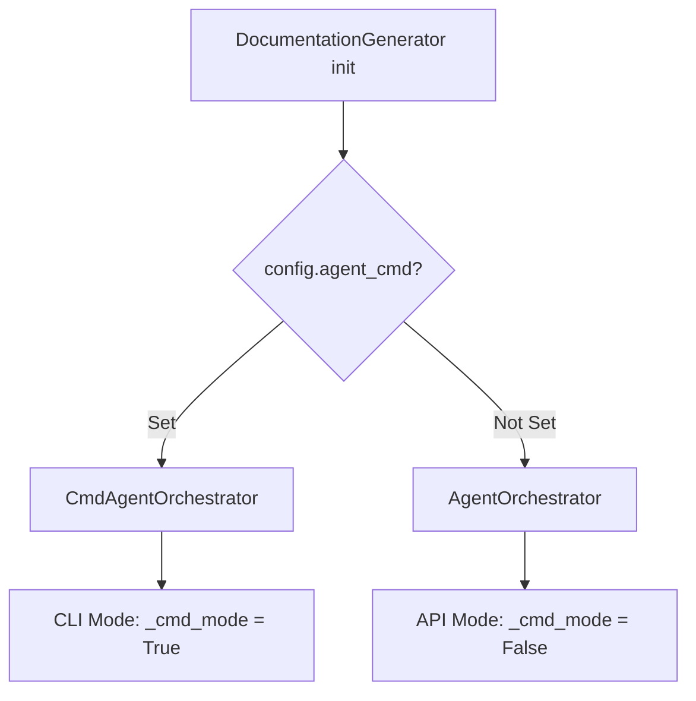
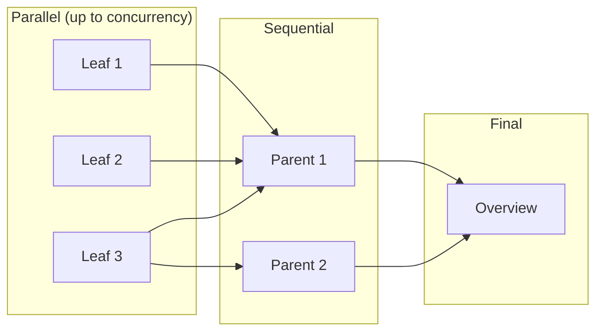
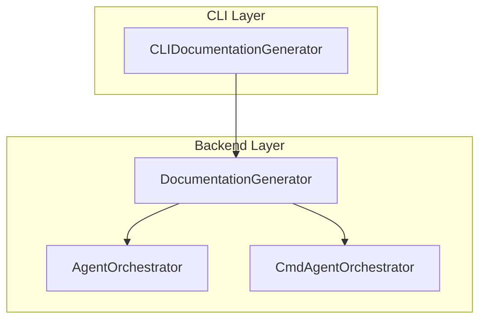

# DocumentationGenerator

The `DocumentationGenerator` class (in `codewiki/src/be/documentation_generator.py`) is the main orchestrator for CodeWiki's backend documentation generation pipeline. It coordinates dependency analysis, module clustering, and documentation generation to produce comprehensive module documentation.

## Overview

DocumentationGenerator serves as the entry point for the backend documentation generation process. It manages:

- Dependency graph building via DependencyGraphBuilder
- Module clustering using cluster_modules
- Parallel processing of leaf modules
- Sequential parent module aggregation
- Repository overview generation

## Class Definition

```python
class DocumentationGenerator:
    """Main documentation generation orchestrator."""

    def __init__(self, config: Config, commit_id: str = None):
        self.config = config
        self.commit_id = commit_id
        self.graph_builder = DependencyGraphBuilder(config)

        # Choose orchestrator: CLI agent subprocess or pydantic-ai API
        if getattr(config, 'agent_cmd', None):
            from codewiki.src.be.cmd_agent_orchestrator import CmdAgentOrchestrator
            self.agent_orchestrator = CmdAgentOrchestrator(config, config.agent_cmd)
            self._cmd_mode = True
        else:
            self.agent_orchestrator = AgentOrchestrator(config)
            self._cmd_mode = False
```

## Orchestrator Selection



## Core Methods

### `run`

The main entry point that executes the complete documentation pipeline:

```python
async def run(self) -> None:
```

#### Pipeline Steps

1. Build dependency graph using `DependencyGraphBuilder`
2. Cluster components into modules using `cluster_modules`
3. Generate module documentation via `generate_module_documentation`
4. Create metadata file with generation information

```mermaid
flowchart TB
    A[run()] --> B[build_dependency_graph]
    B --> C[cluster_modules]
    C --> D[generate_module_documentation]
    D --> E[create_documentation_metadata]
    E --> F[Complete]
```

### `generate_module_documentation`

Orchestrates the documentation generation for all modules using a dynamic programming approach:

```python
async def generate_module_documentation(
    self,
    components: Dict[str, Any],
    leaf_nodes: List[str],
    concurrency: int = 1,
) -> str:
```

#### Processing Strategy

The method uses a **topological processing order** that ensures:
- Leaf modules are processed before their parent modules
- Independent leaf modules can be processed in parallel
- Parent modules aggregate children's documentation



### `get_processing_order`

Determines the optimal processing order using topological sort:

```python
def get_processing_order(self, module_tree: Dict[str, Any],
                         parent_path: List[str] = []) -> List[tuple[List[str], str]]:
```

This method ensures that:
- Child modules are processed before their parents
- Leaf modules are added immediately when encountered
- Parent modules are added after all their children

### `generate_parent_module_docs`

Generates overview documentation for parent modules by aggregating children's docs:

```python
async def generate_parent_module_docs(self, module_path: List[str],
                                     working_dir: str) -> Dict[str, Any]:
```

#### CLI Mode Path

When in CLI mode (`_cmd_mode = True`), delegates to `CmdAgentOrchestrator.generate_parent_module_docs()`.

#### API Mode Path

When in API mode:
1. Loads module tree
2. Builds repo structure with 1-depth children docs embedded
3. Calls LLM with appropriate prompt template
4. Extracts and saves the overview content

### `build_overview_structure`

Builds the structure passed to LLM for overview generation:

```python
def build_overview_structure(self, module_tree: Dict[str, Any],
                            module_path: List[str],
                            working_dir: str) -> Dict[str, Any]:
```

This method:
- Creates a deep copy of the module tree
- Traverses to the target module
- Marks it with `is_target_for_overview_generation = True`
- Embeds each child's markdown documentation
- Returns the enriched structure

### `is_leaf_module`

Determines if a module is a leaf (has no children):

```python
def is_leaf_module(self, module_info: Dict[str, Any]) -> bool:
    children = module_info.get("children", {})
    return not children or (isinstance(children, dict) and len(children) == 0)
```

### `create_documentation_metadata`

Generates a metadata file with information about the documentation generation:

```python
def create_documentation_metadata(self, working_dir: str,
                                  components: Dict[str, Any],
                                  num_leaf_nodes: int):
```

Creates `metadata.json` containing:
- Generation timestamp
- Model information
- Statistics (total components, leaf nodes, max depth)
- List of generated files

## Parallel Processing

The system supports configurable concurrency for leaf module processing:

```python
# Build semaphore for concurrency control
sem = asyncio.Semaphore(concurrency)

async def _process_one(module_path, module_name, module_info):
    async with sem:
        # Process module
```

- **concurrency=1**: Sequential processing (no lock needed)
- **concurrency>1**: Parallel processing with semaphore control

## Module Detection Modes

### Multi-Module Mode

When the repository fits in context but has multiple modules:
- Process each module individually
- Generate parent overviews by aggregating children's docs

### Single Module Mode

When the entire repo fits in context:
- Process as one module
- Rename output to `overview.md`

```python
if len(module_tree) > 0:
    # Multi-module processing
    # ... process leaves in parallel
    # ... process parents sequentially
    # ... generate final overview
else:
    # Single module processing
    final_module_tree = await self.agent_orchestrator.process_module(...)
    # Rename repo_name.md to overview.md
```

## Integration with Agent Orchestrators

DocumentationGenerator delegates to either:

| Mode | Orchestrator | Use Case |
|------|--------------|----------|
| API | `AgentOrchestrator` | Standard API calls with fallback models |
| CLI | `CmdAgentOrchestrator` | Large repos exceeding context limits |

See [agent_orchestrator.md](agent_orchestrator.md) and [cmd_agent_orchestrator.md](cmd_agent_orchestrator.md) for details.

## Error Handling

The `run` method includes comprehensive error handling:

```python
try:
    # ... documentation generation ...
except Exception as e:
    logger.error(f"Documentation generation failed: {str(e)}")
    logger.error(f"Traceback: {traceback.format_exc()}")
    raise
```

## Progress Tracking

The system prints progress to stdout during generation:

```
  [1/10] ▶ [leaf] module_name (2.3s)
  [2/10] ✓ [leaf] module_name (1.5s)
  [3/10] ↩ [skip] module_name
  [4/10] ✗ [error] module_name: error message
```

## Output Files

The generator creates:

| File | Description |
|------|-------------|
| `module_tree.json` | Current module hierarchy |
| `first_module_tree.json` | Initial module clustering |
| `{module_name}.md` | Individual module documentation |
| `overview.md` | Repository overview |
| `metadata.json` | Generation metadata |

## Configuration

DocumentationGenerator uses the [Config](cli_models.md#configuration) from `cli_models` with settings for:

- Repository path and documentation directory
- Model selection and fallbacks
- Maximum dependency analysis depth
- Custom prompt instructions
- Concurrency level
- CLI agent command (when in CLI mode)

## Relationship with CLIDocumentationGenerator

The backend `DocumentationGenerator` is wrapped by `CLIDocumentationGenerator` in the CLI layer. See [cli_adapters.md](cli_adapters.md) for the CLI adapter details.


