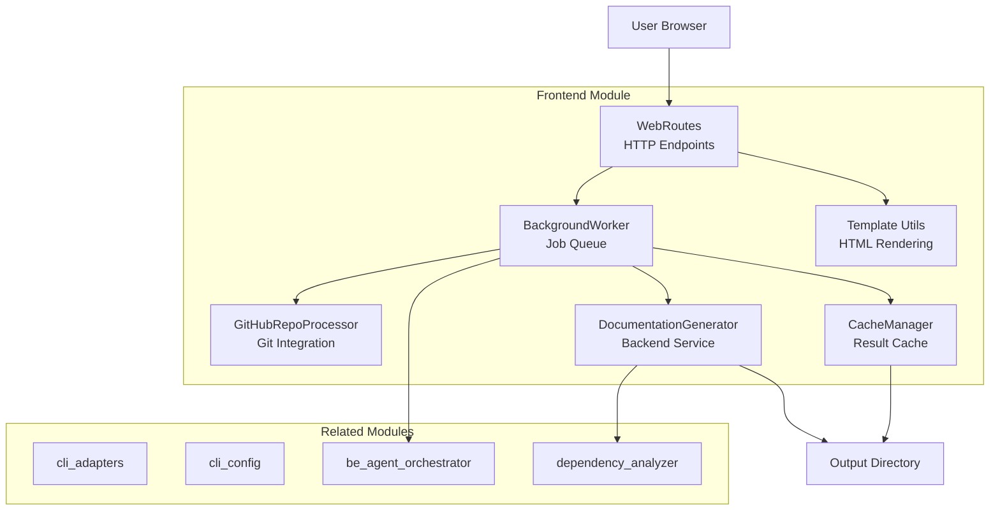
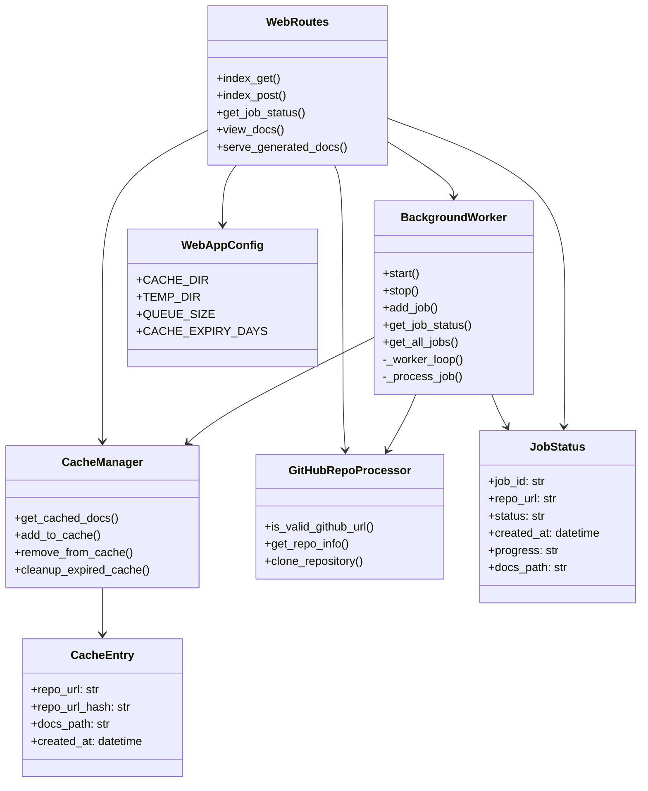
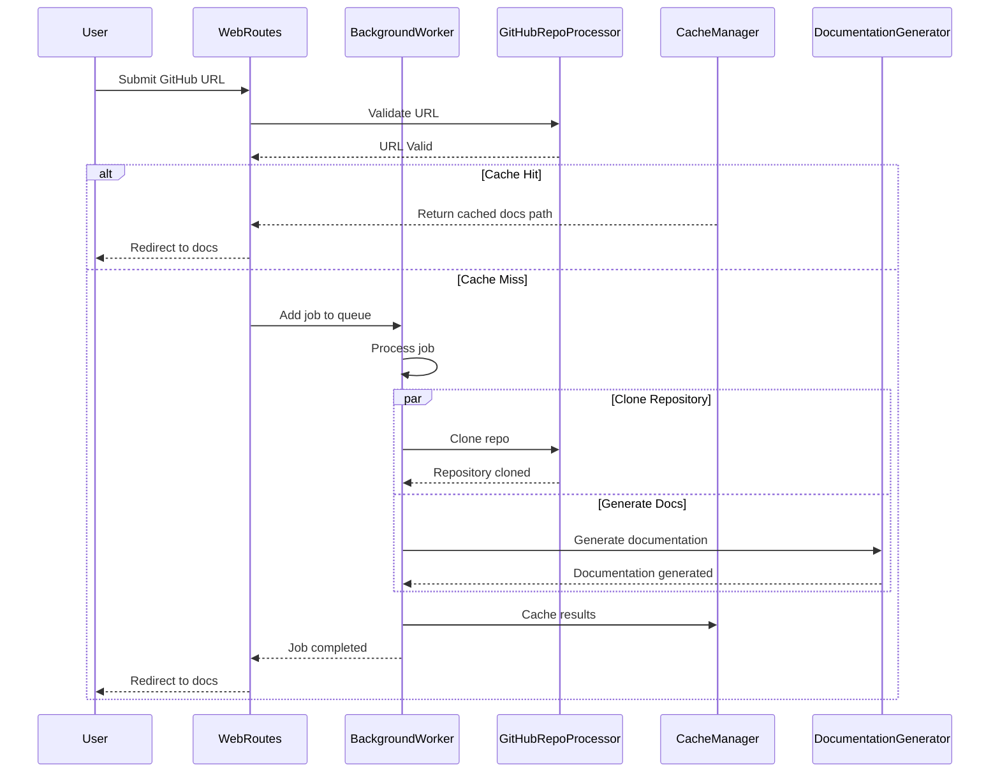

# Frontend Module Documentation

## Overview

The **frontend** module (`codewiki.src.fe`) provides the web interface and job management system for the CodeWiki documentation generation application. It is a FastAPI-based web application that accepts GitHub repository URLs, processes them through background jobs, generates documentation using the backend services, caches results for performance, and serves the generated documentation through a web interface.

This module handles the complete user-facing workflow: from repository submission to documentation viewing, including job queue management, caching, and HTML rendering.

## Architecture Overview

## Component Relationships

## Data Flow

## Sub-Modules

The frontend module is organized into the following functional sub-modules:

### 1. [Job Processing](frontend_job_processing.md)
- **BackgroundWorker**: Manages the job queue and processes documentation generation tasks asynchronously
- Handles repository cloning, documentation generation, and result caching

### 2. [Cache Management](frontend_cache_management.md)
- **CacheManager**: Implements a caching layer for generated documentation
- Uses SHA256 hashing for repository URLs with configurable expiry

### 3. [GitHub Integration](frontend_github_integration.md)
- **GitHubRepoProcessor**: Handles GitHub repository validation, info extraction, and cloning
- Supports specific commit checkout for reproducible documentation

### 4. [Web Routing](frontend_web_routing.md)
- **WebRoutes**: FastAPI route handlers for the web interface
- Provides endpoints for submission, status checking, and documentation viewing

### 5. [Template System](frontend_template_system.md)
- **StringTemplateLoader**: Jinja2-based template rendering utilities
- Provides functions for rendering templates, navigation, and job lists

### 6. [Data Models](frontend_models.md)
- **JobStatus**: Tracks documentation generation job state
- **CacheEntry**: Represents cached documentation metadata
- **JobStatusResponse**: API response model
- **RepositorySubmission**: Form submission model

## Configuration

The module uses [WebAppConfig](frontend_config.md) for configuration settings:

| Setting | Default | Description |
|---------|---------|-------------|
| `CACHE_DIR` | `./output/cache` | Directory for cached documentation |
| `TEMP_DIR` | `./output/temp` | Temporary directory for cloned repos |
| `QUEUE_SIZE` | 100 | Maximum job queue size |
| `CACHE_EXPIRY_DAYS` | 365 | Cache expiration in days |
| `CLONE_TIMEOUT` | 300 seconds | Git clone timeout |
| `CLONE_DEPTH` | 1 | Shallow clone depth |

## Dependencies

### Internal Dependencies
- **DocumentationGenerator** from [be_agent_orchestrator](be_agent_orchestrator.md): Generates documentation from repositories
- **DependencyAnalyzer** from [dependency_analyzer](dependency_analyzer.md): Analyzes code dependencies
- **Config** from [core_utils](core_utils.md): Configuration management

### External Dependencies
- **FastAPI**: Web framework for route handling
- **Jinja2**: Template rendering engine
- **Pydantic**: Data validation
- **Git**: Repository cloning via subprocess

## Usage Flow

1. **Submission**: User submits a GitHub repository URL via web form
2. **Validation**: `GitHubRepoProcessor` validates the URL format
3. **Cache Check**: `CacheManager` checks for existing documentation
4. **Job Queue**: If not cached, job is added to `BackgroundWorker` queue
5. **Processing**: Background worker clones repo and generates docs
6. **Caching**: Results are cached for future requests
7. **Serving**: Generated documentation is served via web interface

## Error Handling

The module implements robust error handling:
- Repository URL validation with user-friendly error messages
- Job status tracking with progress information
- Graceful degradation when cache or temporary storage fails
- Automatic cleanup of old jobs and expired cache entries