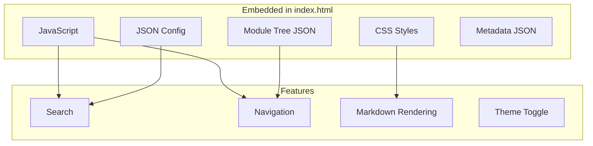
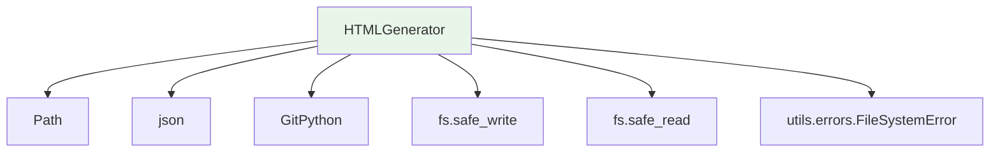

# HTMLGenerator

**File:** `codewiki/cli/html_generator.py`

The `HTMLGenerator` creates a self-contained static HTML viewer for documentation, suitable for deployment on GitHub Pages or local viewing.

## Overview

`HTMLGenerator` transforms the generated markdown documentation into an interactive HTML application with:

- Client-side markdown rendering
- Module tree navigation
- Repository information display
- Responsive design for various screen sizes

## Class Definition

```python
class HTMLGenerator:
    """
    Generates static HTML documentation viewer for GitHub Pages.

    Creates a self-contained index.html with embedded styles, scripts,
    and configuration for client-side markdown rendering.
    """
```

## Initialization

```python
def __init__(self, template_dir: Optional[Path] = None)
```

**Parameters:**
| Parameter | Type | Description |
|-----------|------|-------------|
| `template_dir` | `Optional[Path]` | Path to template directory |

If not provided, defaults to package templates at:
```
codewiki/templates/github_pages/viewer_template.html
```

## Core Methods

### generate()

```python
def generate(
    self,
    output_path: Path,
    title: str,
    module_tree: Optional[Dict[str, Any]] = None,
    repository_url: Optional[str] = None,
    github_pages_url: Optional[str] = None,
    config: Optional[Dict[str, Any]] = None,
    docs_dir: Optional[Path] = None,
    metadata: Optional[Dict[str, Any]] = None
)
```

Generates the HTML documentation viewer.

**Parameters:**
| Parameter | Type | Description |
|-----------|------|-------------|
| `output_path` | `Path` | Output file path (typically `index.html`) |
| `title` | `str` | Documentation title |
| `module_tree` | `Optional[Dict]` | Module tree structure |
| `repository_url` | `Optional[str]` | GitHub repository URL |
| `github_pages_url` | `Optional[str]` | Expected GitHub Pages URL |
| `config` | `Optional[Dict]` | Additional configuration |
| `docs_dir` | `Optional[Path]` | Docs directory (auto-loads module_tree and metadata) |
| `metadata` | `Optional[Dict]` | Metadata dictionary |

**Auto-loading Feature:**
If `docs_dir` is provided, the method automatically loads:
- `module_tree.json` from docs_dir
- `metadata.json` from docs_dir

### load_module_tree()

```python
def load_module_tree(self, docs_dir: Path) -> Dict[str, Any]
```

Loads module tree from documentation directory.

**Parameters:**
| Parameter | Type | Description |
|-----------|------|-------------|
| `docs_dir` | `Path` | Documentation directory path |

**Returns:** Module tree structure dictionary

**Fallback:** Returns a simple "Overview" structure if file not found

### load_metadata()

```python
def load_metadata(self, docs_dir: Path) -> Optional[Dict[str, Any]]
```

Loads metadata from documentation directory.

**Parameters:**
| Parameter | Type | Description |
|-----------|------|-------------|
| `docs_dir` | `Path` | Documentation directory path |

**Returns:** Metadata dictionary or `None` if not found

### detect_repository_info()

```python
def detect_repository_info(self, repo_path: Path) -> Dict[str, Optional[str]]
```

Detects repository information from git.

**Parameters:**
| Parameter | Type | Description |
|-----------|------|-------------|
| `repo_path` | `Path` | Repository path |

**Returns:** Dictionary with:
- `name` - Repository name
- `url` - GitHub URL
- `github_pages_url` - Computed GitHub Pages URL

**Process:**
1. Gets repository name from path
2. Reads remote URL from git
3. Converts SSH URL to HTTPS if needed
4. Computes GitHub Pages URL

### _build_info_content()

```python
def _build_info_content(self, metadata: Optional[Dict[str, Any]]) -> str
```

Builds HTML content for the info section.

**Parameters:**
| Parameter | Type | Description |
|-----------|------|-------------|
| `metadata` | `Optional[Dict]` | Metadata dictionary |

**Returns:** HTML string for info content

Displays:
- Model used for generation
- Generation timestamp
- Commit ID
- Total components
- Maximum depth

### _escape_html()

```python
def _escape_html(self, text: str) -> str
```

Escapes HTML special characters.

**Parameters:**
| Parameter | Type | Description |
|-----------|------|-------------|
| `text` | `str` | Text to escape |

**Returns:** Escaped text

**Replaces:** `&`, `<`, `>`, `"`, `'`

## HTML Template Structure

The generated HTML includes:



### Template Placeholders

The template uses these placeholders:

| Placeholder | Description |
|-------------|-------------|
| `{{TITLE}}` | Page title |
| `{{REPO_LINK}}` | Repository link HTML |
| `{{SHOW_INFO}}` | Info section visibility |
| `{{INFO_CONTENT}}` | Info content HTML |
| `{{CONFIG_JSON}}` | Configuration JSON |
| `{{MODULE_TREE_JSON}}` | Module tree JSON |
| `{{METADATA_JSON}}` | Metadata JSON |
| `{{DOCS_BASE_PATH}}` | Base path for docs |

## Usage Example

### Basic Usage

```python
from pathlib import Path
from codewiki.cli.html_generator import HTMLGenerator

generator = HTMLGenerator()

# Generate with auto-loading
generator.generate(
    output_path=Path('/path/to/docs/index.html'),
    title='My Project Docs',
    docs_dir=Path('/path/to/docs')
)
```

### Manual Configuration

```python
from pathlib import Path
from codewiki.cli.html_generator import HTMLGenerator
import json

# Load custom data
with open('docs/module_tree.json') as f:
    module_tree = json.load(f)

with open('docs/metadata.json') as f:
    metadata = json.load(f)

generator = HTMLGenerator()
generator.generate(
    output_path=Path('docs/index.html'),
    title='My Project',
    module_tree=module_tree,
    repository_url='https://github.com/user/project',
    github_pages_url='https://user.github.io/project/',
    metadata=metadata
)
```

### With Repository Detection

```python
from pathlib import Path
from codewiki.cli.html_generator import HTMLGenerator

generator = HTMLGenerator()

# Auto-detect from git
repo_info = generator.detect_repository_info(Path('/path/to/repo'))
print(f"Name: {repo_info['name']}")
print(f"URL: {repo_info['url']}")
print(f"GitHub Pages: {repo_info['github_pages_url']}")

# Generate with detected info
generator.generate(
    output_path=Path('/path/to/docs/index.html'),
    title=repo_info['name'],
    repository_url=repo_info['url'],
    github_pages_url=repo_info['github_pages_url'],
    docs_dir=Path('/path/to/docs')
)
```

## Integration with CLIDocumentationGenerator

The `HTMLGenerator` is typically invoked from `CLIDocumentationGenerator`:

```python
from codewiki.cli.html_generator import HTMLGenerator

# In CLIDocumentationGenerator._run_html_generation()
def _run_html_generation(self):
    self.progress_tracker.start_stage(4, "HTML Generation")

    html_generator = HTMLGenerator()

    if self.verbose:
        self.progress_tracker.update_stage(0.3, "Loading module tree and metadata...")

    repo_info = html_generator.detect_repository_info(self.repo_path)

    output_path = self.output_dir / "index.html"
    html_generator.generate(
        output_path=output_path,
        title=repo_info['name'],
        repository_url=repo_info['url'],
        github_pages_url=repo_info['github_pages_url'],
        docs_dir=self.output_dir
    )

    self.job.files_generated.append("index.html")
```

## Dependencies



## Generated Output

The `HTMLGenerator` produces an `index.html` file that:

1. **Self-contained** - All CSS and JS embedded inline
2. **No dependencies** - Loads markdown from local files via fetch
3. **Responsive** - Works on desktop and mobile
4. **Searchable** - Client-side search across all modules
5. **Navigation** - Tree view for module browsing

### File Structure in Output

```
docs/
├── index.html          # Generated by HTMLGenerator
├── module_tree.json    # Loaded by HTMLGenerator
├── metadata.json       # Loaded by HTMLGenerator
├── overview.md        # Generated documentation
├── module_1.md
├── module_2.md
└── ...
```

## Error Handling

Template not found:
```python
if not template_path.exists():
    raise FileSystemError(f"Template not found: {template_path}")
```

JSON parse errors:
```python
try:
    content = safe_read(module_tree_path)
    return json.loads(content)
except Exception as e:
    raise FileSystemError(f"Failed to load module tree: {e}")
```

Non-critical metadata errors return `None` instead of failing.
