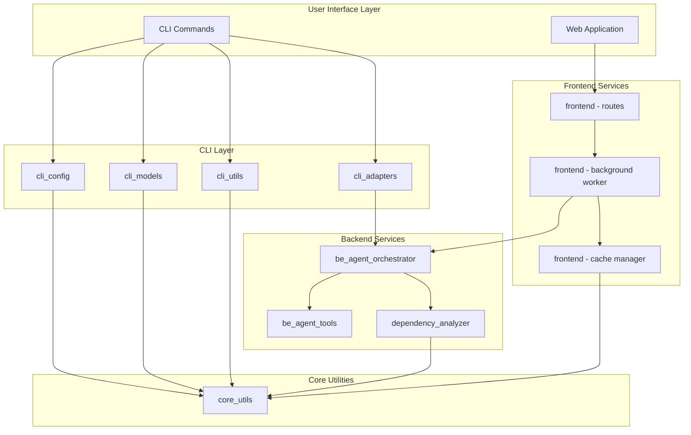
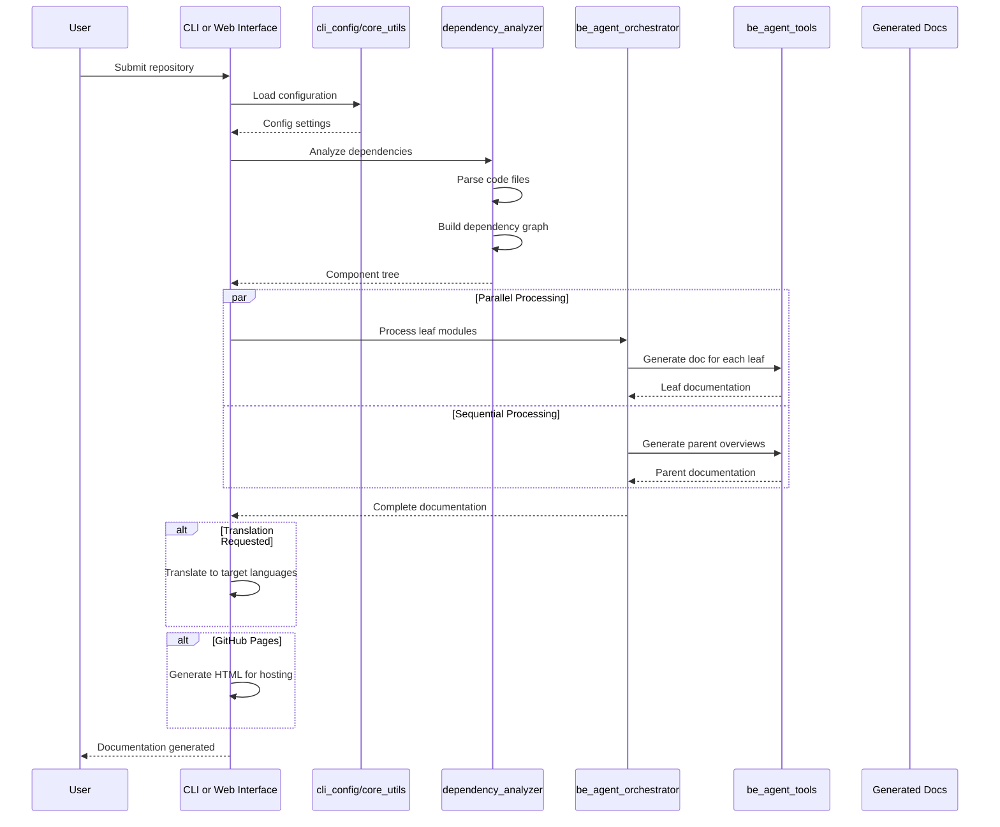

# CodeWiki Repository Overview

## Purpose

CodeWiki is an AI-powered documentation generation system that automatically analyzes source code repositories and produces comprehensive documentation using Large Language Models (LLMs). It supports multiple programming languages, provides multi-language translation of generated documentation, and offers both command-line and web-based interfaces for generating and viewing documentation.

Key capabilities include:
- Multi-language code analysis (Python, JavaScript, TypeScript, Java, C#, C, C++, PHP, Go)
- Automatic dependency graph construction and module clustering
- AI-driven documentation generation with customizable instructions
- Cascading translation with fallback models for robustness
- Parallel processing for improved performance
- GitHub Pages deployment support
- Web interface for repository submission and documentation viewing

## Architecture

### High-Level System Architecture



### End-to-End Documentation Generation Flow



### Data Flow Architecture

```mermaid
flowchart LR
    subgraph Input["Input"]
        Repo[Source Repository]
        Config[User Configuration]
        Instructions[Agent Instructions]
    end
    
    subgraph Processing["Processing Pipeline"]
        Direction TB
        Parse[Code Parsing]
        Cluster[Module Clustering]
        Generate[AI Generation]
        Translate[Translation]
    end
    
    subgraph Output["Output"]
        MDocs[Markdown Docs]
        HTML[HTML Viewer]
        Translations[Multi-language]
    end
    
    Repo --> Parse
    Config --> Parse
    Instructions --> Generate
    
    Parse --> Cluster
    Cluster --> Generate
    Generate --> MDocs
    Generate --> Translate
    Translate --> Translations
    MDocs --> HTML
```

## Core Modules

### CLI Layer

| Module | Documentation | Description |
|--------|---------------|-------------|
| **cli_adapters** | [cli_adapters.md](cli_adapters.md) | Bridges CLI commands with backend services; includes CLIDocumentationGenerator, DocTranslator, and HTMLGenerator |
| **cli_config** | [cli_config.md](cli_config.md) | Configuration management and git operations |
| **cli_models** | [cli_models.md](cli_models.md) | Data models for configuration and job tracking |
| **cli_utils** | [cli_utils.md](cli_utils.md) | Logging and progress tracking utilities |

### Backend Layer

| Module | Documentation | Description |
|--------|---------------|-------------|
| **be_agent_orchestrator** | [be_agent_orchestrator.md](be_agent_orchestrator.md) | Core orchestration for AI-driven documentation generation |
| **be_agent_tools** | [be_agent_tools.md](be_agent_tools.md) | Tools enabling AI agents to interact with source code |
| **dependency_analyzer** | [dependency_analyzer.md](dependency_analyzer.md) | Multi-language code analysis and dependency graph construction |

### Frontend Layer

| Module | Documentation | Description |
|--------|---------------|-------------|
| **frontend** | [frontend.md](frontend.md) | FastAPI web application for repository submission and documentation viewing |

### Core Layer

| Module | Documentation | Description |
|--------|---------------|-------------|
| **core_utils** | [core_utils.md](core_utils.md) | Foundational configuration and utility components |

## Supported Languages

The dependency analyzer supports the following programming languages:

| Language | Extensions |
|----------|------------|
| Python | .py, .pyx |
| JavaScript | .js, .jsx, .mjs, .cjs |
| TypeScript | .ts, .tsx |
| Java | .java |
| C# | .cs |
| C | .c, .h |
| C++ | .cpp, .cc, .cxx, .hpp, .hxx |
| PHP | .php, .phtml, .inc |
| Go | .go |

## Quick Start

### CLI Usage

```bash
# Generate documentation for a repository
codewiki gen /path/to/repo --output docs

# Generate with custom model
codewiki gen /path/to/repo --model gpt-4

# Translate to multiple languages
codewiki translate docs --to zh ja

# Generate HTML for GitHub Pages
codewiki html docs --push
```

### Web Application

```bash
# Start the web interface
codewiki web

# Open browser at http://localhost:8000
```

## Configuration

CodeWiki supports flexible configuration with a triple-fallback priority:
1. Environment variables (highest)
2. Config file (`~/.codewiki/config.json`)
3. System keychain (macOS Keychain / Linux Secret Service)

Key configuration options:
- `main_model`: Primary LLM for documentation generation
- `cluster_model`: Model for code clustering
- `fallback_models`: Ordered list of fallback models
- `max_tokens`: Maximum tokens per LLM request
- `max_depth`: Maximum dependency depth for hierarchy