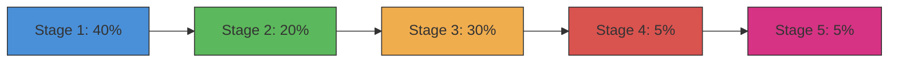

# Progress Tracking Sub-Module

The progress sub-module provides two classes for tracking and displaying progress during documentation generation: `ProgressTracker` for stage-based tracking and `ModuleProgressBar` for module-by-module progress.

## Overview

The progress sub-module (`progress.py`) delivers comprehensive progress tracking capabilities:

- **ProgressTracker**: Stage-based progress with ETA estimation
- **ModuleProgressBar**: Visual progress bar for individual module processing

## ProgressTracker Class

### Purpose

`ProgressTracker` manages the five-stage documentation generation workflow with:
- Weighted progress calculation across stages
- ETA estimation based on actual progress
- Verbose and non-verbose output modes

### Stage Definitions

The documentation generation workflow consists of 5 stages:

| Stage | Name | Weight | Description |
|-------|------|--------|-------------|
| 1 | Dependency Analysis | 40% | Analyzing code dependencies |
| 2 | Module Clustering | 20% | Grouping related modules |
| 3 | Documentation Generation | 30% | Generating documentation |
| 4 | HTML Generation | 5% | Creating HTML output (optional) |
| 5 | Finalization | 5% | Finalizing and saving results |

### Class Definition

```python
class ProgressTracker:
    STAGE_WEIGHTS = {
        1: 0.40,
        2: 0.20,
        3: 0.30,
        4: 0.05,
        5: 0.05,
    }

    def __init__(self, total_stages: int = 5, verbose: bool = False):
        self.total_stages = total_stages
        self.current_stage = 0
        self.stage_progress = 0.0
        self.start_time = time.time()
        self.verbose = verbose
```

### Methods

#### `start_stage(stage: int, description: Optional[str] = None)`

Marks the beginning of a new stage.

```python
tracker = ProgressTracker(verbose=True)
tracker.start_stage(1, "Dependency Analysis")
# Output: [00:00] Phase 1/5: Dependency Analysis (in blue, bold)
```

#### `update_stage(progress: float, message: Optional[str] = None)`

Updates progress within the current stage.

```python
tracker.update_stage(0.5, "Scanning files...")
# Updates internal progress to 50%
# In verbose mode, outputs: [00:15]   Scanning files...
```

#### `complete_stage(message: Optional[str] = None)`

Marks the current stage as complete.

```python
tracker.complete_stage("Found 50 modules")
# Output: [00:30]   Dependency Analysis complete (30.0s)
#         [00:30]   Found 50 modules
```

#### `get_overall_progress() -> float`

Calculates overall progress as a percentage (0.0 to 1.0).

```python
progress = tracker.get_overall_progress()
# Returns: 0.45 (45% complete considering stage weights)
```

#### `get_eta() -> Optional[str]`

Estimates remaining time to completion.

```python
eta = tracker.get_eta()
# Returns: "5m 30s" or "2h 15m" or None if cannot estimate
```

### Progress Calculation

Overall progress is calculated using weighted stages:



### Internal Methods

#### `_format_elapsed() -> str`

Formats elapsed time as MM:SS or HH:MM:SS.

```python
elapsed = tracker._format_elapsed()
# Returns: "02:30" or "1:02:30" for longer durations
```

## ModuleProgressBar Class

### Purpose

`ModuleProgressBar` provides a visual progress bar for tracking individual module processing:

- Displays progress through a terminal progress bar
- Shows ETA and percentage complete
- Supports verbose mode for detailed module listing

### Class Definition

```python
class ModuleProgressBar:
    def __init__(self, total_modules: int, verbose: bool = False):
        self.total_modules = total_modules
        self.current_module = 0
        self.verbose = verbose
```

### Methods

#### `update(module_name: str, cached: bool = False)`

Updates progress after processing a module.

```python
bar = ModuleProgressBar(total_modules=50, verbose=False)
bar.update("module_name", cached=False)
# Non-verbose: Advances progress bar
# Verbose: Outputs: [1/50] module_name... ⟳ (generating)
```

#### `finish()`

Closes and finalizes the progress bar.

```python
bar.finish()
# Cleans up the progress bar display
```

### Display Modes

#### Non-Verbose Mode

Uses Click's progress bar widget:

```
Generating modules [████████████░░░░░░░░░░░] 50% | ETA: 0:02:30
```

#### Verbose Mode

Lists each module as it's processed:

```
[1/50] core/utils... ⟳ (generating)
[2/50] core/config... ✓ (cached)
[3/50] cli/parser... ⟳ (generating)
```

## Usage Examples

### Stage-Based Progress Tracking

```python
from codewiki.cli.utils.progress import ProgressTracker

tracker = ProgressTracker(total_stages=5, verbose=True)

# Stage 1: Dependency Analysis
tracker.start_stage(1)
tracker.update_stage(0.25, "Scanning project files...")
tracker.update_stage(0.50, "Building dependency graph...")
tracker.update_stage(0.75, "Resolving external dependencies...")
tracker.complete_stage("Found 150 dependencies")

# Stage 2: Module Clustering
tracker.start_stage(2)
# ... continue through stages
```

### Module Progress Bar

```python
from codewiki.cli.utils.progress import ModuleProgressBar

# Non-verbose mode with progress bar
bar = ModuleProgressBar(total_modules=50, verbose=False)

modules = ["core/utils", "cli/parser", "be/agent", "fe/routes"]
for module in modules:
    # Process module...
    bar.update(module, cached=False)

bar.finish()
```

### Combined Usage

```python
from codewiki.cli.utils.progress import ProgressTracker, ModuleProgressBar

# Track overall stages
tracker = ProgressTracker(verbose=True)

# Stage 1
tracker.start_stage(1, "Dependency Analysis")
# ... perform analysis ...

# Stage 2
tracker.start_stage(2, "Module Clustering")
modules = cluster_modules(dependencies)
tracker.complete_stage(f"Clustered into {len(modules)} groups")

# Stage 3
tracker.start_stage(3, "Documentation Generation")
bar = ModuleProgressBar(len(modules), verbose=True)

for module in modules:
    doc = generate_doc(module)
    bar.update(module.name, cached=doc.cached)

bar.finish()
tracker.complete_stage(f"Generated {len(modules)} documents")

# Continue with stages 4 and 5...
```

## Dependencies

- **click**: For progress bar widget and colored output
- **time**: For timing and ETA calculation
- **datetime**: For timestamp formatting
- **typing**: For type hints (`Optional`, `Callable`)

## Integration

The progress tracking classes are used by:

- **[be_agent_orchestrator.md](be_agent_orchestrator.md)**: For tracking overall documentation generation
- **[cli_adapters.md](cli_adapters.md)**: For tracking translation and generation progress

## Error Handling

Both progress classes are designed to be resilient:

- Progress values are clamped to 0.0-1.0 range
- ETA returns None if progress is zero (cannot calculate)
- Progress bar cleanup is guaranteed even on exceptions
- No exceptions raised during normal operation
