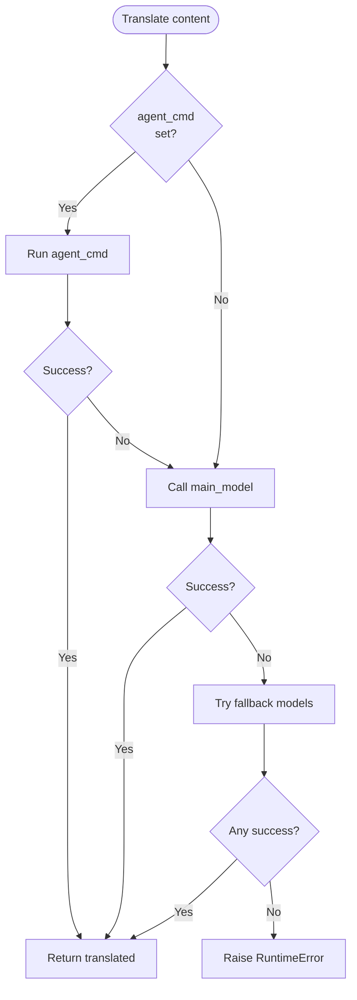
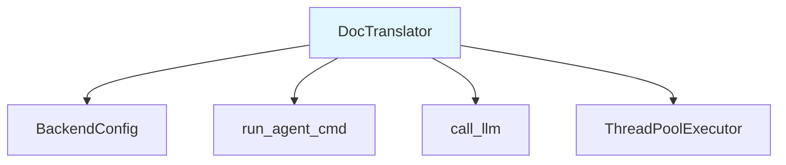

# DocTranslator

**File:** `codewiki/cli/adapters/translator.py`

The `DocTranslator` provides post-generation translation capabilities for documentation. It translates the generated markdown files into multiple languages using a cascading fallback approach.

## Overview

`DocTranslator` is invoked after documentation generation completes. It:

1. Reads all markdown (`.md`) files from the output directory
2. Translates each file using a cascade of backends
3. Writes translated files to `output_dir/<lang_code>/`
4. Copies non-markdown files (JSON metadata, etc.) unchanged

## Supported Languages

The translator supports the following languages:

| Code | Language |
|------|----------|
| `zh` | Simplified Chinese (简体中文) |
| `zh-tw` | Traditional Chinese (繁體中文) |
| `ja` | Japanese (日本語) |
| `ko` | Korean (한국어) |
| `fr` | French (Français) |
| `de` | German (Deutsch) |
| `es` | Spanish (Español) |
| `pt` | Portuguese (Português) |
| `ru` | Russian (Русский) |
| `ar` | Arabic (العربية) |
| `hi` | Hindi (हिन्दी) |
| `it` | Italian (Italiano) |

## Translation Prompt

The translator uses a carefully designed prompt that:

- Preserves ALL Markdown formatting (headers, bold, italics, code blocks, tables, links)
- Does NOT translate code block contents
- Does NOT translate command names, file paths, or proper nouns
- Keeps mermaid diagram source code EXACTLY as-is
- Does NOT add any preamble or explanation

```python
TRANSLATION_PROMPT = """You are a professional technical documentation translator.

Translate the following Markdown documentation into {language_name}.

Rules:
- Preserve ALL Markdown formatting (headers, bold, italics, code blocks, tables, links, mermaid diagrams).
- Do NOT translate code block contents, command names, file paths, or proper nouns (model names, package names, etc.).
- Keep mermaid diagram source code EXACTLY as-is (only translate the surrounding text if any).
- Do NOT add any extra commentary, preamble, or explanation — output ONLY the translated markdown.

--- BEGIN DOCUMENT ---
{content}
--- END DOCUMENT ---"""
```

## Class Definition

```python
class DocTranslator:
    """
    Translates generated markdown documentation into another language using
    the same LLM and credentials used for documentation generation.

    Translation cascade (first success wins):
    1. CLI agent subprocess (--with-agent-cmd) — no timeout / context limits
    2. Main model via API
    3. Fallback models via API
    4. Error → stop
    """
```

## Initialization

```python
def __init__(self, config: Dict[str, Any])
```

**Parameters:**
| Parameter | Type | Description |
|-----------|------|-------------|
| `config` | `Dict[str, Any]` | Configuration dictionary |

**Config dictionary expected keys:**
- `base_url` - LLM API base URL (required)
- `api_key` - LLM API key (required)
- `main_model` - Primary model for translation
- `cluster_model` - Cluster model (optional)
- `fallback_model` - Fallback model name (optional)
- `fallback_models` - List of additional fallback models
- `max_tokens` - Max tokens (default: 4096)
- `max_token_per_module` - Max tokens per module
- `max_token_per_leaf_module` - Max tokens for leaf modules
- `max_depth` - Maximum depth

## Core Methods

### translate_docs()

```python
def translate_docs(
    self,
    output_dir: Path,
    lang_code: str,
    progress_callback=None,
    concurrency: int = 4,
) -> Path
```

Translates all markdown files in the output directory.

**Parameters:**
| Parameter | Type | Description |
|-----------|------|-------------|
| `output_dir` | `Path` | Root docs directory |
| `lang_code` | `str` | Target language code (e.g., 'zh', 'ja') |
| `progress_callback` | `Callable` | Optional callback(current, total, filename) |
| `concurrency` | `int` | Number of parallel workers (default: 4) |

**Returns:** `Path` - Path to the translated output directory

**Raises:** `RuntimeError` - If any file fails after all fallbacks

**Process:**
1. Creates `output_dir/<lang_code>/` directory
2. Collects all `.md` files from `output_dir`
3. Creates thread pool for parallel translation
4. For each file:
   - Skips if already translated (checkpoint resume)
   - Translates using cascade
   - Writes to destination
5. Copies non-markdown files unchanged
6. Returns translated directory path

### _translate_content()

```python
def _translate_content(self, content: str, lang_code: str, filename: str = "") -> str
```

Translates a single markdown string using the cascading approach.

**Translation Cascade:**



**Cascade Order:**
1. **agent_cmd** - CLI agent subprocess (no timeout, no context limits)
2. **main_model** - Primary model via API (timeout: 300s)
3. **fallback_models** - Each fallback model in sequence (timeout: 300s)

**Returns:** Translated markdown string

**Raises:** `RuntimeError` - If all backends fail

### _get_backend_config()

```python
def _get_backend_config(self)
```

Lazily creates a `BackendConfig` from the CLI config dictionary.

## Parallel Translation

The translator uses `ThreadPoolExecutor` for parallel translation:

```python
workers = max(1, min(concurrency, total))
if workers == 1:
    # Serial path — no thread overhead
    for md_path in md_files:
        _translate_one(md_path)
else:
    with ThreadPoolExecutor(max_workers=workers) as pool:
        futures = {pool.submit(_translate_one, p): p for p in md_files}
        for future in as_completed(futures):
            future.result()
```

**Features:**
- Thread-safe progress counter
- Checkpoint resume (skips existing translations)
- Immediate error propagation

## Progress Callback

The `progress_callback` allows integration with CLI progress bars:

```python
def my_callback(current: int, total: int, filename: str):
    click.echo(f"[{current}/{total}] {filename}")

translator.translate_docs(
    output_dir=Path('/path/to/docs'),
    lang_code='zh',
    progress_callback=my_callback,
    concurrency=4
)
```

## Dependencies



## Usage Example

```python
from pathlib import Path
from codewiki.cli.adapters.translator import DocTranslator

# Configure (same as for generation)
config = {
    'base_url': 'https://api.openai.com/v1',
    'api_key': 'sk-your-key',
    'main_model': 'gpt-4o',
    'fallback_models': ['gpt-4o-mini', 'claude-3-haiku'],
    'agent_cmd': 'claude --print',  # Optional
    'max_tokens': 4096
}

translator = DocTranslator(config)

# Translate to Chinese
translated_dir = translator.translate_docs(
    output_dir=Path('/path/to/docs'),
    lang_code='zh',
    concurrency=4
)

print(f"Translated files in: {translated_dir}")
```

## Integration with CLI Commands

The `DocTranslator` is used by the `generate` command when `--output-lang` is specified:

```python
from codewiki.cli.adapters.translator import DocTranslator, LANGUAGE_NAMES

# In generate command
if output_lang:
    lang_name = LANGUAGE_NAMES.get(output_lang.lower(), output_lang)
    click.echo(f"      Translating to {lang_name} …")

    translator = DocTranslator(config={
        'base_url': config.base_url,
        'api_key': api_key,
        'main_model': config.main_model,
        'cluster_model': config.cluster_model,
        'fallback_model': config.fallback_model,
        'fallback_models': config.fallback_models,
        'agent_cmd': config.agent_cmd,
    })

    translator.translate_docs(
        output_dir=output_dir,
        lang_code=output_lang,
        concurrency=config.concurrency
    )
```

## Error Handling

When all translation backends fail:

```python
all_errors = "\n    ".join(errors)
raise RuntimeError(
    f"Translation failed for {filename}. All backends exhausted:\n    {all_errors}"
)
```

Example error message:
```
Translation failed for module_1.md. All backends exhausted:
    agent_cmd: Command failed with code 1
    main_model (gpt-4o): Rate limit exceeded
    fallback (gpt-4o-mini): Invalid API key
```

## File Preservation

Non-markdown files are copied unchanged:

```python
for other in output_dir.iterdir():
    if other.is_file() and not other.suffix == ".md" and other.name not in {"index.html"}:
        try:
            shutil.copy2(other, lang_dir / other.name)
        except Exception:
            pass
```

This ensures:
- `metadata.json` - preserved
- `module_tree.json` - preserved
- `index.html` - NOT copied (generated separately if needed)
- Other JSON/markdown files - preserved
