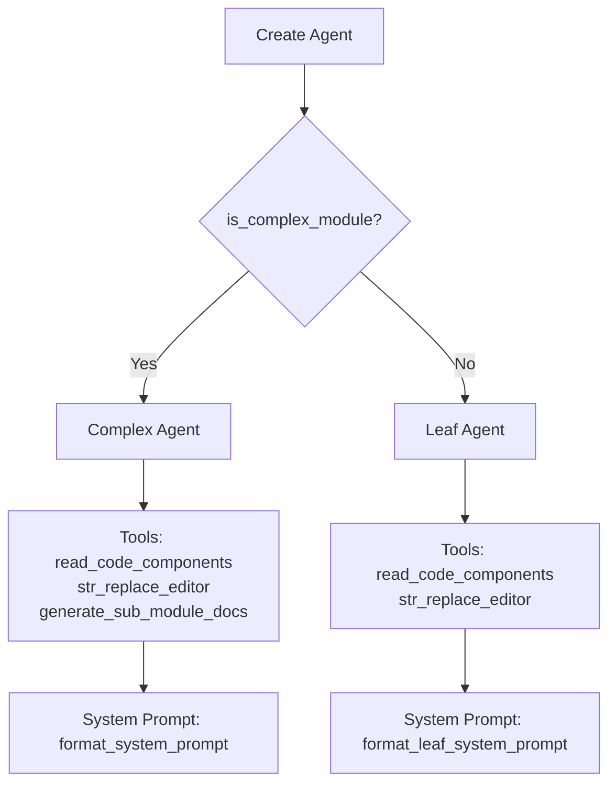

# AgentOrchestrator

`AgentOrchestrator` 类负责为文档生成创建和管理 pydantic-ai 代理。它提供了一个灵活的代理创建系统，能够适应模块的复杂性。

## 概述

AgentOrchestrator 充当文档生成管道与 pydantic-ai 代理框架之间的桥梁。它创建配备专门工具的 AI 代理，用于读取代码、编辑文件和生成子模块文档。

## 主要职责

1. **代理创建** - 根据模块复杂性使用适当配置创建 pydantic-ai 代理
2. **工具配置** - 为代理配备正确的工具集（读取、编辑、子模块生成）
3. **备用模型管理** - 处理多个备用模型以确保可靠性
4. **自定义指令** - 集成用户定义的提示补充

## 类定义

```python
class AgentOrchestrator:
    """Orchestrates the AI agents for documentation generation."""

    def __init__(self, config: Config):
        self.config = config
        self.fallback_models = create_fallback_models(config)
        self.custom_instructions = config.get_prompt_addition() if config else None
```

## 代理创建策略

编排器使用基于复杂性的方法来创建代理：



### 复杂模块

对于复杂模块（具有多个组件的模块），代理接收：

- **完整工具集**：`read_code_components_tool`、`str_replace_editor_tool`、`generate_sub_module_documentation_tool`
- **全面系统提示**：生成层级文档的详细说明
- **带模块树的 Deps**：完整访问模块层次结构以进行交叉引用

### 叶子模块

对于简单/叶子模块，代理接收：

- **有限工具集**：`read_code_components_tool`、`str_replace_editor_tool`
- **简化系统提示**：专注于单模块文档的说明
- **带组件的 Deps**：直接访问模块的组件

## `create_agent` 方法

```python
def create_agent(self, module_name: str, components: Dict[str, Any],
                core_component_ids: List[str]) -> Agent:
    """Create an appropriate agent based on module complexity."""

    if is_complex_module(components, core_component_ids):
        return Agent(
            self.fallback_models,
            name=module_name,
            deps_type=CodeWikiDeps,
            tools=[
                read_code_components_tool,
                str_replace_editor_tool,
                generate_sub_module_documentation_tool
            ],
            system_prompt=format_system_prompt(module_name, self.custom_instructions),
        )
    else:
        return Agent(
            self.fallback_models,
            name=module_name,
            deps_type=CodeWikiDeps,
            tools=[read_code_components_tool, str_replace_editor_tool],
            system_prompt=format_leaf_system_prompt(module_name, self.custom_instructions),
        )
```

## `process_module` 方法

此异步方法处理单个模块的文档生成：

```python
async def process_module(self, module_name: str, components: Dict[str, Node],
                       core_component_ids: List[str], module_path: List[str],
                       working_dir: str) -> Dict[str, Any]:
```

### 处理步骤

1. **加载模块树** - 检索现有模块层次结构
2. **检查现有文档** - 如果文档已存在则跳过
3. **创建代理** - 根据模块复杂性实例化代理
4. **准备依赖项** - 创建包含所有必要上下文的 `CodeWikiDeps`
5. **运行代理** - 使用格式化的提示执行代理
6. **保存结果** - 持久化更新的模块树

### CodeWikiDeps 结构

代理接收包含以下内容的依赖项：

```python
deps = CodeWikiDeps(
    absolute_docs_path=working_dir,      # Documentation output directory
    absolute_repo_path=str(os.path.abspath(self.config.repo_path)),
    registry={},                           # Tool registry
    components=components,                 # Module components
    path_to_current_module=module_path,    # Module path in hierarchy
    current_module_name=module_name,        # Current module name
    module_tree=module_tree,                # Full module tree
    max_depth=self.config.max_depth,        # Max analysis depth
    current_depth=1,                        # Current processing depth
    config=self.config,                    # Full configuration
    custom_instructions=self.custom_instructions
)
```

## 与工具的集成

编排器利用三个代理工具：

| 工具 | 用途 | 可用位置 |
|------|---------|--------------|
| `read_code_components_tool` | 读取和分析源代码 | 两者皆可 |
| `str_replace_editor_tool` | 编辑/写入文档文件 | 两者皆可 |
| `generate_sub_module_documentation_tool` | 生成子模块文档 | 仅复杂模块 |

## 备用模型

编排器使用 `create_fallback_models(config)` 设置备用模型。这在主模型失败或达到速率限制时提供可靠性。

## 错误处理

`process_module` 方法包含全面的错误处理：

```python
try:
    result = await agent.run(
        format_user_prompt(...),
        deps=deps
    )
    file_manager.save_json(deps.module_tree, module_tree_path)
    return deps.module_tree
except Exception as e:
    logger.error(f"Error processing module {module_name}: {str(e)}")
    logger.error(f"Traceback: {traceback.format_exc()}")
    raise
```

## 与 CmdAgentOrchestrator 的关系

AgentOrchestrator 是 `CmdAgentOrchestrator` 的 API 模式对应实现。两者实现相同的接口，允许 `DocumentationGenerator` 使用任一模式：

- **API 模式**（AgentOrchestrator）：使用 pydantic-ai 配合 OpenAI/Anthropic API
- **CLI 模式**（CmdAgentOrchestrator）：使用 CLI 代理子进程以获得无限上下文

有关 CLI 替代方案，请参阅 [cmd_agent_orchestrator.md](cmd_agent_orchestrator.md)。
