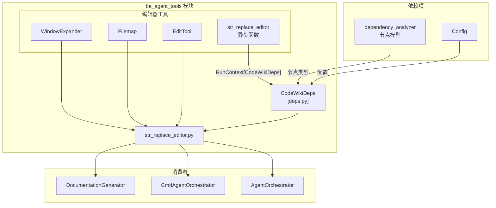
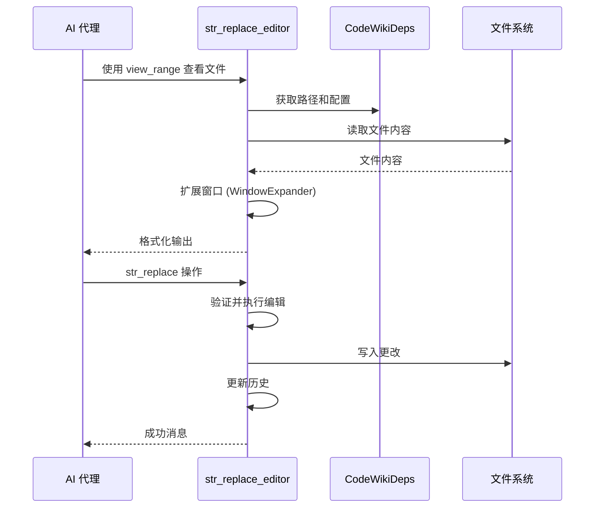

# be_agent_tools 模块文档

`be_agent_tools` 模块提供了使 AI 代理能够与源代码仓库和文档文件进行交互的核心工具。它作为自主代理与文件系统之间的接口层，允许代理在自动化文档生成工作流中查看、搜索、创建和修改代码及文档文件。

## 架构概述

## 核心组件

### 1. CodeWikiDeps (deps.py)

`CodeWikiDeps` 数据类作为上下文容器，为代理提供关于仓库、文档结构和配置的所有必要信息。它充当依赖注入容器，将必要的上下文传递给所有代理工具。

| 属性 | 类型 | 描述 |
|----------|------|-------------|
| `absolute_docs_path` | `str` | 文档输出目录的绝对路径 |
| `absolute_repo_path` | `str` | 源代码仓库的绝对路径 |
| `registry` | `dict` | 用于代理状态的持久键值存储 |
| `components` | `dict[str, Node]` | 将组件名称映射到依赖图节点的字典 |
| `path_to_current_module` | `list[str]` | 正在处理的模块的层级路径 |
| `current_module_name` | `str` | 当前模块的名称 |
| `module_tree` | `dict[str, any]` | 仓库模块的完整树结构 |
| `max_depth` | `int` | 递归操作的最大深度 |
| `current_depth` | `int` | 递归操作中的当前深度 |
| `config` | `Config` | LLM 配置设置 |
| `custom_instructions` | `str` | 代理的可选自定义指令 |

有关依赖分析模型（Node、Repository）的详细信息，请参阅 [dependency_analyzer](dependency_analyzer.md)。

### 2. str_replace_editor.py

此模块提供了一个全面的文件编辑工具包，源自 [SWE-agent](https://github.com/SWE-agent/SWE-agent/blob/main/tools/edit_anthropic/bin/str_replace_editor)。它使 AI 代理能够执行具有安全检查、历史跟踪和可选 linting 集成的文件系统操作。

#### 可用命令

| 命令 | 描述 | 工作目录 |
|---------|-------------|-------------------|
| `view` | 显示带行号的文件内容 | `repo` 或 `docs` |
| `create` | 创建新文件 | 仅限 `docs` |
| `str_replace` | 替换文件中的精确字符串 | 仅限 `docs` |
| `insert` | 在指定行插入文本 | 仅限 `docs` |
| `undo_edit` | 撤销上次编辑操作 | 仅限 `docs` |

#### 工具参数

`str_replace_editor` 异步函数接受以下参数：

- **working_dir**: 目标目录（`repo` 或 `docs`）
- **command**: 要执行的操作
- **path** / **file**: 文件或目录路径
- **file_text**: 文件创建内容
- **view_range**: 查看的行范围 `[start, end]`
- **old_str**: 要替换的字符串（用于 str_replace）
- **new_str**: 替换字符串
- **insert_line**: 插入的行号

## 子模块文档

- [WindowExpander](window_expander.md) - 用于代码查看的智能视口扩展
- [Filemap](filemap.md) - 基于 Tree-sitter 的代码缩写
- [EditTool](edit_tool.md) - 带历史记录的核心文件编辑操作

## 与代理编排系统的集成

`be_agent_tools` 模块与代理编排系统集成，以实现自主文档生成：

## 使用场景

此模块主要由以下组件使用：

1. **AgentOrchestrator** - 协调多个代理处理文档
2. **CmdAgentOrchestrator** - 处理基于命令的代理交互
3. **DocumentationGenerator** - 自动生成模块文档

该工具通过以下方式强制执行安全约束：
- 要求所有文件操作使用绝对路径
- 将写操作限制在文档目录内
- 维护编辑历史以支持撤销功能
- 支持可选的 linting 集成以进行代码验证

## 配置

该模块遵守全局 `Config` 对象以获取 LLM 设置，可通过 `CodeWikiDeps` 中的 `custom_instructions` 字段进行自定义，以提供代理特定指导。
