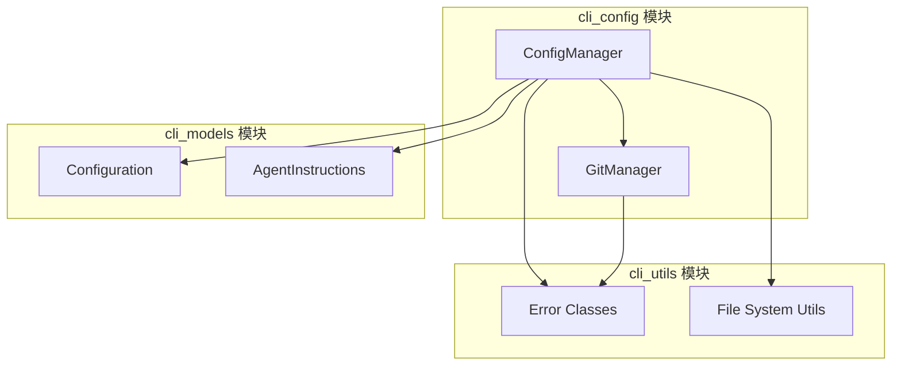
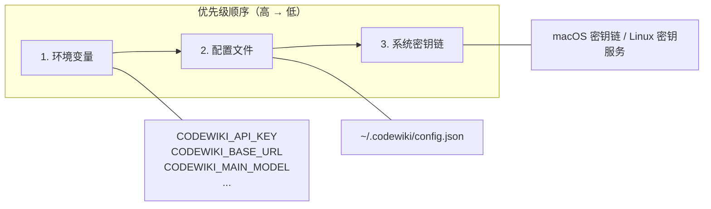
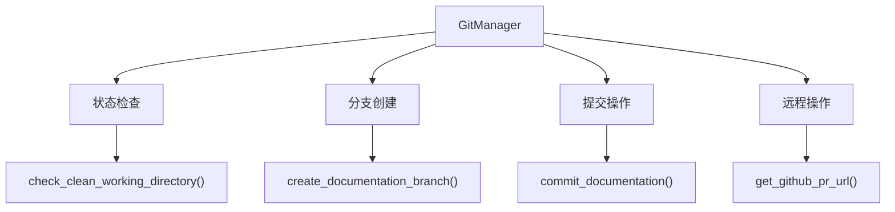

# CLI 配置模块文档

`cli_config` 模块为 CodeWiki CLI 提供必要的配置和 git 管理功能。它处理具有灵活回退机制的凭据存储，并管理文档生成工作流程的 git 操作。

## 架构概览



## 核心组件

### 1. ConfigManager

`ConfigManager` 类提供三级回退凭据链，用于安全且灵活的配置管理：



**主要特性：**

- **环境变量支持**：最高优先级，非常适合无头/CI环境
  - `CODEWIKI_API_KEY` - API 认证密钥
  - `CODEWIKI_BASE_URL` - API 端点基础 URL
  - `CODEWIKI_MAIN_MODEL` - 主要 LLM 模型
  - `CODEWIKI_CLUSTER_MODEL` - 聚类模型
  - `CODEWIKI_FALLBACK_MODEL` - 回退模型

- **配置文件存储**：明文存储在 `~/.codewiki/config.json`
- **密钥链集成**：通过系统密钥链进行安全存储（macOS 密钥链 / Linux 密钥服务）

**配置字段：**

| 字段 | 描述 |
|-------|-------------|
| `base_url` | API 端点 URL |
| `main_model` | 用于生成的主要 LLM 模型 |
| `cluster_model` | 用于聚类的模型 |
| `fallback_model` | 主要回退模型 |
| `fallback_models` | 级联回退模型列表 |
| `default_output` | 默认输出目录 |
| `max_tokens` | 每次请求的最大令牌数 |
| `max_token_per_module` | 每个模块的令牌限制 |
| `max_token_per_leaf_module` | 叶模块的令牌限制 |
| `max_depth` | 最大依赖深度 |

**使用示例：**

```python
from codewiki.cli.config_manager import ConfigManager

# 初始化并加载配置
config_mgr = ConfigManager()
config_mgr.load()

# 检查是否已配置
if config_mgr.is_configured():
    api_key = config_mgr.get_api_key()
    config = config_mgr.get_config()

# 保存新配置
config_mgr.save(
    api_key="your-api-key",
    base_url="https://api.example.com",
    main_model="gpt-4",
    cluster_model="gpt-4"
)
```

### 2. GitManager

`GitManager` 类处理文档生成工作流程所需的所有 git 操作：



**主要特性：**

- **仓库验证**：验证 git 仓库是否存在
- **清洁工作目录检测**：检查未提交的更改
- **文档分支管理**：创建带时间戳的文档分支
- **提交操作**：提交生成的文档文件
- **GitHub 集成**：生成用于分支比较的 PR URL

**使用示例：**

```python
from codewiki.cli.git_manager import GitManager
from pathlib import Path

# 使用仓库路径初始化
git_mgr = GitManager(Path("/path/to/repo"))

# 检查工作目录状态
is_clean, message = git_mgr.check_clean_working_directory()
print(f"清洁: {is_clean}, 消息: {message}")

# 创建文档分支
branch_name = git_mgr.create_documentation_branch()

# 提交文档
commit_hash = git_mgr.commit_documentation(
    docs_path=Path("docs"),
    message="添加生成的文档"
)

# 获取 GitHub PR URL
pr_url = git_mgr.get_github_pr_url(branch_name)
```

## 错误处理

两个组件都使用 `cli_utils` 中的自定义错误类：

| 错误类 | 组件 | 描述 |
|-------------|-----------|-------------|
| `ConfigurationError` | ConfigManager | 配置加载/保存失败 |
| `FileSystemError` | ConfigManager | 文件系统操作 |
| `RepositoryError` | GitManager | Git 操作失败 |

## 配置文件结构

配置文件（`~/.codewiki/config.json`）遵循以下模式：

```json
{
  "version": "1.0",
  "base_url": "",
  "main_model": "",
  "cluster_model": "",
  "fallback_model": "glm-4p5",
  "fallback_models": ["glm-4p5"],
  "default_output": "docs",
  "api_key": "",
  "max_tokens": null,
  "max_token_per_module": null,
  "max_token_per_leaf_module": null,
  "max_depth": null,
  "agent_instructions": {
    "system_prompt": "",
    "cluster_prompt": "",
    "doc_prompt": ""
  }
}
```

## 相关文档

- [cli_models](cli_models.md) - 配置和数据模型
- [cli_utils](cli_utils.md) - 错误处理和工具
- [cli_adapters](cli_adapters.md) - 文档生成器和翻译器
