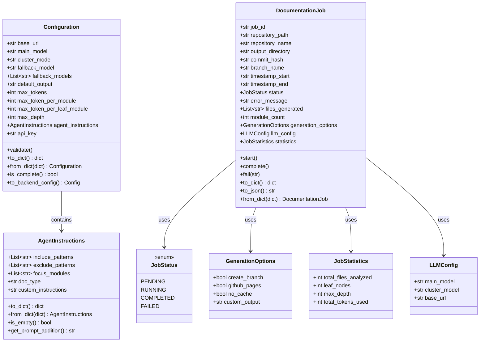
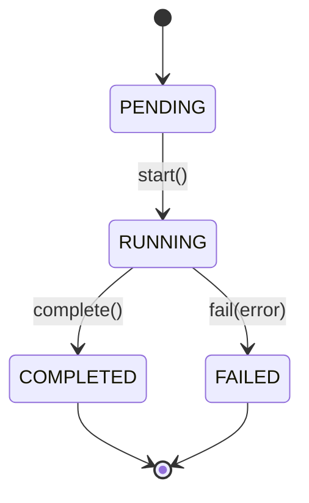
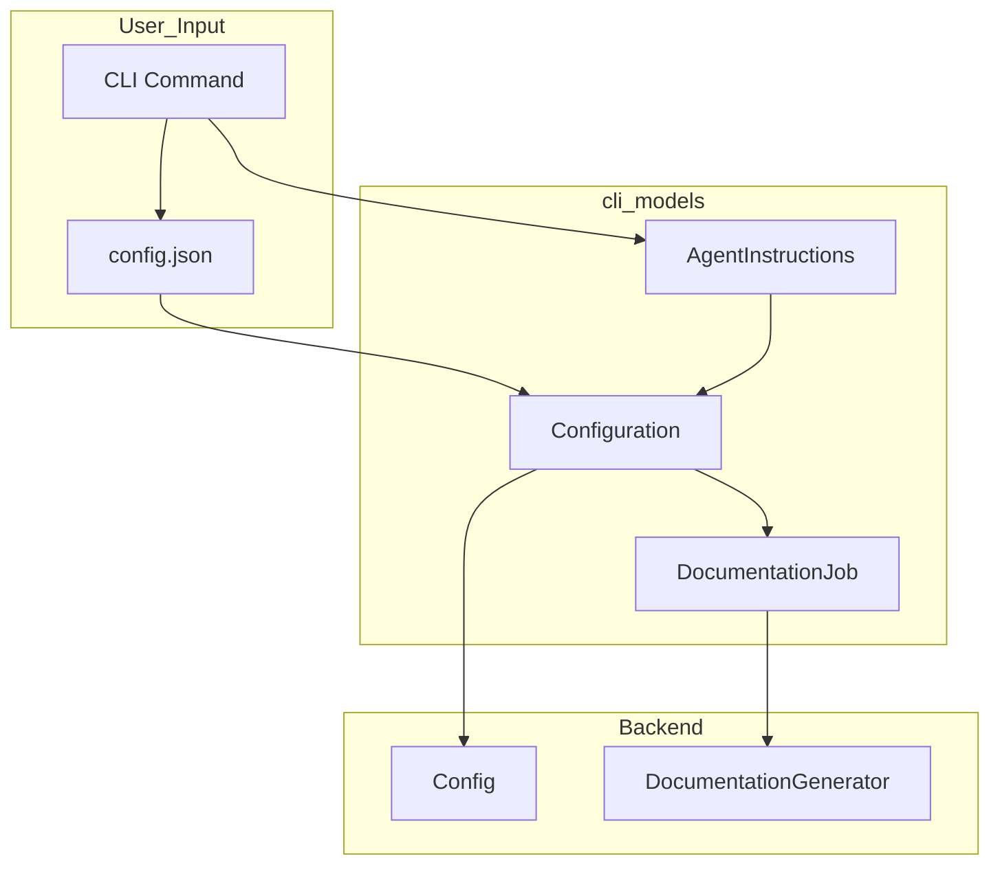

# CLI 模型

`cli_models` 模块为 CodeWiki CLI 提供数据模型，包括配置管理和文档生成的作业跟踪。

## 概述

`cli_models` 模块是 CodeWiki CLI 的基础组件，负责处理文档生成管道的两个关键方面：

1. **配置管理** - 持久化用户设置和运行时指令
2. **作业跟踪** - 文档作业生命周期和统计

这些模型桥接了用户面向的 CLI 操作与后端文档生成系统之间的鸿沟。

## 架构

## 配置模型

### AgentInstructions

`AgentInstructions` 类允许用户自定义文档生成行为：

| 字段 | 类型 | 描述 |
|-------|------|-------------|
| `include_patterns` | `List[str]` | 要包含的文件模式（例如 `["*.cs", "*.py"]`） |
| `exclude_patterns` | `List[str]` | 要排除的模式（例如 `["*Tests*", "*test*"]`） |
| `focus_modules` | `List[str]` | 需要更详细记录的模块 |
| `doc_type` | `str` | 类型：`api`、`architecture`、`user-guide` 或 `developer` |
| `custom_instructions` | `str` | 自由格式的额外指令 |

该类提供辅助方法：
- `to_dict()` / `from_dict()` - 序列化支持
- `is_empty()` - 检查是否设置了任何指令
- `get_prompt_addition()` - 根据指令生成提示补充内容

### Configuration

`Configuration` 类表示存储在 `~/.codewiki/config.json` 中的持久化用户设置：

| 字段 | 类型 | 默认值 | 描述 |
|-------|------|---------|-------------|
| `base_url` | `str` | - | LLM API 基础 URL |
| `main_model` | `str` | - | 用于文档生成的主模型 |
| `cluster_model` | `str` | - | 用于模块聚类的模型 |
| `fallback_model` | `str` | `""` | 传统单一回退模型 |
| `fallback_models` | `List[str]` | `[]` | 有序的回退链（推荐） |
| `default_output` | `str` | `"docs"` | 默认输出目录 |
| `max_tokens` | `int` | `32768` | LLM 响应的最大令牌数 |
| `max_token_per_module` | `int` | `36369` | 每个模块的最大令牌数（用于聚类） |
| `max_token_per_leaf_module` | `int` | `16000` | 每个叶子模块的最大令牌数 |
| `max_depth` | `int` | `2` | 层级分解的最大深度 |
| `agent_instructions` | `AgentInstructions` | - | 自定义代理指令 |
| `api_key` | `str` | `None` | API 密钥回退（当 keyring 不可用时） |

关键方法：
- `validate()` - 验证所有配置字段
- `to_dict()` / `from_dict()` - 序列化支持
- `is_complete()` - 检查必填字段是否已设置
- `to_backend_config()` - 将 CLI 配置转换为后端配置

## 作业模型

### JobStatus

一个枚举，表示文档作业的生命周期状态：

- `PENDING` - 作业已创建但尚未开始
- `RUNNING` - 作业正在积极处理中
- `COMPLETED` - 作业成功完成
- `FAILED` - 作业遇到错误

### GenerationOptions

文档生成的选项：

| 字段 | 类型 | 默认值 | 描述 |
|-------|------|---------|-------------|
| `create_branch` | `bool` | `False` | 为文档创建新的 git 分支 |
| `github_pages` | `bool` | `False` | 部署到 GitHub Pages |
| `no_cache` | `bool` | `False` | 禁用缓存 |
| `custom_output` | `str` | `None` | 自定义输出目录 |

### JobStatistics

在文档生成过程中收集的统计信息：

| 字段 | 类型 | 默认值 | 描述 |
|-------|------|---------|-------------|
| `total_files_analyzed` | `int` | `0` | 分析的文件数 |
| `leaf_nodes` | `int` | `0` | 叶子模块数 |
| `max_depth` | `int` | `0` | 最大层级深度 |
| `total_tokens_used` | `int` | `0` | 消耗的 LLM 令牌总数 |

### LLMConfig

特定作业的 LLM 配置：

| 字段 | 类型 | 描述 |
|-------|------|-------------|
| `main_model` | `str` | 用于文档生成的主模型 |
| `cluster_model` | `str` | 用于模块聚类的模型 |
| `base_url` | `str` | LLM API 基础 URL |

### DocumentationJob

表示文档生成任务的主作业模型：

| 字段 | 类型 | 描述 |
|-------|------|-------------|
| `job_id` | `str` | 唯一标识符（UUID） |
| `repository_path` | `str` | 仓库的绝对路径 |
| `repository_name` | `str` | 仓库名称 |
| `output_directory` | `str` | 输出目录路径 |
| `commit_hash` | `str` | Git 提交 SHA |
| `branch_name` | `str` | Git 分支名称 |
| `timestamp_start` | `str` | 作业开始时间（ISO 格式） |
| `timestamp_end` | `str` | 作业结束时间（ISO 格式） |
| `status` | `JobStatus` | 当前作业状态 |
| `error_message` | `str` | 错误消息（如果失败） |
| `files_generated` | `List[str]` | 生成的文件的列表 |
| `module_count` | `int` | 已记录的模块数 |
| `generation_options` | `GenerationOptions` | 使用的生成选项 |
| `llm_config` | `LLMConfig` | 使用的 LLM 配置 |
| `statistics` | `JobStatistics` | 作业统计信息 |

生命周期方法：
- `start()` - 标记作业已开始
- `complete()` - 标记作业已完成
- `fail(error_message)` - 标记作业失败并附带错误

序列化方法：
- `to_dict()` - 转换为字典
- `to_json()` - 转换为 JSON 字符串
- `from_dict(data)` - 从字典创建

## 数据流

## 模块依赖

`cli_models` 模块依赖于：

| 模块 | 依赖类型 |
|--------|-----------------|
| `cli_utils` | 验证工具 |
| `core_utils` | 后端配置转换 |

该模块提供的数据模型被以下模块使用：

| 模块 | 用法 |
|--------|-------|
| `cli_adapters` | 使用 Configuration 进行 API 设置 |
| `cli_config` | 使用 Configuration 进行配置管理 |
| `be_agent_orchestrator` | 使用 DocumentationJob 进行作业跟踪 |

## 相关文档

- [cli_config](cli_config.md) - 配置管理和 git 操作
- [cli_adapters](cli_adapters.md) - 文档生成和翻译适配器
- [core_utils](core_utils.md) - 后端配置和文件管理
