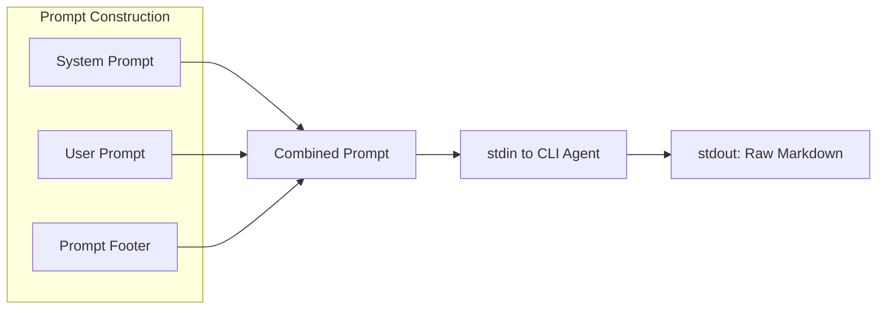
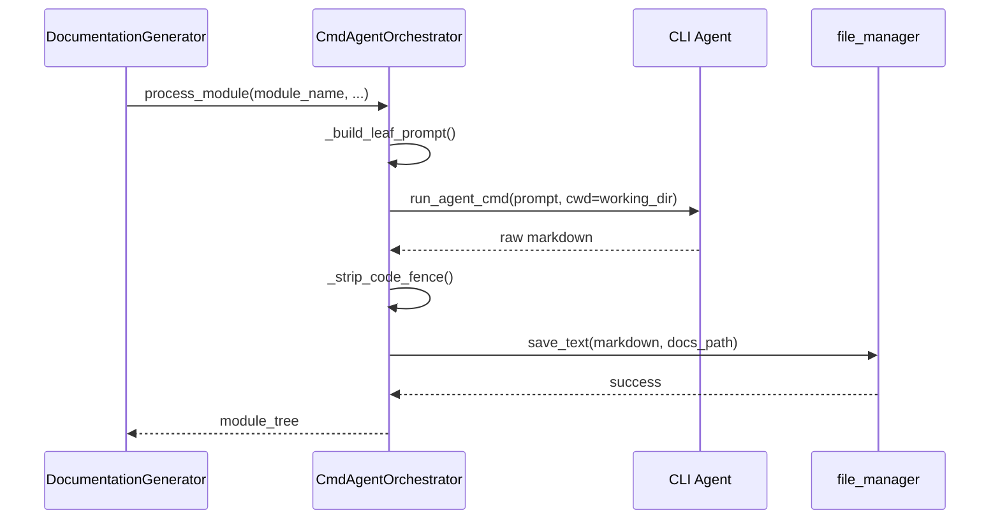

# CmdAgentOrchestrator

`CmdAgentOrchestrator` 类是一个替代 `AgentOrchestrator` 的即插即用解决方案，它通过 CLI 代理子进程而非直接 API 调用来路由所有 AI 请求。这种方法消除了上下文窗口限制，提供了无限的文档生成容量。

## 概述

CmdAgentOrchestrator 镜像了 `AgentOrchestrator` 的接口，但使用根本不同的执行模型：

- **输入**：通过 stdin 将提示词管道传输给 CLI 代理
- **输出**：从 stdout 读取原始 markdown
- **无 API 限制**：绕过速率限制和 token 限制

## 何时使用 CmdAgentOrchestrator

- 超出 API 上下文限制的大型代码库
- 需要大量文档的项目
- API 访问受限的环境
- 使用本地 Claude CLI 或类似工具时

## 类定义

```python
class CmdAgentOrchestrator:
    """
    Generates module documentation by piping prompts to a CLI agent subprocess.

    Mirrors the public interface used by DocumentationGenerator so it can be
    used as a drop-in replacement for AgentOrchestrator.
    """

    def __init__(self, config: Config, agent_cmd: str):
        self.config = config
        self.agent_cmd = agent_cmd
        self.custom_instructions = config.get_prompt_addition() if config else None
```

## CLI 代理协议

CLI 代理期望：

1. **输入**：通过 stdin 接收完整提示词（系统提示 + 用户提示合并）
2. **输出**：stdout 输出原始 markdown 内容
3. **无包装器**：无 JSON/XML 格式，仅原始 markdown

### CLI 代理示例

```bash
# Example usage with Claude CLI
claude --dangerously-skip-permissions -p
```

## 提示词格式化

CmdAgentOrchestrator 使用特殊格式化以确保 CLI 代理正确输出：



### 提示词页脚

```python
CMD_AGENT_FOOTER = """

---
IMPORTANT OUTPUT INSTRUCTIONS:
- Output ONLY the complete markdown content for the documentation file.
- Do NOT add any preamble, explanation, or commentary before or after the markdown.
- Do NOT use XML/JSON wrappers.  Just raw markdown starting from the first heading.
- Mermaid diagrams are welcome; make sure they are well-formed.
"""
```

### 概览页脚

```python
CMD_OVERVIEW_FOOTER = """

---
IMPORTANT OUTPUT INSTRUCTIONS:
Return ONLY the markdown content wrapped exactly as shown:
<OVERVIEW>
…your markdown here…
</OVERVIEW>
"""
```

## 核心方法

### `process_module`

为单个模块生成文档：

```python
async def process_module(
    self,
    module_name: str,
    components: Dict[str, Node],
    core_component_ids: List[str],
    module_path: List[str],
    working_dir: str,
) -> Dict[str, Any]:
```

#### 处理步骤

1. **加载模块树** - 检索现有模块层次结构
2. **检查现有文档** - 如果已生成则跳过
3. **构建提示词** - 合并系统 + 用户提示词并添加页脚
4. **执行 CLI** - 通过 stdin 将提示词传递给代理命令
5. **处理输出** - 去除代理添加的任何代码 fence
6. **保存 markdown** - 将文档写入文件

### `generate_parent_module_docs`

为父模块生成概览文档：

```python
async def generate_parent_module_docs(
    self,
    module_path: List[str],
    working_dir: str,
    module_tree: Dict[str, Any],
) -> Dict[str, Any]:
```

此方法：

- 构建包含子文档嵌入的仓库结构
- 选择适当的提示词模板（模块 vs 仓库概览）
- 使用格式化提示词执行 CLI 代理
- 从 `<OVERVIEW>` 标签中提取内容
- 保存到相应的 markdown 文件

## 辅助函数

### `_strip_code_fence`

去除代理可能添加的 markdown 代码 fence：

```python
def _strip_code_fence(text: str) -> str:
    """Remove ```markdown … ``` or ``` … ``` wrapper if the agent added one."""
    text = text.strip()
    if text.startswith("```"):
        lines = text.splitlines()
        inner = lines[1:-1] if lines[-1].strip() == "```" else lines[1:]
        return "\n".join(inner).strip()
    return text
```

### `_extract_overview`

从概览标签中提取内容：

```python
def _extract_overview(text: str) -> str:
    """Extract content between <OVERVIEW> … </OVERVIEW> tags, or return raw."""
    if "<OVERVIEW>" in text and "</OVERVIEW>" in text:
        return text.split("<OVERVIEW>")[1].split("</OVERVIEW>")[0].strip()
    return _strip_code_fence(text)
```

### `_build_overview_structure`

构建包含嵌入子文档的仓库结构，用于概览生成：

```python
def _build_overview_structure(
    module_tree: Dict[str, Any],
    module_path: List[str],
    working_dir: str,
) -> Dict[str, Any]:
```

此函数：
- 遍历模块树到达目标模块
- 使用 `is_target_for_overview_generation` 标记目标
- 将每个子模块的 markdown 文档嵌入到结构中

## 执行流程



## 与 AgentOrchestrator 的比较

| 特性 | AgentOrchestrator | CmdAgentOrchestrator |
|---------|-------------------|---------------------|
| 执行方式 | pydantic-ai API | CLI 子进程 |
| 上下文限制 | API token 限制 | 无（由代理处理） |
| 延迟 | 较低（直接 API） | 较高（进程启动） |
| 错误处理 | API 错误码 | 进程退出码 |
| 复杂度检测 | 是 | 是（通过 is_complex_module） |

## 配置

要启用 CLI 模式，请设置 `agent_cmd` 配置：

```python
config.agent_cmd = "claude --dangerously-skip-permissions -p"
generator = DocumentationGenerator(config)
# 自动使用 CmdAgentOrchestrator
```

## 集成

当设置了 `config.agent_cmd` 时，`DocumentationGenerator` 会自动选择 CmdAgentOrchestrator：

```python
# In DocumentationGenerator.__init__
if getattr(config, 'agent_cmd', None):
    from codewiki.src.be.cmd_agent_orchestrator import CmdAgentOrchestrator
    self.agent_orchestrator = CmdAgentOrchestrator(config, config.agent_cmd)
    self._cmd_mode = True
else:
    self.agent_orchestrator = AgentOrchestrator(config)
    self._cmd_mode = False
```
