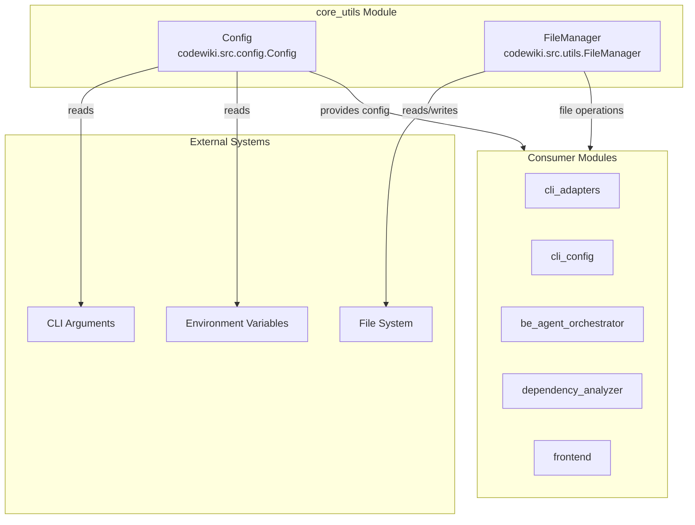
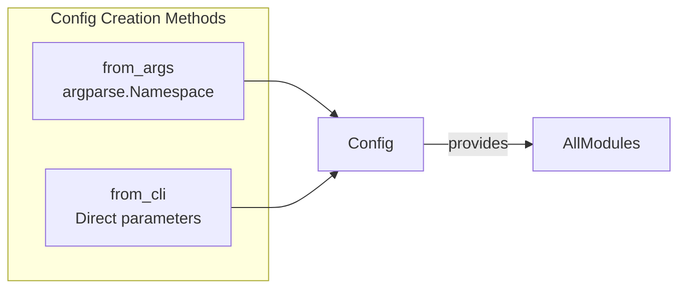

# 核心工具模块

`core_utils` 模块为 CodeWiki 系统提供基础配置和工具组件。它负责应用程序配置管理和整个应用所需的基本文件 I/O 操作。

## 概述

`core_utils` 模块由两个主要组件组成：

- **`Config`**：集中配置类，管理 CodeWiki 文档生成器的所有设置
- **`FileManager`**：用于标准化文件和目录操作的工具类

这些组件构成了其他模块依赖的基础层，提供配置和文件处理功能。

## 架构



## 组件

### Config (`codewiki.src.config.Config`)

`Config` 类是一个全面的配置管理系统，集中管理 CodeWiki 应用程序所需的所有设置。

#### 主要职责

- **目录配置**：管理输出、依赖图和文档的路径
- **LLM 服务配置**：处理 API 端点、身份验证和模型选择
- **令牌限制**：控制不同处理阶段的最大令牌使用量
- **智能体指令**：支持可自定义的文档生成指令

#### 配置属性

| 属性 | 类型 | 描述 |
|----------|------|-------------|
| `repo_path` | str | 要记录文档的仓库路径 |
| `output_dir` | str | 基础输出目录 |
| `docs_dir` | str | 生成文档的目录 |
| `llm_base_url` | str | LLM API 基础 URL |
| `llm_api_key` | str | LLM 身份验证的 API 密钥 |
| `main_model` | str | 主要使用的 LLM 模型 |
| `cluster_model` | str | 用于代码聚类的模型 |
| `fallback_models` | List[str] | 备用模型的有序列表 |
| `max_tokens` | int | LLM 响应的最大令牌数 |
| `max_token_per_module` | int | 聚类期间每个模块的令牌限制 |
| `max_depth` | int | 层次分解的最大深度 |

#### 智能体指令

Config 类通过 `agent_instructions` 字典支持丰富的智能体指令：

```python
@dataclass
class AgentInstructions:
    include_patterns: Optional[List[str]]  # 要包含的文件模式
    exclude_patterns: Optional[List[str]]  # 要排除的文件模式
    focus_modules: Optional[List[str]]     # 需要详细文档的优先模块
    doc_type: Optional[str]                # 类型：api、architecture、user-guide、developer
    custom_instructions: Optional[str]     # 自由形式的自定义指令
```

#### 工厂方法



- **`from_args(args: argparse.Namespace)`**：从命令行参数解析器结果创建 Config
- **`from_cli(...)`**：直接通过参数值为程序化使用创建 Config

### FileManager (`codewiki.src.utils.FileManager`)

`FileManager` 类提供文件和目录操作的静态工具方法，确保应用程序中一致的 I/O 处理。

#### 方法

| 方法 | 描述 |
|--------|-------------|
| `ensure_directory(path)` | 创建目录，`exist_ok=True` |
| `save_json(data, filepath)` | 序列化并保存数据为 JSON |
| `load_json(filepath)` | 加载 JSON 文件，如果缺失则返回 None |
| `save_text(content, filepath)` | 将文本内容写入文件 |
| `load_text(filepath)` | 从文件读取文本内容 |

#### 使用模式

```python
from codewiki.src.utils import file_manager

# 目录操作
file_manager.ensure_directory('/path/to/output')

# JSON 操作
file_manager.save_json({'key': 'value'}, 'data.json')
data = file_manager.load_json('data.json')

# 文本操作
file_manager.save_text('content', 'file.txt')
content = file_manager.load_text('file.txt')
```

## 与其他模块的集成

`core_utils` 模块作为 CodeWiki 系统中所有其他模块的基础：

| 模块 | 使用方式 |
|--------|-------|
| [cli_adapters](cli_adapters.md) | 使用 Config 获取文档生成设置 |
| [cli_config](cli_config.md) | 通过 ConfigManager 读写配置 |
| [be_agent_orchestrator](be_agent_orchestrator.md) | 使用 Config 获取智能体执行设置 |
| [dependency_analyzer](dependency_analyzer.md) | 使用 FileManager 进行图和分析输出 |
| [frontend](frontend.md) | 使用 Config 获取 Web 应用程序设置 |

## 常量

该模块还定义了整个系统中使用的重要常量：

```python
OUTPUT_BASE_DIR = 'output'           # 所有输出的基础目录
DEPENDENCY_GRAPHS_DIR = 'dependency_graphs'  # 依赖图的子目录
DOCS_DIR = 'docs'                    # 文档的子目录
FIRST_MODULE_TREE_FILENAME = 'first_module_tree.json'
MODULE_TREE_FILENAME = 'module_tree.json'
OVERVIEW_FILENAME = 'overview.md'
MAX_DEPTH = 2                         # 模块树的默认最大深度

# 令牌限制
DEFAULT_MAX_TOKENS = 32_768
DEFAULT_MAX_TOKEN_PER_MODULE = 36_369
DEFAULT_MAX_TOKEN_PER_LEAF_MODULE = 16_000
```

## CLI 上下文检测

该模块包含用于区分 CLI 和 Web 应用程序模式的上下文检测：

```python
set_cli_context(enabled: bool)  # 设置运行上下文
is_cli_context() -> bool        # 检查当前上下文
```

这允许配置系统根据 CodeWiki 是作为命令行工具还是作为 Web 应用程序运行来调整行为。
