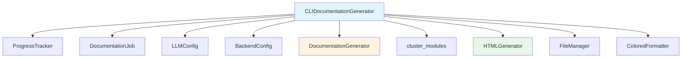

# CLIDocumentationGenerator

**文件：** `codewiki/cli/adapters/doc_generator.py`

`CLIDocumentationGenerator` 是 CLI 中文档生成的主要协调器。它封装了后端的 `DocumentationGenerator`，并提供了一套完整的端到端流程来分析代码库并生成文档。

## 概述

`CLIDocumentationGenerator` 将完整的文档生成流程管理为一个 5 阶段流水线：

1. **依赖分析**（占 40% 的时间）- 分析源代码并构建依赖图
2. **模块聚类**（占 20% 的时间）- 使用 LLM 将相关组件分组到模块中
3. **文档生成**（占 30% 的时间）- 为每个模块生成 Markdown 文档
4. **HTML 生成**（占 5% 的时间，可选）- 为 GitHub Pages 创建 HTML 查看器
5. **最终处理**（占 5% 的时间）- 完成作业并保存元数据

## 类定义

```python
class CLIDocumentationGenerator:
    """
    CLI adapter for documentation generation with progress reporting.

    This class wraps the backend documentation generator and adds
    CLI-specific features like progress tracking and error handling.
    """
```

## 初始化

```python
def __init__(
    self,
    repo_path: Path,
    output_dir: Path,
    config: Dict[str, Any],
    verbose: bool = False,
    generate_html: bool = False
)
```

**参数：**
| 参数 | 类型 | 描述 |
|-----------|------|-------------|
| `repo_path` | `Path` | 要记录文档的仓库路径 |
| `output_dir` | `Path` | 生成的文档输出目录 |
| `config` | `Dict[str, Any]` | LLM 配置字典 |
| `verbose` | `bool` | 启用详细输出，显示详细进度 |
| `generate_html` | `bool` | 是否生成 HTML 查看器 |

**配置字典预期包含的键：**
- `base_url` - LLM API 基础 URL
- `api_key` - LLM API 密钥
- `main_model` - 文档生成的主模型
- `cluster_model` - 模块聚类用的模型
- `fallback_model` - 备用模型名称
- `fallback_models` - 额外的备用模型列表
- `agent_cmd` - 用于复杂任务的 Agent 命令
- `max_tokens` - LLM 响应的最大令牌数（默认值：32768）
- `max_token_per_module` - 每个模块的最大令牌数（默认值：36369）
- `max_token_per_leaf_module` - 叶子模块的最大令牌数（默认值：16000）
- `max_depth` - 最大依赖深度（默认值：2）
- `concurrency` - 并行工作线程数（默认值：1）

## 核心方法

### generate()

```python
def generate(self) -> DocumentationJob
```

执行完整文档生成流水线的主入口点。

**返回：** `DocumentationJob` - 包含统计信息和文件列表的已完成作业

**抛出：**
- `APIError` - 如果 LLM API 调用失败
- `Exception` - 生成过程中的其他错误

**流程：**
1. 初始化作业开始时间
2. 创建后端配置
3. 执行 5 阶段流水线
4. 返回已完成的 DocumentationJob

### _run_backend_generation()

```python
async def _run_backend_generation(self, backend_config: BackendConfig)
```

使用进度跟踪执行核心后端文档生成。

**阶段 1：依赖分析**
- 使用后端配置创建 `DocumentationGenerator`
- 调用 `graph_builder.build_dependency_graph()`
- 更新已分析文件和叶子节点的作业统计信息

**阶段 2：模块聚类**
- 调用 `cluster_modules()` 来分组组件
- 将模块树保存到 `module_tree.json` 和 `first_module_tree.json`
- 更新作业模块计数

**阶段 3：文档生成**
- 调用 `doc_generator.generate_module_documentation()`
- 创建文档元数据
- 收集生成的 Markdown 和 JSON 文件

### _run_html_generation()

```python
def _run_html_generation(self)
```

生成 HTML 查看器的可选阶段。仅在 `generate_html=True` 时执行。

**流程：**
1. 从 git 检测仓库信息
2. 创建 HTMLGenerator 实例
3. 生成嵌入模块树的 `index.html`

### _finalize_job()

```python
def _finalize_job(self)
```

通过验证/创建元数据文件来完成作业。

## 进度跟踪

`CLIDocumentationGenerator` 使用 `ProgressTracker` 进行实时进度更新：

```python
from codewiki.cli.utils.progress import ProgressTracker

# 5 个阶段，具有不同的权重
STAGE_WEIGHTS = {
    1: 0.40,  # 依赖分析
    2: 0.20,  # 模块聚类
    3: 0.30,  # 文档生成
    4: 0.05,  # HTML 生成（可选）
    5: 0.05,  # 最终处理
}
```

## 后端日志配置

该适配器为 CLI 使用配置后端日志：

```python
def _configure_backend_logging(self)
```

**行为：**
- **详细模式**：显示 INFO 及以上级别，使用彩色格式化器
- **非详细模式**：仅显示 WARNING 和 ERROR，抑制后端的 INFO/DEBUG

## 作业管理

该适配器在整个流水线中管理 `DocumentationJob` 对象：

| 属性 | 描述 |
|-----------|-------------|
| `job_id` | 唯一标识符 |
| `repository_path` | 源仓库路径 |
| `repository_name` | 仓库名称 |
| `output_directory` | 输出目录路径 |
| `status` | 作业状态（PENDING、RUNNING、COMPLETED、FAILED） |
| `statistics` | 生成统计信息 |
| `files_generated` | 生成的文件列表 |
| `module_count` | 创建的模块数量 |

## 错误处理

错误被捕获并传播，并附带有意义的错误信息：

```python
try:
    # 阶段操作
except APIError as e:
    self.job.fail(str(e))
    raise
except Exception as e:
    self.job.fail(str(e))
    raise
```

## 依赖关系



## 使用示例

```python
from pathlib import Path
from codewiki.cli.adapters.doc_generator import CLIDocumentationGenerator

# 配置
config = {
    'base_url': 'https://api.openai.com/v1',
    'api_key': 'sk-your-key',
    'main_model': 'gpt-4o',
    'cluster_model': 'gpt-4o-mini',
    'concurrency': 4,
    'max_depth': 2,
    'max_tokens': 32768
}

# 生成文档
generator = CLIDocumentationGenerator(
    repo_path=Path('/path/to/repo'),
    output_dir=Path('/path/to/docs'),
    config=config,
    verbose=True,
    generate_html=True
)

job = generator.generate()

print(f"Status: {job.status}")
print(f"Modules: {job.module_count}")
print(f"Files: {len(job.files_generated)}")
print(f"Files analyzed: {job.statistics.total_files_analyzed}")
print(f"Leaf nodes: {job.statistics.leaf_nodes}")
```

## 与 CLI 命令的集成

`CLIDocumentationGenerator` 由 `codewiki/cli/commands/generate.py` 中的 `generate` 命令使用：

```python
from codewiki.cli.adapters.doc_generator import CLIDocumentationGenerator

# 在 generate 命令中
generator = CLIDocumentationGenerator(
    repo_path=Path(args.repo_path),
    output_dir=Path(args.output_dir),
    config=config_dict,
    verbose=args.verbose,
    generate_html=args.html
)
job = generator.generate()
```
