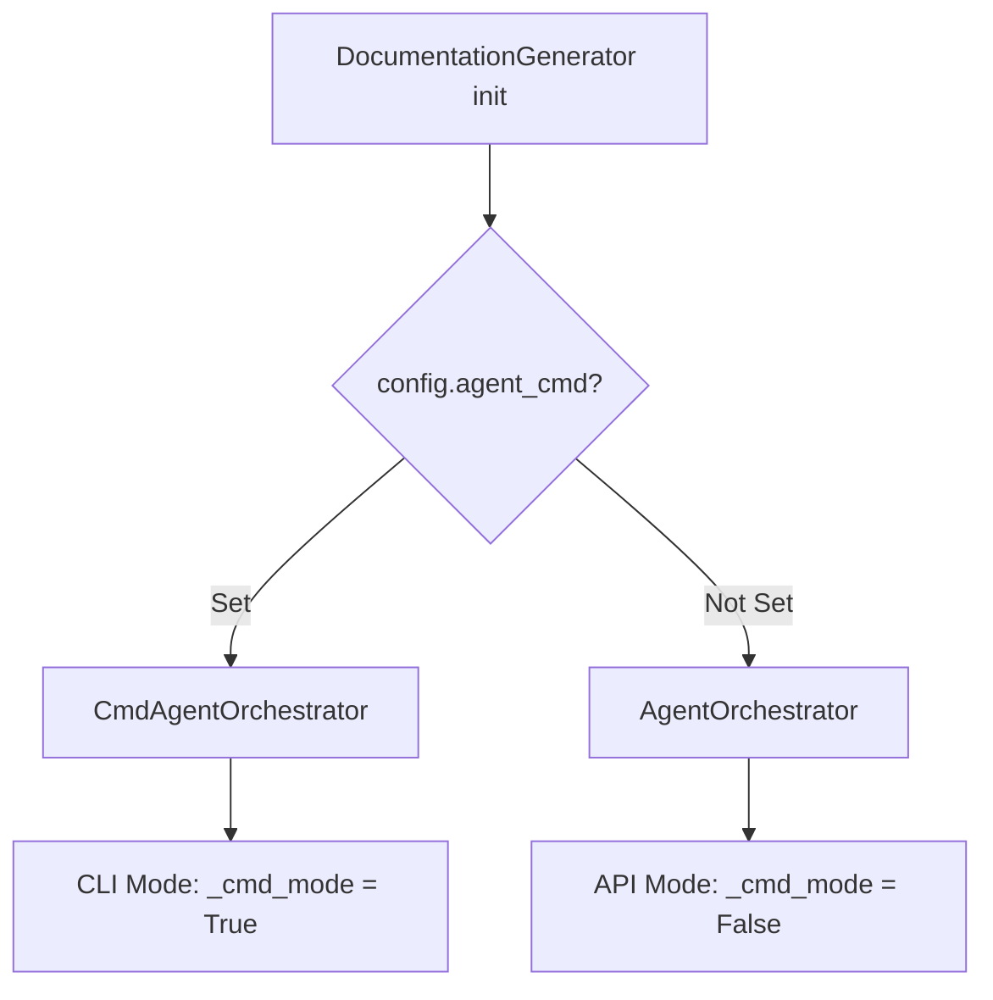
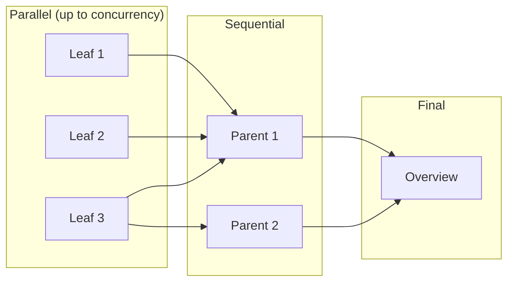
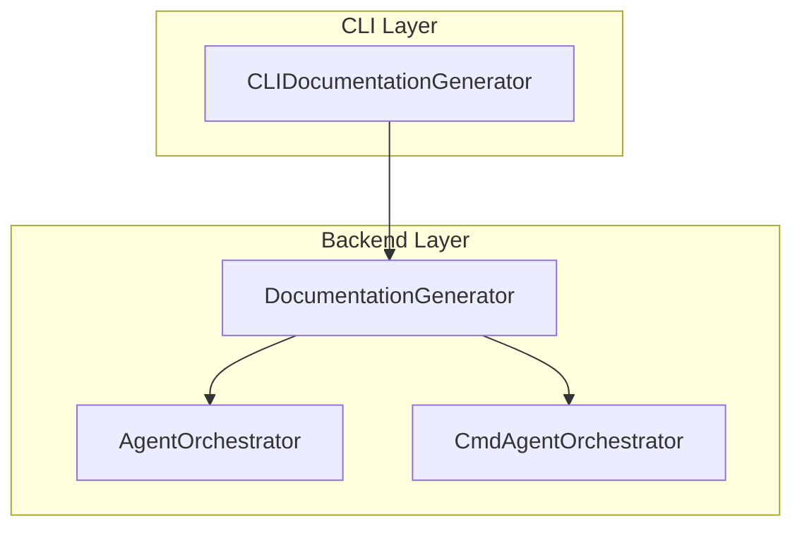

# DocumentationGenerator

`DocumentationGenerator` 类（位于 `codewiki/src/be/documentation_generator.py`）是 CodeWiki 后端文档生成流程的主要协调器。它负责协调依赖分析、模块聚类和文档生成，以生成全面的模块文档。

## 概述

DocumentationGenerator 作为后端文档生成流程的入口点，负责管理以下内容：

- 通过 DependencyGraphBuilder 构建依赖图
- 使用 cluster_modules 进行模块聚类
- 叶模块的并行处理
- 父模块的顺序聚合
- 仓库概览生成

## 类定义

```python
class DocumentationGenerator:
    """Main documentation generation orchestrator."""

    def __init__(self, config: Config, commit_id: str = None):
        self.config = config
        self.commit_id = commit_id
        self.graph_builder = DependencyGraphBuilder(config)

        # Choose orchestrator: CLI agent subprocess or pydantic-ai API
        if getattr(config, 'agent_cmd', None):
            from codewiki.src.be.cmd_agent_orchestrator import CmdAgentOrchestrator
            self.agent_orchestrator = CmdAgentOrchestrator(config, config.agent_cmd)
            self._cmd_mode = True
        else:
            self.agent_orchestrator = AgentOrchestrator(config)
            self._cmd_mode = False
```

## 协调器选择



## 核心方法

### `run`

执行完整文档流程的主入口点：

```python
async def run(self) -> None:
```

#### 流程步骤

1. 使用 `DependencyGraphBuilder` 构建依赖图
2. 使用 `cluster_modules` 将组件聚类到模块中
3. 通过 `generate_module_documentation` 生成模块文档
4. 创建包含生成信息的元数据文件

```mermaid
flowchart TB
    A[run()] --> B[build_dependency_graph]
    B --> C[cluster_modules]
    C --> D[generate_module_documentation]
    D --> E[create_documentation_metadata]
    E --> F[Complete]
```

### `generate_module_documentation`

使用动态规划方法协调所有模块的文档生成：

```python
async def generate_module_documentation(
    self,
    components: Dict[str, Any],
    leaf_nodes: List[str],
    concurrency: int = 1,
) -> str:
```

#### 处理策略

该方法使用**拓扑处理顺序**，确保：

- 叶模块在其父模块之前处理
- 独立的叶模块可以并行处理
- 父模块聚合子模块的文档



### `get_processing_order`

使用拓扑排序确定最佳处理顺序：

```python
def get_processing_order(self, module_tree: Dict[str, Any],
                         parent_path: List[str] = []) -> List[tuple[List[str], str]]:
```

此方法确保：

- 子模块在其父模块之前处理
- 遇到叶模块时立即添加
- 父模块在所有子模块之后添加

### `generate_parent_module_docs`

通过聚合子模块的文档来生成父模块的概览文档：

```python
async def generate_parent_module_docs(self, module_path: List[str],
                                     working_dir: str) -> Dict[str, Any]:
```

#### CLI 模式路径

在 CLI 模式下（`_cmd_mode = True`），委托给 `CmdAgentOrchestrator.generate_parent_module_docs()`。

#### API 模式路径

在 API 模式下：
1. 加载模块树
2. 构建包含 1 层深度子模块文档的仓库结构
3. 使用适当的提示模板调用 LLM
4. 提取并保存概览内容

### `build_overview_structure`

构建传递给 LLM 用于概览生成的结构：

```python
def build_overview_structure(self, module_tree: Dict[str, Any],
                            module_path: List[str],
                            working_dir: str) -> Dict[str, Any]:
```

此方法：

- 创建模块树的深拷贝
- 遍历到目标模块
- 标记 `is_target_for_overview_generation = True`
- 嵌入每个子模块的 markdown 文档
- 返回丰富的结构

### `is_leaf_module`

判断模块是否为叶模块（没有子模块）：

```python
def is_leaf_module(self, module_info: Dict[str, Any]) -> bool:
    children = module_info.get("children", {})
    return not children or (isinstance(children, dict) and len(children) == 0)
```

### `create_documentation_metadata`

生成包含文档生成信息的元数据文件：

```python
def create_documentation_metadata(self, working_dir: str,
                                  components: Dict[str, Any],
                                  num_leaf_nodes: int):
```

创建包含以下内容的 `metadata.json`：

- 生成时间戳
- 模型信息
- 统计信息（总组件数、叶节点数、最大深度）
- 生成的文件列表

## 并行处理

系统支持叶模块处理的可配置并发数：

```python
# Build semaphore for concurrency control
sem = asyncio.Semaphore(concurrency)

async def _process_one(module_path, module_name, module_info):
    async with sem:
        # Process module
```

- **concurrency=1**：顺序处理（无需锁）
- **concurrency>1**：使用信号量控制的并行处理

## 模块检测模式

### 多模块模式

当仓库适合上下文但有多个模块时：

- 单独处理每个模块
- 通过聚合子模块的文档生成父模块概览

### 单模块模式

当整个仓库适合上下文时：

- 作为一个模块处理
- 将输出重命名为 `overview.md`

```python
if len(module_tree) > 0:
    # Multi-module processing
    # ... process leaves in parallel
    # ... process parents sequentially
    # ... generate final overview
else:
    # Single module processing
    final_module_tree = await self.agent_orchestrator.process_module(...)
    # Rename repo_name.md to overview.md
```

## 与 Agent 协调器的集成

DocumentationGenerator 委托给以下任一协调器：

| 模式 | 协调器 | 使用场景 |
|------|--------------|----------|
| API | `AgentOrchestrator` | 使用备用模型的标准 API 调用 |
| CLI | `CmdAgentOrchestrator` | 超出上下文限制的大型仓库 |

详细信息请参阅 [agent_orchestrator.md](agent_orchestrator.md) 和 [cmd_agent_orchestrator.md](cmd_agent_orchestrator.md)。

## 错误处理

`run` 方法包含全面的错误处理：

```python
try:
    # ... documentation generation ...
except Exception as e:
    logger.error(f"Documentation generation failed: {str(e)}")
    logger.error(f"Traceback: {traceback.format_exc()}")
    raise
```

## 进度跟踪

系统在生成过程中向 stdout 打印进度：

```
  [1/10] ▶ [leaf] module_name (2.3s)
  [2/10] ✓ [leaf] module_name (1.5s)
  [3/10] ↩ [skip] module_name
  [4/10] ✗ [error] module_name: error message
```

## 输出文件

生成器创建以下文件：

| 文件 | 描述 |
|------|-------------|
| `module_tree.json` | 当前模块层次结构 |
| `first_module_tree.json` | 初始模块聚类 |
| `{module_name}.md` | 各个模块的文档 |
| `overview.md` | 仓库概览 |
| `metadata.json` | 生成元数据 |

## 配置

DocumentationGenerator 使用 `cli_models` 中的 [Config](cli_models.md#configuration)，配置包括：

- 仓库路径和文档目录
- 模型选择和备用模型
- 最大依赖分析深度
- 自定义提示指令
- 并发级别
- CLI 代理命令（在 CLI 模式下）

## 与 CLIDocumentationGenerator 的关系

后端 `DocumentationGenerator` 由 CLI 层的 `CLIDocumentationGenerator` 包装。请参阅 [cli_adapters.md](cli_adapters.md) 了解 CLI 适配器详情。


