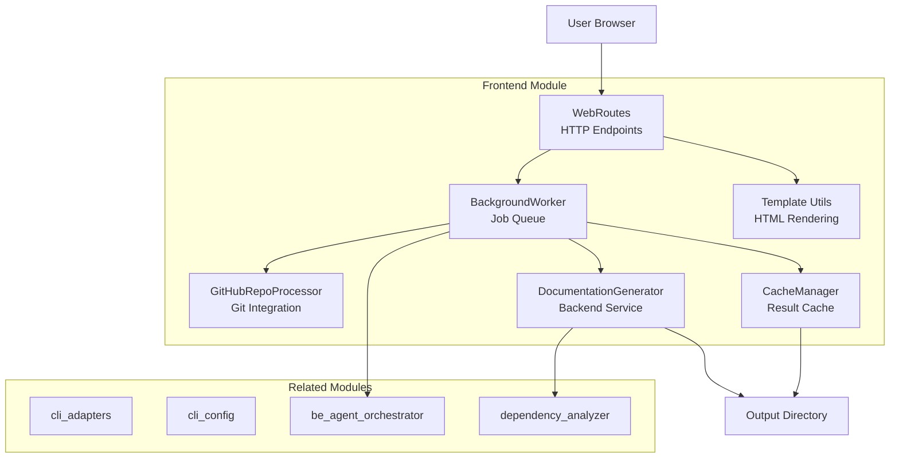
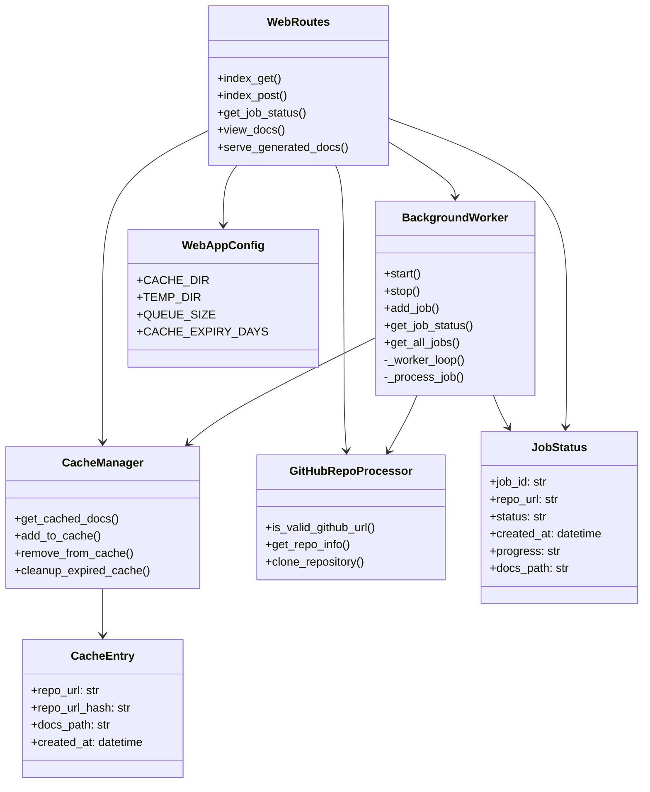
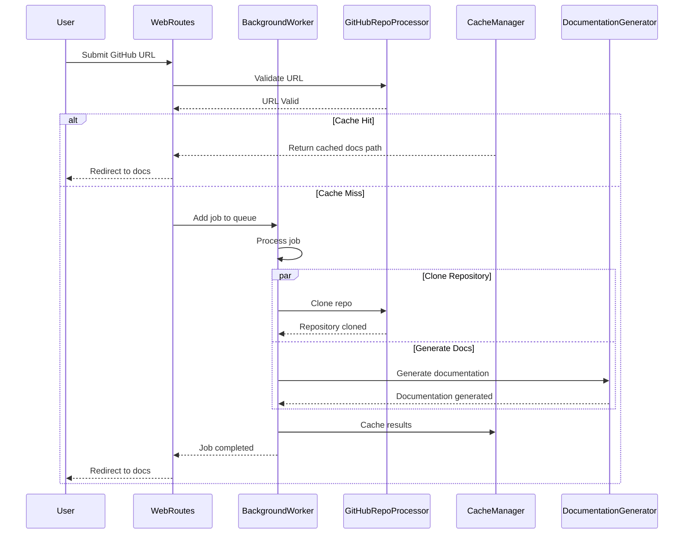

# 前端模块文档

## 概述

**frontend** 模块（`codewiki.src.fe`）为 CodeWiki 文档生成应用提供 Web 界面和任务管理系统。它是一个基于 FastAPI 的 Web 应用，接受 GitHub 仓库 URL，通过后台任务对其进行处理，使用后端服务生成文档，缓存结果以提升性能，并通过 Web 界面提供生成的文档服务。

该模块处理完整的用户工作流程：从仓库提交到文档查看，包括任务队列管理、缓存和 HTML 渲染。

## 架构概述

## 组件关系

## 数据流

## 子模块

前端模块由以下功能子模块组成：

### 1. [任务处理](frontend_job_processing.md)
- **BackgroundWorker**：管理任务队列并异步处理文档生成任务
- 处理仓库克隆、文档生成和结果缓存

### 2. [缓存管理](frontend_cache_management.md)
- **CacheManager**：为生成的文档实现缓存层
- 使用 SHA256 哈希处理仓库 URL，并配置过期时间

### 3. [GitHub 集成](frontend_github_integration.md)
- **GitHubRepoProcessor**：处理 GitHub 仓库验证、信息提取和克隆
- 支持特定提交版本检出以实现可复现的文档生成

### 4. [Web 路由](frontend_web_routing.md)
- **WebRoutes**：Web 界面的 FastAPI 路由处理器
- 提供提交、状态检查和文档查看的端点

### 5. [模板系统](frontend_template_system.md)
- **StringTemplateLoader**：基于 Jinja2 的模板渲染工具
- 提供模板渲染、导航和任务列表的函数

### 6. [数据模型](frontend_models.md)
- **JobStatus**：跟踪文档生成任务状态
- **CacheEntry**：表示缓存的文档元数据
- **JobStatusResponse**：API 响应模型
- **RepositorySubmission**：表单提交模型

## 配置

该模块使用 [WebAppConfig](frontend_config.md) 进行配置：

| 设置 | 默认值 | 描述 |
|---------|---------|-------------|
| `CACHE_DIR` | `./output/cache` | 缓存文档的目录 |
| `TEMP_DIR` | `./output/temp` | 克隆仓库的临时目录 |
| `QUEUE_SIZE` | 100 | 最大任务队列大小 |
| `CACHE_EXPIRY_DAYS` | 365 | 缓存过期天数 |
| `CLONE_TIMEOUT` | 300 秒 | Git 克隆超时时间 |
| `CLONE_DEPTH` | 1 | 浅克隆深度 |

## 依赖项

### 内部依赖
- 来自 [be_agent_orchestrator](be_agent_orchestrator.md) 的 **DocumentationGenerator**：从仓库生成文档
- 来自 [dependency_analyzer](dependency_analyzer.md) 的 **DependencyAnalyzer**：分析代码依赖
- 来自 [core_utils](core_utils.md) 的 **Config**：配置管理

### 外部依赖
- **FastAPI**：用于路由处理的 Web 框架
- **Jinja2**：模板渲染引擎
- **Pydantic**：数据验证
- **Git**：通过子进程进行仓库克隆

## 使用流程

1. **提交**：用户通过 Web 表单提交 GitHub 仓库 URL
2. **验证**：`GitHubRepoProcessor` 验证 URL 格式
3. **缓存检查**：`CacheManager` 检查是否存在现有文档
4. **任务队列**：如果未缓存，任务被添加到 `BackgroundWorker` 队列
5. **处理**：后台工作器克隆仓库并生成文档
6. **缓存**：结果被缓存以供后续请求使用
7. **服务**：生成的文档通过 Web 界面提供

## 错误处理

该模块实现了健壮的错误处理：
- 仓库 URL 验证，带有用户友好的错误消息
- 任务状态跟踪，带有进度信息
- 当缓存或临时存储失败时的优雅降级
- 自动清理旧任务和过期缓存条目
