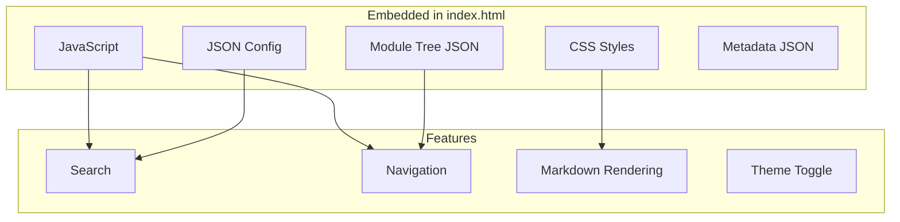
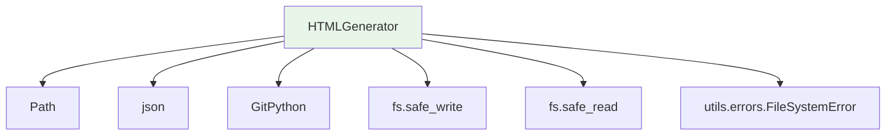

# HTMLGenerator

**文件：** `codewiki/cli/html_generator.py`

`HTMLGenerator` 用于创建独立的静态 HTML 文档查看器，适用于部署在 GitHub Pages 或本地查看。

## 概述

`HTMLGenerator` 将生成的 Markdown 文档转换为交互式 HTML 应用程序，具有以下特性：

- 客户端 Markdown 渲染
- 模块树导航
- 仓库信息展示
- 响应式设计，适配各种屏幕尺寸

## 类定义

```python
class HTMLGenerator:
    """
    为 GitHub Pages 生成静态 HTML 文档查看器。

    创建一个独立的 index.html，其中包含内嵌的样式、脚本，
    用于客户端 Markdown 渲染。
    """
```

## 初始化

```python
def __init__(self, template_dir: Optional[Path] = None)
```

**参数：**
| 参数 | 类型 | 描述 |
|------|------|------|
| `template_dir` | `Optional[Path]` | 模板目录路径 |

如果未提供，默认为包模板所在位置：
```
codewiki/templates/github_pages/viewer_template.html
```

## 核心方法

### generate()

```python
def generate(
    self,
    output_path: Path,
    title: str,
    module_tree: Optional[Dict[str, Any]] = None,
    repository_url: Optional[str] = None,
    github_pages_url: Optional[str] = None,
    config: Optional[Dict[str, Any]] = None,
    docs_dir: Optional[Path] = None,
    metadata: Optional[Dict[str, Any]] = None
)
```

生成 HTML 文档查看器。

**参数：**
| 参数 | 类型 | 描述 |
|------|------|------|
| `output_path` | `Path` | 输出文件路径（通常为 `index.html`） |
| `title` | `str` | 文档标题 |
| `module_tree` | `Optional[Dict]` | 模块树结构 |
| `repository_url` | `Optional[str]` | GitHub 仓库 URL |
| `github_pages_url` | `Optional[str]` | 预期的 GitHub Pages URL |
| `config` | `Optional[Dict]` | 额外配置 |
| `docs_dir` | `Optional[Path]` | 文档目录（自动加载 module_tree 和 metadata） |
| `metadata` | `Optional[Dict]` | 元数据字典 |

**自动加载功能：**
如果提供了 `docs_dir`，该方法会自动加载：
- 来自 docs_dir 的 `module_tree.json`
- 来自 docs_dir 的 `metadata.json`

### load_module_tree()

```python
def load_module_tree(self, docs_dir: Path) -> Dict[str, Any]
```

从文档目录加载模块树。

**参数：**
| 参数 | 类型 | 描述 |
|------|------|------|
| `docs_dir` | `Path` | 文档目录路径 |

**返回：** 模块树结构字典

**备用方案：** 如果文件未找到，则返回简单的"概述"结构

### load_metadata()

```python
def load_metadata(self, docs_dir: Path) -> Optional[Dict[str, Any]]
```

从文档目录加载元数据。

**参数：**
| 参数 | 类型 | 描述 |
|------|------|------|
| `docs_dir` | `Path` | 文档目录路径 |

**返回：** 元数据字典，如果未找到则返回 `None`

### detect_repository_info()

```python
def detect_repository_info(self, repo_path: Path) -> Dict[str, Optional[str]]
```

从 git 检测仓库信息。

**参数：**
| 参数 | 类型 | 描述 |
|------|------|------|
| `repo_path` | `Path` | 仓库路径 |

**返回：** 包含以下内容的字典：
- `name` - 仓库名称
- `url` - GitHub URL
- `github_pages_url` - 计算得出的 GitHub Pages URL

**处理流程：**
1. 从路径获取仓库名称
2. 从 git 读取远程 URL
3. 如需要将 SSH URL 转换为 HTTPS
4. 计算 GitHub Pages URL

### _build_info_content()

```python
def _build_info_content(self, metadata: Optional[Dict[str, Any]]) -> str
```

构建信息区域的 HTML 内容。

**参数：**
| 参数 | 类型 | 描述 |
|------|------|------|
| `metadata` | `Optional[Dict]` | 元数据字典 |

**返回：** 信息内容的 HTML 字符串

**显示内容：**
- 用于生成的模型
- 生成时间戳
- 提交 ID
- 组件总数
- 最大深度

### _escape_html()

```python
def _escape_html(self, text: str) -> str
```

转义 HTML 特殊字符。

**参数：**
| 参数 | 类型 | 描述 |
|------|------|------|
| `text` | `str` | 要转义的文本 |

**返回：** 转义后的文本

**替换内容：** `&`、`<`、`>`、`"`、`'`

## HTML 模板结构

生成的 HTML 包含以下内容：



### 模板占位符

模板使用以下占位符：

| 占位符 | 描述 |
|--------|------|
| `{{TITLE}}` | 页面标题 |
| `{{REPO_LINK}}` | 仓库链接 HTML |
| `{{SHOW_INFO}}` | 信息区域可见性 |
| `{{INFO_CONTENT}}` | 信息内容 HTML |
| `{{CONFIG_JSON}}` | 配置 JSON |
| `{{MODULE_TREE_JSON}}` | 模块树 JSON |
| `{{METADATA_JSON}}` | 元数据 JSON |
| `{{DOCS_BASE_PATH}}` | 文档基础路径 |

## 使用示例

### 基本用法

```python
from pathlib import Path
from codewiki.cli.html_generator import HTMLGenerator

generator = HTMLGenerator()

# 生成并自动加载
generator.generate(
    output_path=Path('/path/to/docs/index.html'),
    title='My Project Docs',
    docs_dir=Path('/path/to/docs')
)
```

### 手动配置

```python
from pathlib import Path
from codewiki.cli.html_generator import HTMLGenerator
import json

# 加载自定义数据
with open('docs/module_tree.json') as f:
    module_tree = json.load(f)

with open('docs/metadata.json') as f:
    metadata = json.load(f)

generator = HTMLGenerator()
generator.generate(
    output_path=Path('docs/index.html'),
    title='My Project',
    module_tree=module_tree,
    repository_url='https://github.com/user/project',
    github_pages_url='https://user.github.io/project/',
    metadata=metadata
)
```

### 结合仓库检测使用

```python
from pathlib import Path
from codewiki.cli.html_generator import HTMLGenerator

generator = HTMLGenerator()

# 从 git 自动检测
repo_info = generator.detect_repository_info(Path('/path/to/repo'))
print(f"Name: {repo_info['name']}")
print(f"URL: {repo_info['url']}")
print(f"GitHub Pages: {repo_info['github_pages_url']}")

# 使用检测到的信息生成
generator.generate(
    output_path=Path('/path/to/docs/index.html'),
    title=repo_info['name'],
    repository_url=repo_info['url'],
    github_pages_url=repo_info['github_pages_url'],
    docs_dir=Path('/path/to/docs')
)
```

## 与 CLIDocumentationGenerator 的集成

`HTMLGenerator` 通常从 `CLIDocumentationGenerator` 调用：

```python
from codewiki.cli.html_generator import HTMLGenerator

# 在 CLIDocumentationGenerator._run_html_generation() 中
def _run_html_generation(self):
    self.progress_tracker.start_stage(4, "HTML Generation")

    html_generator = HTMLGenerator()

    if self.verbose:
        self.progress_tracker.update_stage(0.3, "Loading module tree and metadata...")

    repo_info = html_generator.detect_repository_info(self.repo_path)

    output_path = self.output_dir / "index.html"
    html_generator.generate(
        output_path=output_path,
        title=repo_info['name'],
        repository_url=repo_info['url'],
        github_pages_url=repo_info['github_pages_url'],
        docs_dir=self.output_dir
    )

    self.job.files_generated.append("index.html")
```

## 依赖关系



## 生成输出

`HTMLGenerator` 生成的 `index.html` 文件具有以下特点：

1. **独立完整** - 所有 CSS 和 JS 内联嵌入
2. **无外部依赖** - 通过 fetch 从本地文件加载 Markdown
3. **响应式** - 支持桌面端和移动端
4. **可搜索** - 客户端跨所有模块搜索
5. **可导航** - 树形视图浏览模块

### 输出中的文件结构

```
docs/
├── index.html          # 由 HTMLGenerator 生成
├── module_tree.json    # 由 HTMLGenerator 加载
├── metadata.json       # 由 HTMLGenerator 加载
├── overview.md        # 生成的文档
├── module_1.md
├── module_2.md
└── ...
```

## 错误处理

模板未找到：
```python
if not template_path.exists():
    raise FileSystemError(f"Template not found: {template_path}")
```

JSON 解析错误：
```python
try:
    content = safe_read(module_tree_path)
    return json.loads(content)
except Exception as e:
    raise FileSystemError(f"Failed to load module tree: {e}")
```

非关键元数据错误返回 `None` 而不是失败。
