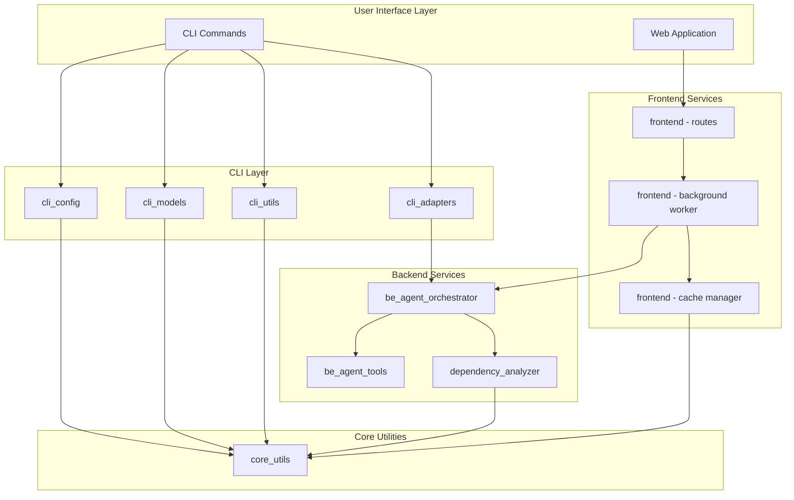
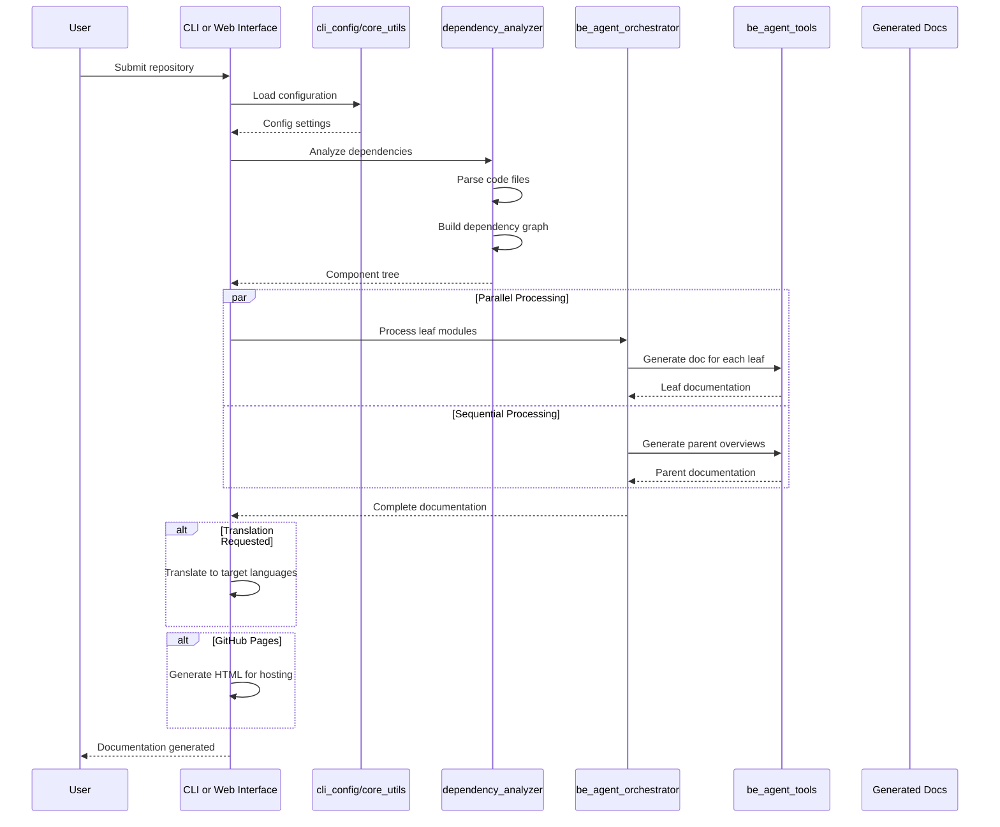

# CodeWiki 代码库概述

## 目的

CodeWiki 是一个由 AI 驱动的文档生成系统，能够自动分析源代码仓库并利用大语言模型（LLM）生成全面的文档。它支持多种编程语言，提供生成文档的多语言翻译功能，同时提供命令行和 Web 两种界面用于生成和查看文档。

主要功能包括：
- 多语言代码分析（Python、JavaScript、TypeScript、Java、C#、C、C++、PHP、Go）
- 自动构建依赖关系图和模块聚类
- AI 驱动的文档生成，支持自定义指令
- 级联翻译与回退模型，确保稳健性
- 并行处理，提升性能
- GitHub Pages 部署支持
- 用于仓库提交和文档查看的 Web 界面

## 架构

### 高层系统架构



### 端到端文档生成流程



### 数据流架构

```mermaid
flowchart LR
    subgraph Input["Input"]
        Repo[Source Repository]
        Config[User Configuration]
        Instructions[Agent Instructions]
    end
    
    subgraph Processing["Processing Pipeline"]
        Direction TB
        Parse[Code Parsing]
        Cluster[Module Clustering]
        Generate[AI Generation]
        Translate[Translation]
    end
    
    subgraph Output["Output"]
        MDocs[Markdown Docs]
        HTML[HTML Viewer]
        Translations[Multi-language]
    end
    
    Repo --> Parse
    Config --> Parse
    Instructions --> Generate
    
    Parse --> Cluster
    Cluster --> Generate
    Generate --> MDocs
    Generate --> Translate
    Translate --> Translations
    MDocs --> HTML
```

## 核心模块

### CLI 层

| 模块 | 文档 | 描述 |
|--------|---------------|-------------|
| **cli_adapters** | [cli_adapters.md](cli_adapters.md) | 桥接 CLI 命令与后端服务；包含 CLIDocumentationGenerator、DocTranslator 和 HTMLGenerator |
| **cli_config** | [cli_config.md](cli_config.md) | 配置管理和 Git 操作 |
| **cli_models** | [cli_models.md](cli_models.md) | 配置和任务跟踪的数据模型 |
| **cli_utils** | [cli_utils.md](cli_utils.md) | 日志和进度跟踪工具 |

### 后端层

| 模块 | 文档 | 描述 |
|--------|---------------|-------------|
| **be_agent_orchestrator** | [be_agent_orchestrator.md](be_agent_orchestrator.md) | AI 驱动文档生成的核心编排 |
| **be_agent_tools** | [be_agent_tools.md](be_agent_tools.md) | 使 AI 代理能够与源代码交互的工具 |
| **dependency_analyzer** | [dependency_analyzer.md](dependency_analyzer.md) | 多语言代码分析和依赖关系图构建 |

### 前端层

| 模块 | 文档 | 描述 |
|--------|---------------|-------------|
| **frontend** | [frontend.md](frontend.md) | 用于仓库提交和文档查看的 FastAPI Web 应用 |

### 核心层

| 模块 | 文档 | 描述 |
|--------|---------------|-------------|
| **core_utils** | [core_utils.md](core_utils.md) | 基础配置和工具组件 |

## 支持的语言

依赖分析器支持以下编程语言：

| 语言 | 文件扩展名 |
|----------|------------|
| Python | .py, .pyx |
| JavaScript | .js, .jsx, .mjs, .cjs |
| TypeScript | .ts, .tsx |
| Java | .java |
| C# | .cs |
| C | .c, .h |
| C++ | .cpp, .cc, .cxx, .hpp, .hxx |
| PHP | .php, .phtml, .inc |
| Go | .go |

## 快速开始

### CLI 使用方法

```bash
# 为仓库生成文档
codewiki gen /path/to/repo --output docs

# 使用自定义模型生成
codewiki gen /path/to/repo --model gpt-4

# 翻译为多种语言
codewiki translate docs --to zh ja

# 为 GitHub Pages 生成 HTML
codewiki html docs --push
```

### Web 应用

```bash
# 启动 Web 界面
codewiki web

# 在浏览器中打开 http://localhost:8000
```

## 配置

CodeWiki 支持灵活的配置，采用三级回退优先级：
1. 环境变量（最高优先级）
2. 配置文件（`~/.codewiki/config.json`）
3. 系统密钥链（macOS Keychain / Linux Secret Service）

主要配置选项：
- `main_model`：用于文档生成的主要 LLM
- `cluster_model`：用于代码聚类的模型
- `fallback_models`：回退模型的有序列表
- `max_tokens`：每次 LLM 请求的最大令牌数
- `max_depth`：依赖关系层次的最大深度
