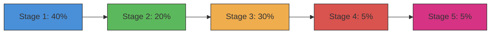

# 进度跟踪子模块

进度子模块提供了两个用于在文档生成过程中跟踪和显示进度的类：用于分阶段跟踪的 `ProgressTracker` 和用于逐模块跟踪的 `ModuleProgressBar`。

## 概述

进度子模块（`progress.py`）提供全面的进度跟踪功能：

- **ProgressTracker**：带 ETA 估算的阶段式进度跟踪
- **ModuleProgressBar**：用于单个模块处理的视觉进度条

## ProgressTracker 类

### 用途

`ProgressTracker` 管理五阶段文档生成工作流，具备以下功能：
- 跨阶段的加权进度计算
- 基于实际进度的 ETA 估算
- 详细输出和非详细输出模式

### 阶段定义

文档生成工作流包含 5 个阶段：

| 阶段 | 名称 | 权重 | 描述 |
|-------|------|--------|-------------|
| 1 | 依赖分析 | 40% | 分析代码依赖关系 |
| 2 | 模块聚类 | 20% | 分组相关模块 |
| 3 | 文档生成 | 30% | 生成文档 |
| 4 | HTML 生成 | 5% | 创建 HTML 输出（可选） |
| 5 | 最终确定 | 5% | 确定并保存结果 |

### 类定义

```python
class ProgressTracker:
    STAGE_WEIGHTS = {
        1: 0.40,
        2: 0.20,
        3: 0.30,
        4: 0.05,
        5: 0.05,
    }

    def __init__(self, total_stages: int = 5, verbose: bool = False):
        self.total_stages = total_stages
        self.current_stage = 0
        self.stage_progress = 0.0
        self.start_time = time.time()
        self.verbose = verbose
```

### 方法

#### `start_stage(stage: int, description: Optional[str] = None)`

标记新阶段的开始。

```python
tracker = ProgressTracker(verbose=True)
tracker.start_stage(1, "Dependency Analysis")
# 输出: [00:00] Phase 1/5: Dependency Analysis（蓝色，粗体）
```

#### `update_stage(progress: float, message: Optional[str] = None)`

更新当前阶段内的进度。

```python
tracker.update_stage(0.5, "Scanning files...")
# 将内部进度更新到 50%
# 详细模式下输出: [00:15]   Scanning files...
```

#### `complete_stage(message: Optional[str] = None)`

将当前阶段标记为完成。

```python
tracker.complete_stage("Found 50 modules")
# 输出: [00:30]   Dependency Analysis complete (30.0s)
#         [00:30]   Found 50 modules
```

#### `get_overall_progress() -> float`

计算总体进度百分比（0.0 到 1.0）。

```python
progress = tracker.get_overall_progress()
# 返回: 0.45（考虑阶段权重后完成 45%）
```

#### `get_eta() -> Optional[str]`

估算剩余完成时间。

```python
eta = tracker.get_eta()
# 返回: "5m 30s" 或 "2h 15m"，如果无法估算则返回 None
```

### 进度计算

总体进度使用加权阶段计算：



### 内部方法

#### `_format_elapsed() -> str`

将已用时间格式化为 MM:SS 或 HH:MM:SS。

```python
elapsed = tracker._format_elapsed()
# 返回: "02:30" 或更长持续时间返回 "1:02:30"
```

## ModuleProgressBar 类

### 用途

`ModuleProgressBar` 提供用于跟踪单个模块处理的视觉进度条：

- 通过终端进度条显示进度
- 显示 ETA 和完成百分比
- 支持详细模式以显示详细模块列表

### 类定义

```python
class ModuleProgressBar:
    def __init__(self, total_modules: int, verbose: bool = False):
        self.total_modules = total_modules
        self.current_module = 0
        self.verbose = verbose
```

### 方法

#### `update(module_name: str, cached: bool = False)`

在处理模块后更新进度。

```python
bar = ModuleProgressBar(total_modules=50, verbose=False)
bar.update("module_name", cached=False)
# 非详细模式: 推进进度条
# 详细模式: 输出: [1/50] module_name... ⟳ (generating)
```

#### `finish()`

关闭并最终确定进度条。

```python
bar.finish()
# 清理进度条显示
```

### 显示模式

#### 非详细模式

使用 Click 的进度条小部件：

```
Generating modules [████████████░░░░░░░░░░░] 50% | ETA: 0:02:30
```

#### 详细模式

在处理每个模块时列出：

```
[1/50] core/utils... ⟳ (generating)
[2/50] core/config... ✓ (cached)
[3/50] cli/parser... ⟳ (generating)
```

## 使用示例

### 阶段式进度跟踪

```python
from codewiki.cli.utils.progress import ProgressTracker

tracker = ProgressTracker(total_stages=5, verbose=True)

# 阶段 1: 依赖分析
tracker.start_stage(1)
tracker.update_stage(0.25, "Scanning project files...")
tracker.update_stage(0.50, "Building dependency graph...")
tracker.update_stage(0.75, "Resolving external dependencies...")
tracker.complete_stage("Found 150 dependencies")

# 阶段 2: 模块聚类
tracker.start_stage(2)
# ... 继续后续阶段
```

### 模块进度条

```python
from codewiki.cli.utils.progress import ModuleProgressBar

# 带进度条的非详细模式
bar = ModuleProgressBar(total_modules=50, verbose=False)

modules = ["core/utils", "cli/parser", "be/agent", "fe/routes"]
for module in modules:
    # 处理模块...
    bar.update(module, cached=False)

bar.finish()
```

### 组合使用

```python
from codewiki.cli.utils.progress import ProgressTracker, ModuleProgressBar

# 跟踪整体阶段
tracker = ProgressTracker(verbose=True)

# 阶段 1
tracker.start_stage(1, "Dependency Analysis")
# ... 执行分析 ...

# 阶段 2
tracker.start_stage(2, "Module Clustering")
modules = cluster_modules(dependencies)
tracker.complete_stage(f"Clustered into {len(modules)} groups")

# 阶段 3
tracker.start_stage(3, "Documentation Generation")
bar = ModuleProgressBar(len(modules), verbose=True)

for module in modules:
    doc = generate_doc(module)
    bar.update(module.name, cached=doc.cached)

bar.finish()
tracker.complete_stage(f"Generated {len(modules)} documents")

# 继续阶段 4 和 5...
```

## 依赖项

- **click**：用于进度条小部件和彩色输出
- **time**：用于计时和 ETA 计算
- **datetime**：用于时间戳格式化
- **typing**：用于类型提示（`Optional`、`Callable`）

## 集成

进度跟踪类由以下模块使用：

- **[be_agent_orchestrator.md](be_agent_orchestrator.md)**：用于跟踪整体文档生成
- **[cli_adapters.md](cli_adapters.md)**：用于跟踪翻译和生成进度

## 错误处理

两个进度类都设计为具有容错性：

- 进度值被限制在 0.0-1.0 范围内
- 如果进度为零，ETA 返回 None（无法计算）
- 即使发生异常也能保证进度条清理
- 正常操作期间不抛出异常
