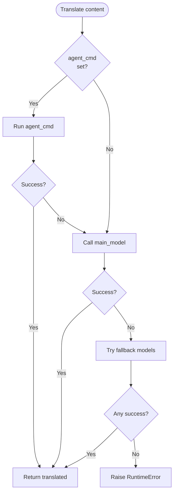
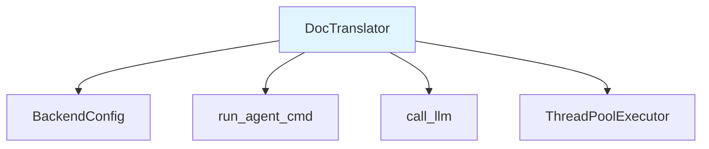

# DocTranslator

**文件：** `codewiki/cli/adapters/translator.py`

`DocTranslator` 为文档提供生成后的翻译功能。它使用级联回退机制将生成的 Markdown 文件翻译成多种语言。

## 概述

`DocTranslator` 在文档生成完成后被调用。它会：

1. 从输出目录读取所有 Markdown（`.md`）文件
2. 使用后端级联翻译每个文件
3. 将翻译后的文件写入 `output_dir/<lang_code>/`
4. 原样复制非 Markdown 文件（如 JSON 元数据等）

## 支持的语言

翻译器支持以下语言：

| 代码 | 语言 |
|------|----------|
| `zh` | 简体中文 |
| `zh-tw` | 繁體中文 |
| `ja` | 日本語 |
| `ko` | 한국어 |
| `fr` | Français |
| `de` | Deutsch |
| `es` | Español |
| `pt` | Português |
| `ru` | Русский |
| `ar` | العربية |
| `hi` | हिन्दी |
| `it` | Italiano |

## 翻译提示

翻译器使用精心设计的提示词，其特点是：

- 保留所有 Markdown 格式（标题、粗体、斜体、代码块、表格、链接）
- 不翻译代码块内容
- 不翻译命令名、文件路径或专有名词
- 完全保持 Mermaid 图表源代码不变
- 不添加任何额外的注释、前言或说明

```python
TRANSLATION_PROMPT = """You are a professional technical documentation translator.

Translate the following Markdown documentation into {language_name}.

Rules:
- Preserve ALL Markdown formatting (headers, bold, italics, code blocks, tables, links, mermaid diagrams).
- Do NOT translate code block contents, command names, file paths, or proper nouns (model names, package names, etc.).
- Keep mermaid diagram source code EXACTLY as-is (only translate the surrounding text if any).
- Do NOT add any extra commentary, preamble, or explanation — output ONLY the translated markdown.

--- BEGIN DOCUMENT ---
{content}
--- END DOCUMENT ---"""
```

## 类定义

```python
class DocTranslator:
    """
    Translates generated markdown documentation into another language using
    the same LLM and credentials used for documentation generation.

    Translation cascade (first success wins):
    1. CLI agent subprocess (--with-agent-cmd) — no timeout / context limits
    2. Main model via API
    3. Fallback models via API
    4. Error → stop
    """
```

## 初始化

```python
def __init__(self, config: Dict[str, Any])
```

**参数：**
| 参数 | 类型 | 描述 |
|-----------|------|-------------|
| `config` | `Dict[str, Any]` | 配置字典 |

**配置字典预期包含的键：**
- `base_url` - LLM API 基础 URL（必需）
- `api_key` - LLM API 密钥（必需）
- `main_model` - 主要翻译模型
- `cluster_model` - 聚类模型（可选）
- `fallback_model` - 回退模型名称（可选）
- `fallback_models` - 额外回退模型列表
- `max_tokens` - 最大令牌数（默认：4096）
- `max_token_per_module` - 每个模块的最大令牌数
- `max_token_per_leaf_module` - 叶模块的最大令牌数
- `max_depth` - 最大深度

## 核心方法

### translate_docs()

```python
def translate_docs(
    self,
    output_dir: Path,
    lang_code: str,
    progress_callback=None,
    concurrency: int = 4,
) -> Path
```

翻译输出目录中的所有 Markdown 文件。

**参数：**
| 参数 | 类型 | 描述 |
|-----------|------|-------------|
| `output_dir` | `Path` | 文档根目录 |
| `lang_code` | `str` | 目标语言代码（如 'zh'、'ja'） |
| `progress_callback` | `Callable` | 可选的回调函数(current, total, filename) |
| `concurrency` | `int` | 并行工作线程数（默认：4） |

**返回：** `Path` - 翻译输出目录的路径

**抛出：** `RuntimeError` - 如果所有回退都失败

**处理流程：**
1. 创建 `output_dir/<lang_code>/` 目录
2. 收集 `output_dir` 中的所有 `.md` 文件
3. 创建线程池进行并行翻译
4. 对于每个文件：
   - 如果已翻译则跳过（检查点恢复）
   - 使用级联机制翻译
   - 写入目标位置
5. 原样复制非 Markdown 文件
6. 返回翻译后的目录路径

### _translate_content()

```python
def _translate_content(self, content: str, lang_code: str, filename: str = "") -> str
```

使用级联方式翻译单个 Markdown 字符串。

**翻译级联：**



**级联顺序：**
1. **agent_cmd** - CLI agent 子进程（无超时，无上下文限制）
2. **main_model** - 通过 API 的主模型（超时：300秒）
3. **fallback_models** - 按顺序尝试每个回退模型（超时：300秒）

**返回：** 翻译后的 Markdown 字符串

**抛出：** `RuntimeError` - 如果所有后端都失败

### _get_backend_config()

```python
def _get_backend_config(self)
```

从 CLI 配置字典惰性创建 `BackendConfig`。

## 并行翻译

翻译器使用 `ThreadPoolExecutor` 进行并行翻译：

```python
workers = max(1, min(concurrency, total))
if workers == 1:
    # Serial path — no thread overhead
    for md_path in md_files:
        _translate_one(md_path)
else:
    with ThreadPoolExecutor(max_workers=workers) as pool:
        futures = {pool.submit(_translate_one, p): p for p in md_files}
        for future in as_completed(futures):
            future.result()
```

**特性：**
- 线程安全的进度计数器
- 检查点恢复（跳过已存在的翻译）
- 立即错误传播

## 进度回调

`progress_callback` 允许与 CLI 进度条集成：

```python
def my_callback(current: int, total: int, filename: str):
    click.echo(f"[{current}/{total}] {filename}")

translator.translate_docs(
    output_dir=Path('/path/to/docs'),
    lang_code='zh',
    progress_callback=my_callback,
    concurrency=4
)
```

## 依赖关系



## 使用示例

```python
from pathlib import Path
from codewiki.cli.adapters.translator import DocTranslator

# Configure (same as for generation)
config = {
    'base_url': 'https://api.openai.com/v1',
    'api_key': 'sk-your-key',
    'main_model': 'gpt-4o',
    'fallback_models': ['gpt-4o-mini', 'claude-3-haiku'],
    'agent_cmd': 'claude --print',  # Optional
    'max_tokens': 4096
}

translator = DocTranslator(config)

# Translate to Chinese
translated_dir = translator.translate_docs(
    output_dir=Path('/path/to/docs'),
    lang_code='zh',
    concurrency=4
)

print(f"Translated files in: {translated_dir}")
```

## 与 CLI 命令的集成

当指定 `--output-lang` 时，`generate` 命令会使用 `DocTranslator`：

```python
from codewiki.cli.adapters.translator import DocTranslator, LANGUAGE_NAMES

# In generate command
if output_lang:
    lang_name = LANGUAGE_NAMES.get(output_lang.lower(), output_lang)
    click.echo(f"      Translating to {lang_name} …")

    translator = DocTranslator(config={
        'base_url': config.base_url,
        'api_key': api_key,
        'main_model': config.main_model,
        'cluster_model': config.cluster_model,
        'fallback_model': config.fallback_model,
        'fallback_models': config.fallback_models,
        'agent_cmd': config.agent_cmd,
    })

    translator.translate_docs(
        output_dir=output_dir,
        lang_code=output_lang,
        concurrency=config.concurrency
    )
```

## 错误处理

当所有翻译后端都失败时：

```python
all_errors = "\n    ".join(errors)
raise RuntimeError(
    f"Translation failed for {filename}. All backends exhausted:\n    {all_errors}"
)
```

错误信息示例：
```
Translation failed for module_1.md. All backends exhausted:
    agent_cmd: Command failed with code 1
    main_model (gpt-4o): Rate limit exceeded
    fallback (gpt-4o-mini): Invalid API key
```

## 文件保留

非 Markdown 文件会被原样复制：

```python
for other in output_dir.iterdir():
    if other.is_file() and not other.suffix == ".md" and other.name not in {"index.html"}:
        try:
            shutil.copy2(other, lang_dir / other.name)
        except Exception:
            pass
```

这确保了：
- `metadata.json` - 保留
- `module_tree.json` - 保留
- `index.html` - 不复制（如需要会单独生成）
- 其他 JSON/markdown 文件 - 保留
